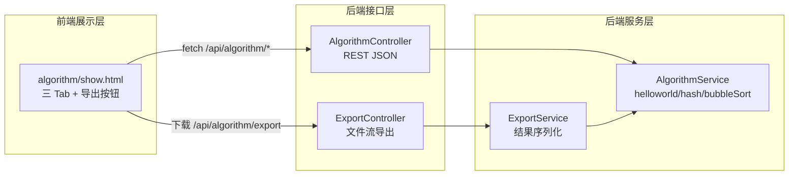
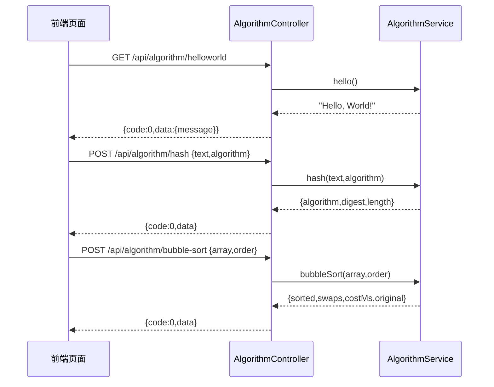
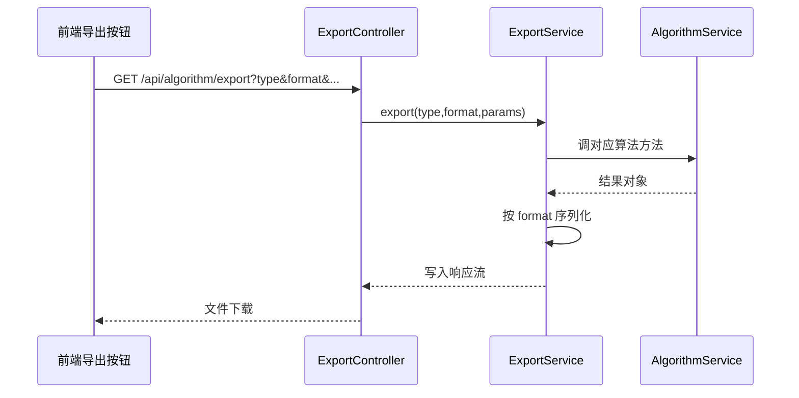
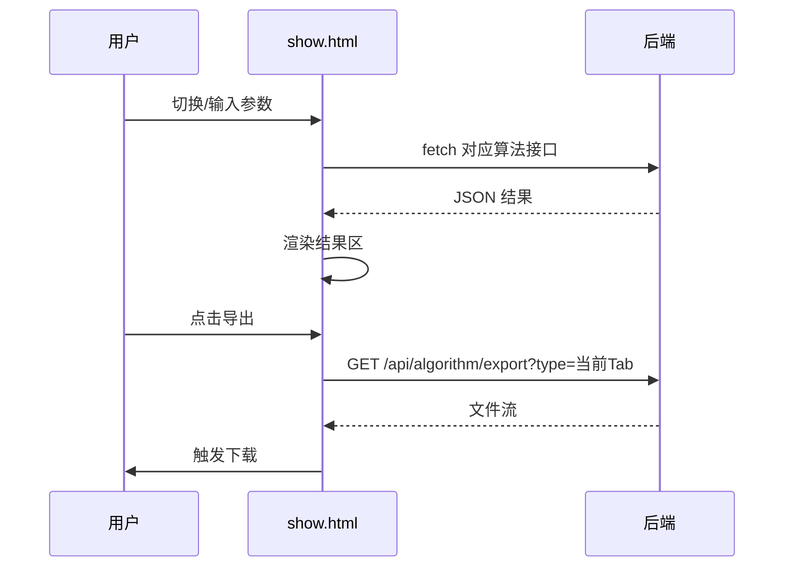

# 算法接口与前端展示导出 — 系统分析与设计文档

## 文档信息

| 项目 | 内容 |
|---|---|
| 主题 | 算法接口（HelloWorld / 哈希 / 冒泡排序）+ 前端三 Tab 展示 + 导出接口 |
| 仓库 | ranxitest（`my-spring-boot-app`，Spring Boot 2.6.6，`com.example.myapp`） |
| 设计模式 | 全量模式（无同模块历史文档） |
| 产出文件 | `.agents/20260730-算法接口与前端展示导出/design.md` |
| 流程实例 ID | 20260730-a7c |
| 生成日期 | 2026-07-30 |

> 说明：本仓库 `my-spring-boot-app` 已具备 Controller/Service/Model/Repository 分层、Thymeleaf、Spring Data JPA、H2、Validation。本次设计为**增量新增**算法演示功能模块，不改写既有 Item/User 模块。

---

## 1. 需求与范围分析

### 1.1 背景与目标

提供一个轻量算法演示与结果导出能力：后端用 Java 实现三类算法接口，前端单页面以 Tab 形式分别展示各接口执行结果，并支持将各页面展示结果导出为文件。目标是将"算法计算 → 结果展示 → 结果导出"形成一条自洽闭环，便于演示与复核。

### 1.2 核心功能

| 编号 | 功能点 | 说明 | 优先级 |
|---|---|---|---|
| F01 | HelloWorld 接口 | Java 接口返回 hello world 文本结果 | P0 |
| F02 | 哈希算法接口 | Java 接口接收文本与算法类型，输出哈希摘要 | P0 |
| F03 | 冒泡排序接口 | Java 接口接收整数数组，输出排序后结果（含过程指标） | P0 |
| F04 | 前端展示页面 | 新增页面，三个 Tab 分别展示 F01/F02/F03 执行结果 | P0 |
| F05 | 导出按钮与导出接口 | 页面提供导出按钮；后台提供导出接口，按页面类型导出对应展示结果 | P0 |

### 1.3 约束与非功能要求

| 类别 | 要求 |
|---|---|
| 技术栈 | 后端 Java 17 + Spring Boot 2.6.6（复用 `my-spring-boot-app` 既有依赖）；前端 Thymeleaf + 原生 JS（Tab + AJAX） |
| 兼容性 | 新增接口/页面，不改动既有 Item/User 模块对外行为（向后兼容） |
| 安全性 | 哈希输入与排序数组需做长度/大小校验，防止超大输入导致 OOM 或长耗时 |
| 性能 | 算法为内存无状态计算，单次响应 <200ms（常规输入）；导出流式输出，避免全量驻留内存 |
| 可维护性 | 遵循现有分层（Controller–Service），算法逻辑收敛于 Service |

### 1.4 排除范围

- 不涉及用户登录鉴权（演示功能，默认开放；若需可后续加 Filter，本次不实现）。
- 不涉及业务数据持久化（算法为无状态计算，无需建表）。
- 不改造既有 Item/User/Profile 控制器与模板。
- 不引入独立前端工程框架（Vue/React），前端用 Thymeleaf 模板 + 原生 JS。

### 1.5 假设与待确认项

| 编号 | 假设/待确认 | 选择理由 | 仅供事后审阅，不暂停流程 |
|---|---|---|---|
| A01 | 假设哈希算法类型支持 SHA-256 / SHA-512 / MD5 | 覆盖常见摘要需求，Java 原生 `MessageDigest` 即可支持 | — |
| A02 | 假设冒泡排序输入为整数数组，输出含排序后数组 + 交换次数 + 耗时 | 展示排序过程指标便于演示 | — |
| A03 | 假设导出格式以 CSV 为主，可选 JSON | CSV 通用、Excel 可直接打开；JSON 便于程序消费 | — |
| A04 | 假设前端 Tab 用原生 JS 切换 + fetch AJAX 调 REST 接口 | 复用 Thymeleaf 单页架构，无需引入构建工具 | — |
| A05 | 假设导出接口复用对应算法接口实时计算后导出 | 无持久化，结果即算即导，保证一致性 | — |

---

## 2. 架构与模块划分

### 2.1 功能架构图

### 2.2 模块清单

| 模块 | 职责 | 所属层 | 新增/变更 |
|---|---|---|---|
| 算法接口模块 | 提供 helloworld/hash/bubbleSort REST 接口 | Controller + Service | 新增 |
| 导出模块 | 按页面类型导出对应算法结果为文件 | Controller + Service | 新增 |
| 前端展示页面 | 三 Tab 展示 + 触发导出 | Thymeleaf 模板 | 新增 |

### 2.3 部署架构

单体应用 `my-spring-boot-app`（jar 包，内嵌 Tomcat）。前端页面由同一应用 Thymeleaf 渲染，前后端同源，无 CORS 问题。无外部系统集成。

> 假设：部署形态沿用现有 Spring Boot 单体；如后续独立前端工程化，见备选方案 C。

---

## 3. 数据模型与存储

本需求为**无状态算法计算**，F01/F02/F03 均为即时计算即时返回，F05 导出复用计算结果实时序列化，不涉及业务数据持久化。

**本项不适用（实体表设计）**，原因：无业务实体需落库；不引入冗余存储，降低维护成本与一致性风险。

若后续需要"历史结果留痕/重放"，再增量设计 `algorithm_record` 表（字段：id、algo_type、input_summary、output_summary、cost_ms、created_at），本次不做（避免过度设计）。

### 3.1 实体关系图

不适用（无持久化实体）。

---

## 4. 接口设计

> 新增对外接口统一前缀 `/api/algorithm`，采用 RESTful（OpenAPI 形态）。通用出参结构：`{code, msg, data}`，`code=0` 成功，非 0 失败。

| 编号 | 名称 | 方法 | 路径 | 所属模块 |
|---|---|---|---|---|
| I01 | HelloWorld | GET | `/api/algorithm/helloworld` | 算法接口模块 |
| I02 | 哈希计算 | POST | `/api/algorithm/hash` | 算法接口模块 |
| I03 | 冒泡排序 | POST | `/api/algorithm/bubble-sort` | 算法接口模块 |
| I04 | 结果导出 | GET | `/api/algorithm/export` | 导出模块 |
| I05 | 展示页面 | GET | `/algorithm` | 前端展示页面（返回 Thymeleaf 视图，非 JSON） |

---

## 5. 功能模块设计

### 5.0 全局约定

| 约定项 | 规则 |
|---|---|
| 错误码格式 | `{MODULE}_{SEQ}`，MODULE=`ALGO`（算法）、`EXPORT`（导出） |
| 通用出参结构 | `{ "code": int, "msg": string, "data": object }`；code=0 成功 |
| 模块映射 | ALGO → 算法接口；EXPORT → 导出 |

### 5.1 算法接口模块

#### 5.1.1 表结构设计

不适用，原因：无状态计算，不落库。

#### 5.1.2 枚举与常量定义

| 枚举/常量 | 取值 | 说明 |
|---|---|---|
| HashAlgorithm | SHA_256 / SHA_512 / MD5 | 哈希算法类型，默认 SHA_256 |
| ExportType | HELLOWORLD / HASH / BUBBLE_SORT | 导出页面类型 |
| ExportFormat | CSV / JSON | 导出格式，默认 CSV |
| MAX_INPUT_LEN | 10000 | 哈希文本最大字符数 |
| MAX_ARRAY_SIZE | 1000 | 冒泡排序数组最大长度 |
| MAX_ARRAY_ELEMENT | 10^9 | 数组元素绝对值上界 |

#### 5.1.3 接口详细设计

##### I01 HelloWorld

- 方法/路径：`GET /api/algorithm/helloworld`
- 入参：无
- 出参 `data`：

| 字段 | 类型 | 说明 |
|---|---|---|
| message | string | 固定 "Hello, World!" |

- 请求示例：`GET /api/algorithm/helloworld`
- 响应示例：`{"code":0,"msg":"success","data":{"message":"Hello, World!"}}`
- 错误码：无入参，常规仅 ALGO_999（服务异常）

##### I02 哈希计算

- 方法/路径：`POST /api/algorithm/hash`
- 请求体 JSON：

| 参数 | 类型 | 必填 | 说明 |
|---|---|---|---|
| text | string | 是 | 待哈希文本 |
| algorithm | string | 否 | SHA_256 / SHA_512 / MD5，默认 SHA_256 |

- 出参 `data`：

| 字段 | 类型 | 说明 |
|---|---|---|
| algorithm | string | 实际使用算法 |
| digest | string | 十六进制摘要 |
| length | int | 原文长度 |

- 请求示例：`{"text":"abc","algorithm":"SHA_256"}`
- 响应示例：`{"code":0,"msg":"success","data":{"algorithm":"SHA_256","digest":"ba7816bf...","length":3}}`
- 错误码：

| 错误码 | 含义 |
|---|---|
| ALGO_001 | text 为空 |
| ALGO_002 | text 超长（>MAX_INPUT_LEN） |
| ALGO_003 | algorithm 不支持 |
| ALGO_999 | 服务异常 |

##### I03 冒泡排序

- 方法/路径：`POST /api/algorithm/bubble-sort`
- 请求体 JSON：

| 参数 | 类型 | 必填 | 说明 |
|---|---|---|---|
| array | int[] | 是 | 待排序整数数组 |
| order | string | 否 | ASC / DESC，默认 ASC |

- 出参 `data`：

| 字段 | 类型 | 说明 |
|---|---|---|
| sorted | int[] | 排序后数组 |
| swaps | int | 交换次数 |
| costMs | long | 耗时毫秒 |
| original | int[] | 原始数组（便于展示对照） |

- 请求示例：`{"array":[5,2,8,1],"order":"ASC"}`
- 响应示例：`{"code":0,"msg":"success","data":{"sorted":[1,2,5,8],"swaps":4,"costMs":0,"original":[5,2,8,1]}}`
- 错误码：

| 错误码 | 含义 |
|---|---|
| ALGO_004 | array 为空 |
| ALGO_005 | array 超长（>MAX_ARRAY_SIZE） |
| ALGO_006 | 元素越界 |
| ALGO_007 | order 不支持 |
| ALGO_999 | 服务异常 |

#### 5.1.4 子功能详细设计

**算法逻辑描述（不含代码）**：

- HelloWorld：直接返回固定问候串。
- 哈希：依据 algorithm 选择 `MessageDigest` 实例（SHA-256 / SHA-512 / MD5），将 text 按 UTF-8 编码为字节，计算摘要，转小写十六进制串返回。
- 冒泡排序：对 array 自首至尾两两比较相邻元素，依 order 升序/降序决定是否交换；每轮将极值冒泡至末端，重复 n-1 轮（可提前终止：若某轮无交换则已有序）。统计交换次数与耗时。

**调用时序图**：

**业务规则表**：

| 规则编号 | 规则 |
|---|---|
| R01 | algorithm 为空或非法时回退 SHA_256（并回显实际算法） |
| R02 | order 为空时默认 ASC |
| R03 | 输入超限直接拒绝并返回对应错误码，不截断 |
| R04 | 冒泡排序为原地算法实现，交换次数反映实际元素交换计数 |

**异常场景表**：

| 场景 | 触发条件 | 处理 |
|---|---|---|
| 超大输入 | text/array 超限 | 返回 ALGO_002/005，提示上限 |
| 非法算法 | algorithm 不在枚举 | 回退默认（R01）或按 ALGO_003 |
| 空数组 | array 为空或长度 0 | 返回 ALGO_004 |
| 服务异常 | 未捕获异常 | 兜底返回 ALGO_999 |

**并发控制策略**：算法为无状态纯函数计算，天然线程安全；无需额外锁。导出复用同一 Service 实例方法，只读不写共享态，无并发风险。

#### 5.1.5 状态机

不适用，原因：无状态字段实体。

#### 5.1.6 模块自检

| 对账项 | 结果 |
|---|---|
| F01/F02/F03 均有接口与算法设计 | ✅ |
| 入参出参表格化且每参数独占一行 | ✅ |
| 错误码覆盖边界 | ✅ |
| 无代码片段（仅设计描述） | ✅ |
| 无过度设计（无冗余表/无状态机） | ✅ |

### 5.2 导出模块

#### 5.2.1 接口详细设计

##### I04 结果导出

- 方法/路径：`GET /api/algorithm/export`
- 查询参数：

| 参数 | 类型 | 必填 | 说明 |
|---|---|---|---|
| type | string | 是 | HELLOWORLD / HASH / BUBBLE_SORT |
| format | string | 否 | CSV / JSON，默认 CSV |
| text | string | 否 | type=HASH 时作为哈希输入 |
| algorithm | string | 否 | type=HASH 时算法，默认 SHA_256 |
| array | string | 否 | type=BUBBLE_SORT 时逗号分隔整数 |
| order | string | 否 | type=BUBBLE_SORT 时 ASC/DESC，默认 ASC |

- 出参：文件流（`Content-Type: text/csv` 或 `application/json`，`Content-Disposition: attachment`），文件名 `algorithm-{type}-{时间戳}.csv`
- 错误码：

| 错误码 | 含义 |
|---|---|
| EXPORT_001 | type 不支持 |
| EXPORT_002 | format 不支持 |
| EXPORT_003 | 缺少必要参数（如 BUBBLE_SORT 无 array） |
| EXPORT_999 | 导出异常 |

- CSV 结构示例（type=BUBBLE_SORT）：

| 字段 | 值 |
|---|---|
| type | BUBBLE_SORT |
| original | 5,2,8,1 |
| sorted | 1,2,5,8 |
| swaps | 4 |
| costMs | 0 |

#### 5.2.2 子功能详细设计

**导出流程描述**：根据 type 调用 AlgorithmService 对应方法实时计算结果，再按 format 序列化：CSV 用逗号分隔键值行，JSON 直接序列化出参对象。通过 `HttpServletResponse` 设置响应头并流式写出。

**调用时序图**：

**业务规则表**：

| 规则编号 | 规则 |
|---|---|
| R05 | 导出结果与页面展示同源（同一 Service 方法），保证一致 |
| R06 | format 非法时回退 CSV（默认） |
| R07 | type=BUBBLE_SORT 时 array 必填，否则 EXPORT_003 |

**异常场景表**：

| 场景 | 处理 |
|---|---|
| 参数缺失 | EXPORT_003 |
| 序列化失败 | EXPORT_999 |
| 客户端取消下载 | 服务端忽略中断异常 |

### 5.3 前端展示页面

#### 5.3.1 页面结构

- 路由：`GET /algorithm`（Thymeleaf 视图 `algorithm/show`）
- 布局：标题 + 三 Tab（HelloWorld / 哈希算法 / 冒泡排序）+ 右上角「导出」按钮
- 交互：切换 Tab 时通过 fetch 调对应接口并渲染结果区；哈希 Tab 含输入框（text + 算法下拉）；冒泡 Tab 含数组输入框（逗号分隔）+ 升降序选择；导出按钮按当前 Tab 类型触发下载。

#### 5.3.2 页面接口契约对齐

| 页面元素 | 调用接口 |
|---|---|
| HelloWorld Tab | GET I01 |
| 哈希 Tab「计算」 | POST I02 |
| 冒泡 Tab「排序」 | POST I03 |
| 导出按钮 | GET I04（type 随当前 Tab） |

#### 5.3.3 页面调用时序图

---

## 6. 非功能性需求设计

| 类别 | 设计 | 适用性 |
|---|---|---|
| 稳定性 | 算法为内存计算，无下游依赖；导出流式输出避免 OOM | 适用 |
| 高可用 | 单体应用，演示场景默认满足；生产需多副本（后续可容器化） | 适用 |
| 安全性 | 输入长度/大小校验防 OOM；哈希仅做摘要不存原文；导出文件名不含用户输入防注入 | 适用 |
| 性能 | 常规输入 <200ms；数组上限 1000 防长耗时 | 适用 |
| 扩展性 | 新增算法只需在 Service 加方法 + Controller 暴露 + 前端加 Tab，解耦清晰 | 适用 |

---

## 7. 变更三板斧

| 维度 | 设计 |
|---|---|
| 可监控 | AlgorithmController/ExportController 关键方法记录入参摘要、处理结果、耗时；异常打 ERROR 日志 |
| 可灰度 | 演示功能无租户概念；若需灰度，可加配置开关 `algo.feature.enabled`，前端按开关显隐入口 |
| 可应急 | 新增模块独立，回滚仅需移除新增 Controller/Service/模板，不影响既有 Item/User 功能；发布包回滚即可 |

---

## 8. 方案检查 checklist

| 检查项 | 结论 | 说明 |
|---|---|---|
| 模块划分合理性 | 通过 | 算法接口、导出、前端页面三模块单一职责，无循环依赖 |
| 依赖关系合理性 | 通过 | 前端依赖后端接口；导出依赖算法 Service；无外部系统异常传导 |
| 单点问题（部署） | 不适用 | 演示单体，默认满足 |
| 表模型设计范式 | 不适用 | 无持久化表 |
| 隐私安全 | 通过 | 哈希输入不落库；导出文件名用时间戳不含用户输入 |
| 兼容性（接口） | 通过 | 全部为新增接口，不改动既有接口，向后兼容 |
| 兼容性（表） | 不适用 | 无表变更 |
| 数据迁移 | 不适用 | 无表 |
| 一致性（功能点） | 通过 | F01-F05 在模块设计中均有对应（I01-I04 + 页面） |
| 一致性（表） | 不适用 | 无实体 |
| 一致性（接口） | 通过 | I01-I04 在 5.1/5.2 均有详细定义 |
| 一致性（枚举） | 通过 | HashAlgorithm/ExportType/ExportFormat 与接口参数一致 |
| 状态机完整性 | 不适用 | 无状态字段实体 |
| 并发风险 | 通过 | 无状态纯函数 + 只读导出，无共享可变态 |
| 单点问题（定时任务） | 不适用 | 无定时任务 |
| 非功能性可行性 | 通过 | 校验/流式导出/解耦均可在 Spring Boot 落地 |
| 可监控可行性 | 通过 | 方法级日志可行 |
| 可灰度可行性 | 通过 | 配置开关方案可行 |
| 可应急可行性 | 通过 | 新增模块可独立回滚 |

---

## 附录 A：决策记录

| 决策项 | 决策结果 | 备选方案 | 决策原因 |
|---|---|---|---|
| 产物落盘仓库 | ranxitest | library-backend / library-frontend | 核心业务库；现成 Spring Boot 承接主体实现 |
| 技术方案 | 方案 A 单体（ranxitest 后端 REST + Thymeleaf 前端） | B 前后端分离从零 / C 混合 | 改动最小、立即可运行、无跨库联调风险 |
| 前端实现 | Thymeleaf + 原生 JS | Vue/React 独立工程 | 复用现有架构，无需构建工具 |
| 数据持久化 | 不建表 | 新增 algorithm_record | 无状态计算，避免过度设计 |
| 导出格式 | CSV 为主 + JSON | xlsx | CSV 通用且实现简单 |
| board-knowledge-search | 不可用，降级为仓库目录探查 | — | 该技能在本环境未注册，以目录探查获取初始信息 |
| 通用出参 | {code,msg,data} | 沿用 Model.addAttribute | 新增 REST 接口统一规范，与现有 Thymeleaf Controller 并存不冲突 |

## 附录 B：跨仓对齐点

| 对齐点 | 结论 |
|---|---|
| 后端接口契约 | 新增 `/api/algorithm/*`，不触碰既有 `/items`、`/profiles` 路由，跨库无耦合 |
| 前端页面 | 新增 `/algorithm` 视图，不改动既有 `items/*` 模板 |
| library-backend/frontend | 不纳入本功能，避免语义混淆与空仓库从零搭建风险 |
| dtazzi-cline | 无关，不涉及 |

## 附录 C：实现落点清单（供编码阶段参考，本阶段不写代码）

| 层 | 新增文件（相对 ranxitest worktree） | 说明 |
|---|---|---|
| Controller | `my-spring-boot-app/src/main/java/com/example/myapp/controllers/AlgorithmController.java` | `@RestController`，I01-I03 |
| Controller | `my-spring-boot-app/src/main/java/com/example/myapp/controllers/ExportController.java` | I04 导出 |
| Controller | `my-spring-boot-app/src/main/java/com/example/myapp/controllers/AlgorithmPageController.java` | I05 返回 Thymeleaf 视图 |
| Service | `my-spring-boot-app/src/main/java/com/example/myapp/services/AlgorithmService.java` | 算法逻辑 |
| Service | `my-spring-boot-app/src/main/java/com/example/myapp/services/ExportService.java` | 结果序列化 |
| Model | `my-spring-boot-app/src/main/java/com/example/myapp/models/dto/HashResult.java` 等 | 出参 DTO |
| 模板 | `my-spring-boot-app/src/main/resources/templates/algorithm/show.html` | 前端页面 |

