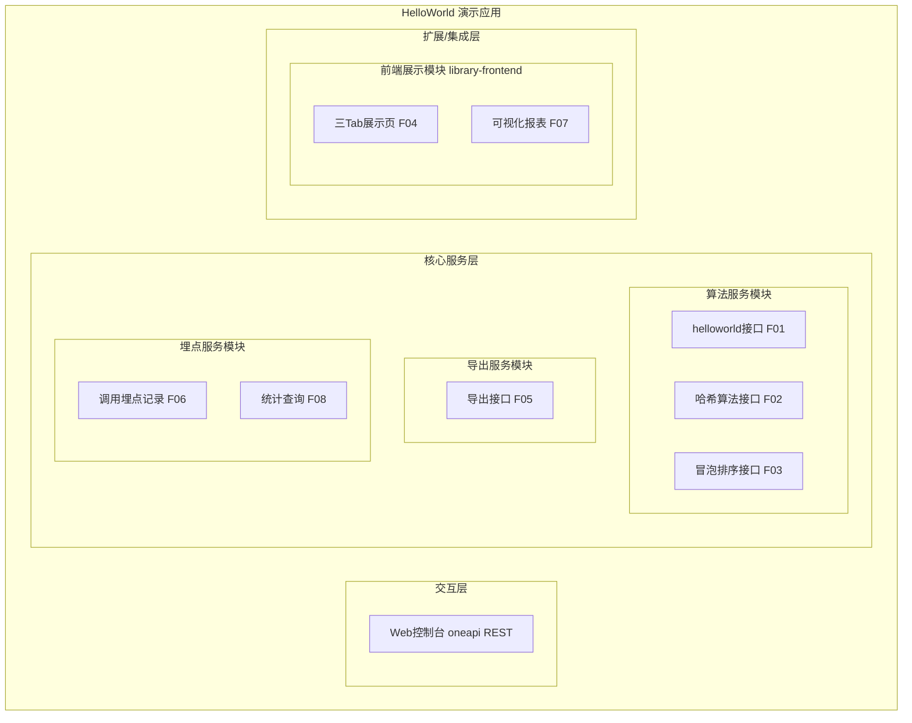
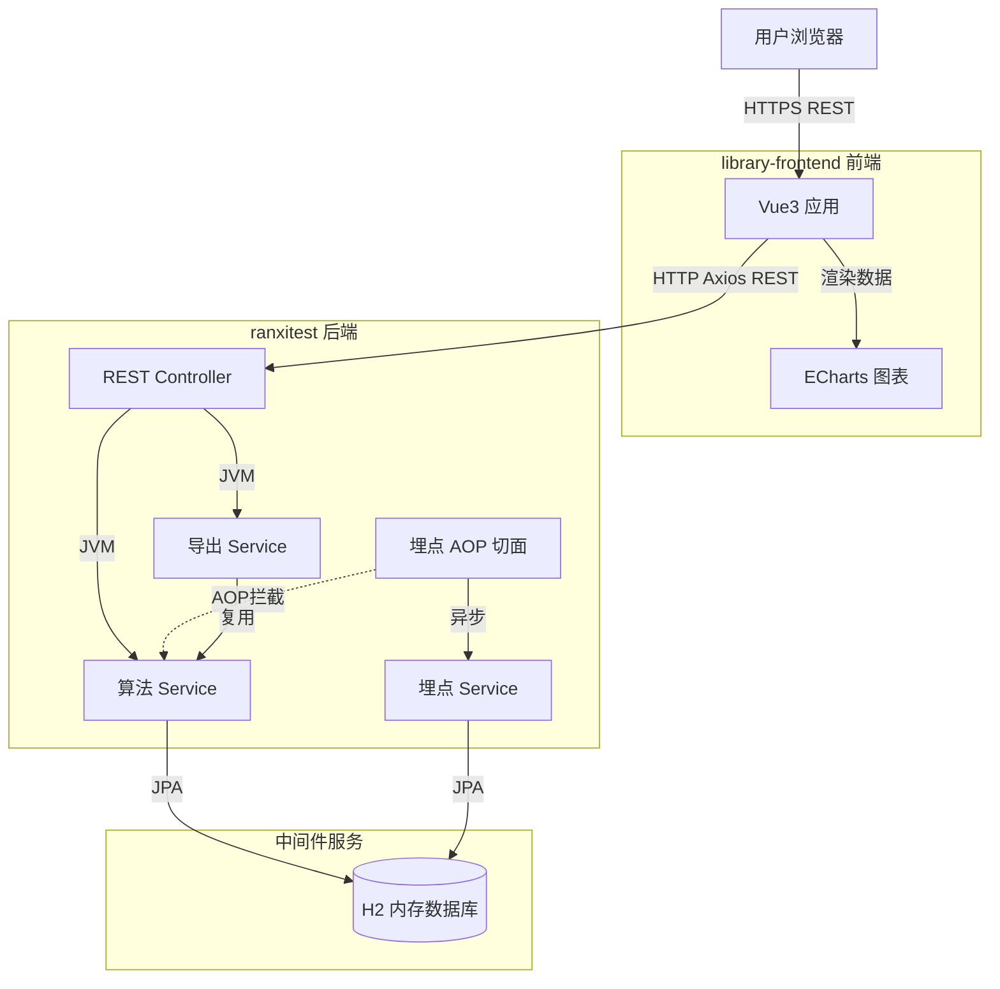
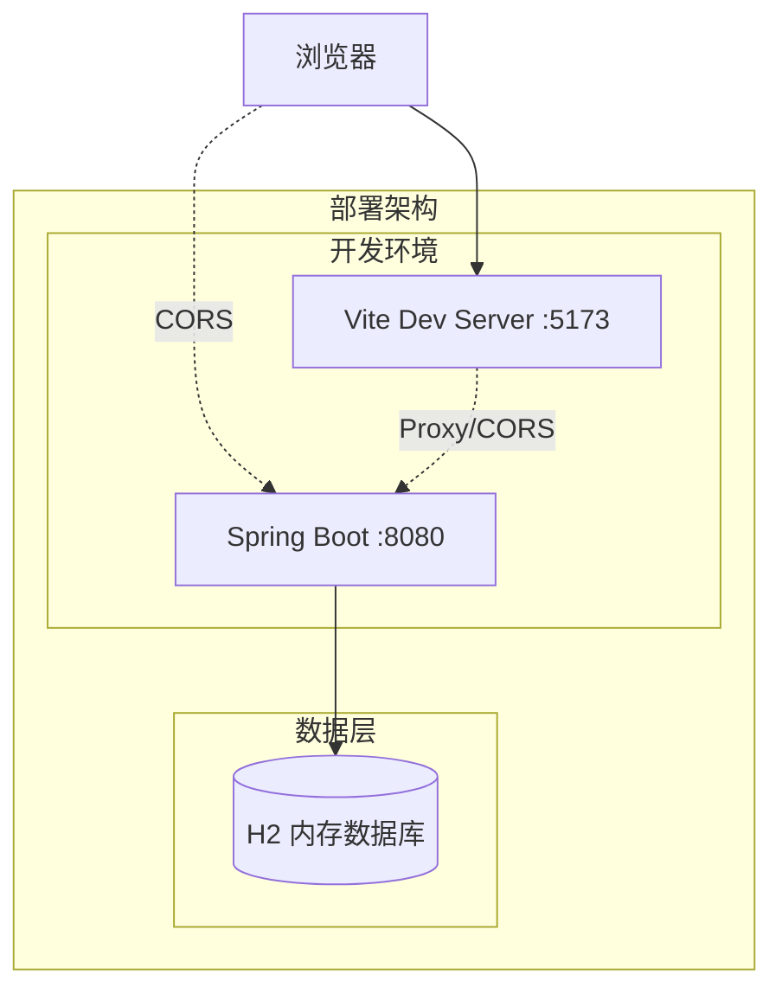
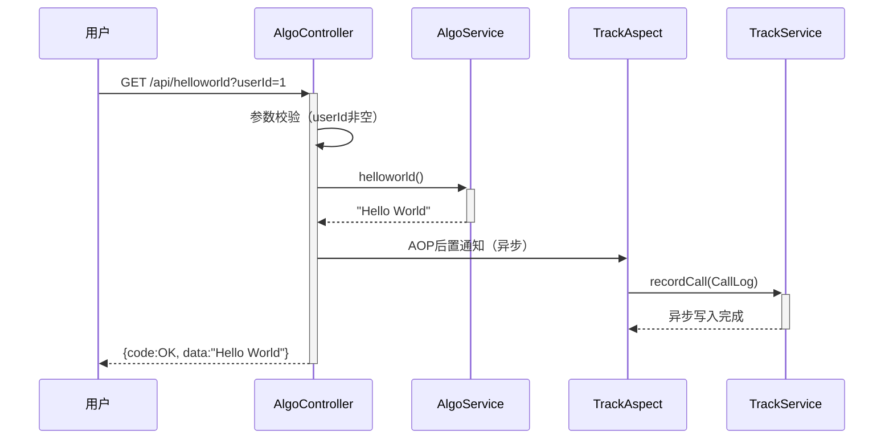
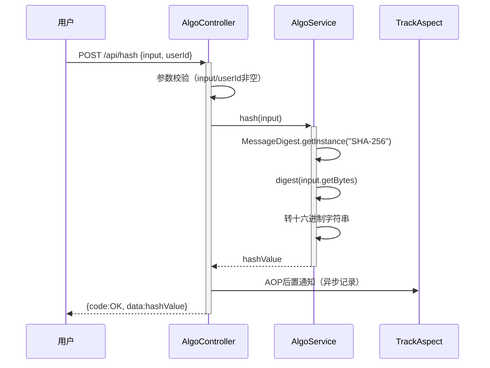
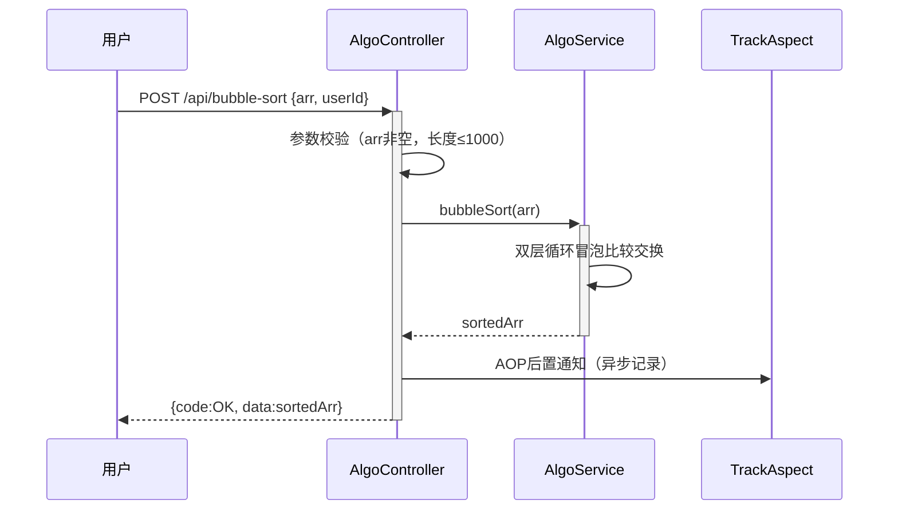
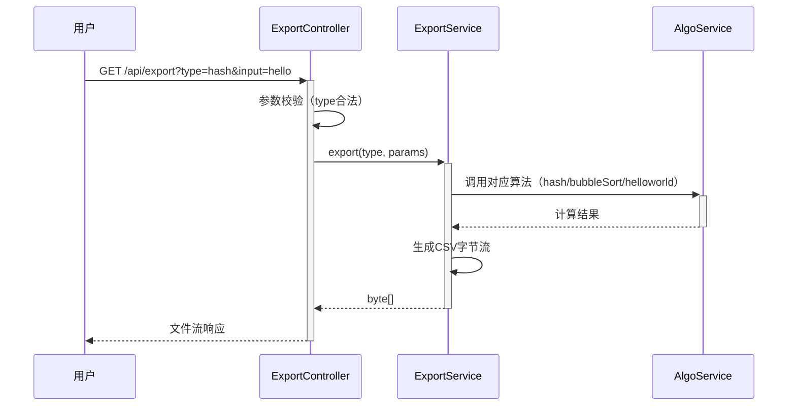
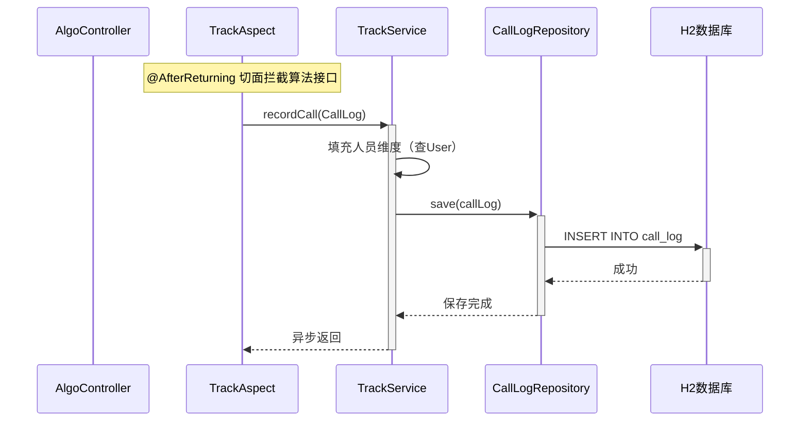
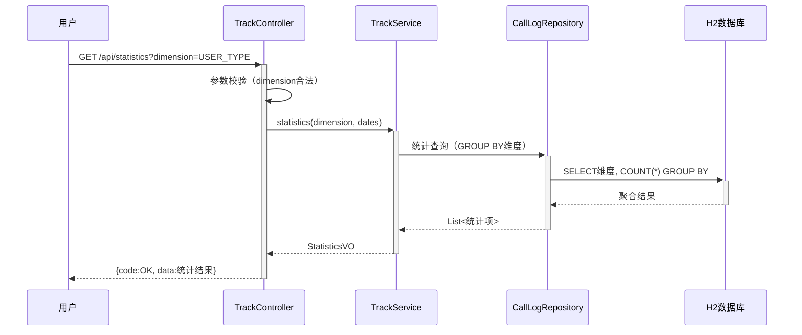

> **文档元信息**
>
> | 项目 | 内容 |
> |------|------|
> | 文档版本 | v1.0 |
> | 作者 | DTCoder |
> | 创建日期 | 2026-07-31 |
> | 需求来源 | hello world-1.0T2重跑 需求描述 |
> | 评审状态 | 待评审 |

# HelloWorld 接口与埋点可视化 系分设计

## 1. 需求与范围

- **背景与目标**：作为 hello world-1.0T2 重跑任务，构建一套前后端联动的演示系统。后端提供三个基础算法接口（helloworld、哈希算法、冒泡排序），前端以多 Tab 页面展示执行结果；同时实现导出功能和接口调用埋点，并在前端以多种图表形式可视化调用统计情况，验证从接口开发到数据埋点、可视化展示的端到端工程能力。
- **核心功能**：
  1. 后端三个算法接口：helloworld 返回固定字符串、哈希算法对输入字符串计算哈希值、冒泡排序对输入数组排序
  2. 前端新增页面，三个 Tab 分别展示三个接口的执行结果
  3. 导出功能：前端导出按钮触发后端导出接口，支持导出各 Tab 页面的展示结果
  4. 后端埋点：记录每个接口的调用次数和调用人，含人员维度信息（类型/层级/部门）
  5. 前端可视化报表：按人员类型、人员层级、人员部门等维度展示调用情况，支持折线图、饼图、柱状图三种展示形式
- **约束与非功能要求**：
  - 后端复用 ranxitest 现有 Spring Boot 2.6.6 + JPA + H2 技术栈，不引入新的基础设施
  - 前端从零搭建于 library-frontend 空仓，技术栈选型 Vue3 + Vite + ECharts
  - 埋点采集不得阻塞主业务流程，采用异步方式记录
  - 接口响应时间 < 200ms（算法本身为纯内存计算）
  - CORS 跨域配置允许前端开发环境访问
- **排除范围**：
  - 不涉及用户认证/登录系统（埋点中的"调用人"通过请求参数传入，假设前端已登录态）
  - 不涉及 library-backend 仓库（该仓为空仓，本次后端开发全部落在 ranxitest）
  - 不涉及 cloud / dtazzi-cline 仓库
  - 不涉及生产环境部署方案（使用 H2 内存数据库，面向演示场景）

### 需求功能清单与优先级

| 编号 | 功能点 | 优先级 | PRD 原始描述/章节 | 备注 |
|------|--------|--------|-------------------|------|
| F01 | helloworld 接口 | P0 | "分别写三个接口helloworld" | 返回固定字符串 "Hello World" |
| F02 | 哈希算法接口 | P0 | "哈希算法" | 输入字符串返回 SHA-256 哈希值 |
| F03 | 冒泡排序接口 | P0 | "冒泡排序" | 输入整数数组返回升序排序结果 |
| F04 | 前端三 Tab 展示页面 | P0 | "前端新增一个页面，有三个tab分别展示不同的执行结果" | 每个 Tab 调用对应接口并展示结果 |
| F05 | 导出功能 | P1 | "新增导出按钮，后台提供导出接口，支持导出各个页面的展示结果" | 后端生成文件流，前端触发下载 |
| F06 | 后端埋点 | P1 | "后端再做个埋点，获取调用次数和调用人" | AOP 切面异步记录调用日志 |
| F07 | 前端可视化报表 | P1 | "前端在当前页面上可视化出来一个报表查看调用情况" | 折线图+饼图+柱状图 |
| F08 | 多维度统计查询 | P1 | "根据不同的维度：人员类型、人员层级、人员部门等" | 后端统计接口支持维度参数 |

### 假设与待确认项

| 编号 | 假设/待确认内容 | 当前假设 | 确认状态 |
|------|-----------------|----------|----------|
| A01 | 前端技术栈选型 | 假设使用 Vue3 + Vite + ECharts + Axios，理由：library-frontend 为空仓需从零搭建，Vue3 + ECharts 是数科前端常见可视化技术栈 | 待确认 |
| A02 | "调用人"身份获取方式 | 假设通过请求参数 `userId` 传入（无独立认证系统），后端据其查询 User 实体获取人员维度信息 | 待确认 |
| A03 | 哈希算法具体类型 | 假设使用 SHA-256，理由：业界通用安全哈希标准 | 待确认 |
| A04 | 导出文件格式 | 假设导出为 CSV 格式，理由：轻量通用、无需额外依赖 | 待确认 |
| A05 | User 实体是否已有人员维度字段 | 现有 User 实体无 userType/userLevel/department 字段，假设本次新增这三个字段 | 待确认 |
| A06 | 前后端是否同源部署 | 假设开发期前后端分离部署（前端 Vite dev server + 后端 8080），需配置 CORS | 待确认 |

## 2. 架构与模块

### 功能架构



- 交互层说明：Web 控制台提供 RESTful API（/api 前缀），前端通过 HTTP 调用
- 核心服务层说明：
  - 算法服务模块：三个独立算法接口，纯内存计算无状态
  - 导出服务模块：根据类型参数生成对应结果文件流
  - 埋点服务模块：AOP 切面拦截算法接口调用，异步写入调用日志；提供多维度统计查询
- 扩展/集成层说明：前端展示模块位于 library-frontend 独立仓库，通过 REST API 与后端交互

**模块清单**

| 模块 | 职责 | 依赖 |
|------|------|------|
| 算法服务模块 | 提供 helloworld、哈希计算、冒泡排序三个 REST 接口 | 埋点服务模块（AOP 拦截） |
| 导出服务模块 | 根据类型参数生成对应算法结果的 CSV 文件流 | 算法服务模块（复用算法逻辑） |
| 埋点服务模块 | AOP 切面采集接口调用日志，提供多维度统计查询 | User 实体（人员维度） |
| 前端展示模块 | 三 Tab 页面展示执行结果，可视化报表展示调用统计 | 算法服务模块、导出服务模块、埋点服务模块 |

### 应用集成架构



**集成关系说明：**

| 调用方 | 被调用方 | 协议 | 接口类型 | 说明 |
|--------|----------|------|----------|------|
| 用户浏览器 | library-frontend Vue 应用 | HTTPS | Web 页面 | 用户访问前端页面 |
| library-frontend | ranxitest REST Controller | HTTP | oneapi REST | Axios 调用后端 API，需 CORS |
| ranxitest 埋点 AOP | ranxitest 埋点 Service | JVM | 内部方法 | AOP 切面异步调用 |
| ranxitest Service | H2 数据库 | JDBC | SQL/JPA | 数据持久化 |

### 部署架构



**部署说明：**
- **开发环境层**：前端 Vite Dev Server（默认 5173 端口），后端 Spring Boot（8080 端口），开发期通过 CORS 或 Vite proxy 解决跨域
- **数据层**：H2 内存数据库，应用重启数据清空（演示场景适用）

## 3. 数据模型与存储

### 实体清单

| 实体名称 | 实体说明 | 所属模块 | 与其他实体的关系 |
|----------|----------|----------|-----------------|
| User | 用户实体（已存在，本次扩展） | 埋点服务模块 | 一对多关联 CallLog（一个用户多次调用） |
| CallLog | 接口调用日志实体（新增） | 埋点服务模块 | 多对一关联 User（多条日志属一个用户） |

### 实体关系图


**模型说明：**
- User 与 CallLog 为一对多关系：一个用户可产生多条接口调用日志
- CallLog 中冗余存储人员维度字段（userType/userLevel/department），避免统计查询时频繁 JOIN User 表
- 调用人通过请求参数 userId 传入，后端据此加载 User 实体获取维度信息写入 CallLog

## 4. 接口设计

### 4.1 oneapi（Web 控制台接口）

| 编号 | 接口名称 | 方法 | 路径 | 模块 |
|------|----------|------|------|------|
| W01 | helloworld 接口 | GET | /api/helloworld | 算法服务模块 |
| W02 | 哈希算法接口 | POST | /api/hash | 算法服务模块 |
| W03 | 冒泡排序接口 | POST | /api/bubble-sort | 算法服务模块 |
| W04 | 导出接口 | GET | /api/export | 导出服务模块 |
| W05 | 埋点统计查询接口 | GET | /api/statistics | 埋点服务模块 |

### 4.2 OpenAPI（对外接口）

本需求无对外 OpenAPI 接口。

### 4.3 内部接口（Service 层）

| 编号 | 接口名称 | 类 | 方法签名 |
|------|----------|------|----------|
| S01 | helloworld 计算 | AlgoService | `String helloworld()` |
| S02 | 哈希计算 | AlgoService | `String hash(String input)` |
| S03 | 冒泡排序 | AlgoService | `int[] bubbleSort(int[] arr)` |
| S04 | 导出结果生成 | ExportService | `byte[] export(String type)` |
| S05 | 记录调用日志 | TrackService | `void recordCall(CallLog log)` |
| S06 | 多维度统计查询 | TrackService | `StatisticsVO statistics(String dimension, String startDate, String endDate)` |

### 4.4 集成接口（Integration 层）

本需求无外部系统集成接口。

## 5. 功能模块设计

### 5.1 算法服务模块

#### 5.1.1 表结构设计

本模块为纯计算模块，不涉及新增数据表。helloworld 返回固定字符串、哈希计算使用 JDK 内置 MessageDigest、冒泡排序为纯内存数组操作。

##### 5.1.1.x 枚举与常量定义

| 枚举名称 | 取值 | 含义 | 关联字段 |
|----------|------|------|----------|
| ApiName | HELLOWORLD | helloworld 接口 | call_log.api_name |
| ApiName | HASH | 哈希算法接口 | call_log.api_name |
| ApiName | BUBBLE_SORT | 冒泡排序接口 | call_log.api_name |

#### 5.1.2 接口详细设计

##### W01 helloworld 接口

- **URI**: GET /api/helloworld
- **描述**: 返回固定字符串 "Hello World"，用于验证基础接口连通性
- **入参**:

| 参数名称 | 类型 | 是否必填 | 描述 |
|----------|------|----------|------|
| userId | Long | 是 | 调用人ID（用于埋点） |

- **出参**:

| 参数名称 | 类型 | 描述 |
|----------|------|------|
| code | String | 结果code，OK 表示成功 |
| msg | String | 提示信息 |
| data | String | "Hello World" |

- **错误码**:

| 错误码 | 说明 |
|--------|------|
| ALGO_001 | 用户不存在 |
| ALGO_002 | userId 不能为空 |

- **业务规则**: userId 非空校验；查 User 实体获取人员维度供埋点使用

- **请求示例**:
```
GET /api/helloworld?userId=1
```

- **响应示例**:
```json
{
  "code": "OK",
  "msg": "SUCCESS",
  "data": "Hello World"
}
```

##### W02 哈希算法接口

- **URI**: POST /api/hash
- **描述**: 对输入字符串计算 SHA-256 哈希值并返回
- **入参**:

| 参数名称 | 类型 | 是否必填 | 描述 |
|----------|------|----------|------|
| input | String | 是 | 待哈希的原始字符串 |
| userId | Long | 是 | 调用人ID（用于埋点） |

- **出参**:

| 参数名称 | 类型 | 描述 |
|----------|------|------|
| code | String | 结果code |
| msg | String | 提示信息 |
| data | String | SHA-256 哈希值（64位十六进制字符串） |

- **错误码**:

| 错误码 | 说明 |
|--------|------|
| ALGO_002 | userId 不能为空 |
| ALGO_003 | input 不能为空 |
| ALGO_004 | 哈希计算异常 |

- **业务规则**: input 非空校验；使用 SHA-256 算法；结果转为小写十六进制字符串

- **请求示例**:
```json
{
  "input": "hello",
  "userId": 1
}
```

- **响应示例**:
```json
{
  "code": "OK",
  "msg": "SUCCESS",
  "data": "2cf24dba5fb0a30e26e83b2ac5b9e29e1b161e5c1fa7425e73043362938b9824"
}
```

##### W03 冒泡排序接口

- **URI**: POST /api/bubble-sort
- **描述**: 对输入整数数组执行冒泡排序，返回升序排列结果
- **入参**:

| 参数名称 | 类型 | 是否必填 | 描述 |
|----------|------|----------|------|
| arr | int[] | 是 | 待排序整数数组 |
| userId | Long | 是 | 调用人ID（用于埋点） |

- **出参**:

| 参数名称 | 类型 | 描述 |
|----------|------|------|
| code | String | 结果code |
| msg | String | 提示信息 |
| data | int[] | 升序排序后的数组 |

- **错误码**:

| 错误码 | 说明 |
|--------|------|
| ALGO_002 | userId 不能为空 |
| ALGO_005 | 数组不能为空 |
| ALGO_006 | 数组长度超过限制（最大1000） |

- **业务规则**: arr 非空且长度 ≤ 1000；实现标准冒泡排序算法（非 Arrays.sort）；返回升序数组

- **请求示例**:
```json
{
  "arr": [5, 3, 8, 1, 9, 2],
  "userId": 1
}
```

- **响应示例**:
```json
{
  "code": "OK",
  "msg": "SUCCESS",
  "data": [1, 2, 3, 5, 8, 9]
}
```

#### 5.1.3 子功能详细设计

##### 5.1.3.1 helloworld 执行（F01）

- 处理时序图


**业务规则：**
| 规则编号 | 规则描述 | 校验时机 | 不满足时的处理 |
|----------|----------|----------|--------------|
| R01 | userId 非空 | 调用时 | 返回错误码 ALGO_002，提示"userId不能为空" |
| R02 | userId 对应 User 存在 | 调用时 | 返回错误码 ALGO_001，提示"用户不存在" |

**异常场景：**
| 异常场景 | 处理方式 |
|----------|----------|
| 埋点异步写入失败 | 仅记录日志告警，不影响主流程返回（埋点降级） |

##### 5.1.3.2 哈希计算（F02）

- 处理时序图


**业务规则：**
| 规则编号 | 规则描述 | 校验时机 | 不满足时的处理 |
|----------|----------|----------|--------------|
| R03 | input 非空 | 调用时 | 返回错误码 ALGO_003，提示"input不能为空" |
| R04 | SHA-256 实例化成功 | 调用时 | 捕获 NoSuchAlgorithmException，返回 ALGO_004 |

**异常场景：**
| 异常场景 | 处理方式 |
|----------|----------|
| MessageDigest 异常 | 返回 ALGO_004，提示"哈希计算异常" |

##### 5.1.3.3 冒泡排序（F03）

- 处理时序图


**业务规则：**
| 规则编号 | 规则描述 | 校验时机 | 不满足时的处理 |
|----------|----------|----------|--------------|
| R05 | arr 非空 | 调用时 | 返回错误码 ALGO_005，提示"数组不能为空" |
| R06 | arr.length ≤ 1000 | 调用时 | 返回错误码 ALGO_006，提示"数组长度超过限制" |
| R07 | 使用冒泡排序算法（非 Arrays.sort） | 实现时 | 代码审查约束 |

### 5.2 导出服务模块

#### 5.2.1 表结构设计

本模块不涉及新增数据表，导出结果由算法服务模块实时计算生成。

#### 5.2.2 接口详细设计

##### W04 导出接口

- **URI**: GET /api/export
- **描述**: 根据类型参数导出对应算法接口的执行结果为 CSV 文件
- **入参**:

| 参数名称 | 类型 | 是否必填 | 描述 |
|----------|------|----------|------|
| type | String | 是 | 导出类型：helloworld / hash / bubble-sort |
| input | String | 否 | 哈希算法的输入字符串（type=hash 时必填） |
| arr | String | 否 | 冒泡排序的输入数组（type=bubble-sort 时必填，逗号分隔） |

- **出参**: `application/octet-stream` 文件流（CSV 文件）

- **错误码**:

| 错误码 | 说明 |
|--------|------|
| EXPORT_001 | type 参数不合法 |
| EXPORT_002 | 导出类型缺少必要参数 |
| EXPORT_003 | 导出生成失败 |

- **业务规则**: type 必须为 helloworld/hash/bubble-sort 之一；根据 type 复用对应算法逻辑计算结果；生成 CSV 格式文件流

- **请求示例**:
```
GET /api/export?type=hash&input=hello
```

- **响应示例**:
```
Content-Type: application/octet-stream
Content-Disposition: attachment; filename="hash_export.csv"

result
2cf24dba5fb0a30e26e83b2ac5b9e29e1b161e5c1fa7425e73043362938b9824
```

#### 5.2.3 子功能详细设计

##### 5.2.3.1 导出结果生成（F05）

- 处理时序图


**业务规则：**
| 规则编号 | 规则描述 | 校验时机 | 不满足时的处理 |
|----------|----------|----------|--------------|
| R08 | type ∈ {helloworld, hash, bubble-sort} | 调用时 | 返回错误码 EXPORT_001 |
| R09 | type=hash 时 input 必填 | 调用时 | 返回错误码 EXPORT_002 |
| R10 | type=bubble-sort 时 arr 必填 | 调用时 | 返回错误码 EXPORT_002 |

**异常场景：**
| 异常场景 | 处理方式 |
|----------|----------|
| CSV 生成 IO 异常 | 返回 EXPORT_003，提示"导出生成失败" |

### 5.3 埋点服务模块

#### 5.3.1 表结构设计

##### 5.3.1.1 call_log（接口调用日志表）

| 字段名 | 数据类型 | 约束 | 默认值 | 说明 |
|--------|----------|------|--------|------|
| id | bigint | PK, 自增 | - | 系统自增主键 |
| api_name | varchar(32) | NOT NULL | - | 接口名称（HELLOWORLD/HASH/BUBBLE_SORT） |
| user_id | bigint | NOT NULL | - | 调用人ID |
| user_name | varchar(50) | NOT NULL | - | 调用人用户名（冗余） |
| user_type | varchar(32) | - | - | 人员类型 |
| user_level | varchar(32) | - | - | 人员层级 |
| department | varchar(64) | - | - | 人员部门 |
| call_time | datetime | NOT NULL | CURRENT_TIMESTAMP | 调用时间 |
| duration | bigint | - | - | 调用耗时（毫秒） |
| result | varchar(16) | - | - | 调用结果（SUCCESS/FAIL） |
| gmt_create | datetime | NOT NULL | CURRENT_TIMESTAMP | 创建时间 |

**索引：**
- IDX: `idx_call_log_api_name` (api_name) — 按接口统计查询
- IDX: `idx_call_log_user_id` (user_id) — 按调用人查询
- IDX: `idx_call_log_call_time` (call_time) — 按时间趋势查询
- IDX: `idx_call_log_user_type` (user_type) — 按人员类型统计
- IDX: `idx_call_log_department` (department) — 按部门统计

##### 5.3.1.2 users 表扩展字段

在现有 users 表新增以下字段（通过 JPA ddl-auto=update 自动加列）：

| 字段名 | 数据类型 | 约束 | 默认值 | 说明 |
|--------|----------|------|--------|------|
| user_type | varchar(32) | - | - | 人员类型（如：开发/测试/产品） |
| user_level | varchar(32) | - | - | 人员层级（如：初级/中级/高级） |
| department | varchar(64) | - | - | 人员部门 |

##### 5.3.1.x 枚举与常量定义

| 枚举名称 | 取值 | 含义 | 关联字段 |
|----------|------|------|----------|
| CallResult | SUCCESS | 调用成功 | call_log.result |
| CallResult | FAIL | 调用失败 | call_log.result |
| Dimension | USER_TYPE | 按人员类型统计 | 统计查询参数 |
| Dimension | USER_LEVEL | 按人员层级统计 | 统计查询参数 |
| Dimension | DEPARTMENT | 按人员部门统计 | 统计查询参数 |
| Dimension | API_NAME | 按接口名称统计 | 统计查询参数 |

#### 5.3.2 接口详细设计

##### W05 埋点统计查询接口

- **URI**: GET /api/statistics
- **描述**: 按指定维度查询接口调用统计数据，供前端报表展示
- **入参**:

| 参数名称 | 类型 | 是否必填 | 描述 |
|----------|------|----------|------|
| dimension | String | 是 | 统计维度：USER_TYPE / USER_LEVEL / DEPARTMENT / API_NAME |
| startDate | String | 否 | 查询开始日期（yyyy-MM-dd） |
| endDate | String | 否 | 查询结束日期（yyyy-MM-dd） |
| chartType | String | 否 | 图表类型提示：LINE / PIE / BAR（后端按维度返回适配数据结构） |

- **出参**:

| 参数名称 | 类型 | 描述 |
|----------|------|------|
| code | String | 结果code |
| msg | String | 提示信息 |
| data | Object | 统计数据 |
| data.dimension | String | 统计维度 |
| data.items | Array | 统计项列表 |
| data.items[].label | String | 维度标签（如"开发"） |
| data.items[].count | Long | 调用次数 |
| data.items[].trend | Array | 时间趋势（折线图用，每项含 date + count） |

- **错误码**:

| 错误码 | 说明 |
|--------|------|
| TRACK_001 | dimension 参数不合法 |
| TRACK_002 | 日期格式错误 |

- **业务规则**: dimension 必须为枚举值之一；startDate ≤ endDate；按维度 GROUP BY 聚合调用次数

- **请求示例**:
```
GET /api/statistics?dimension=USER_TYPE&startDate=2026-07-01&endDate=2026-07-31&chartType=PIE
```

- **响应示例**:
```json
{
  "code": "OK",
  "msg": "SUCCESS",
  "data": {
    "dimension": "USER_TYPE",
    "items": [
      {"label": "开发", "count": 150},
      {"label": "测试", "count": 80},
      {"label": "产品", "count": 30}
    ]
  }
}
```

#### 5.3.3 子功能详细设计

##### 5.3.3.1 接口调用埋点记录（F06）

- 处理时序图


**业务规则：**
| 规则编号 | 规则描述 | 校验时机 | 不满足时的处理 |
|----------|----------|----------|--------------|
| R11 | 埋点异步执行，不阻塞主流程 | 始终 | 异常仅记日志，不影响接口返回 |
| R12 | 人员维度字段从 User 实体获取 | 记录时 | User 不存在则维度字段置空 |
| R13 | 冗余存储人员维度到 CallLog | 记录时 | 避免统计查询 JOIN |

**异常场景：**
| 异常场景 | 处理方式 |
|----------|----------|
| 埋点写入数据库失败 | 记录 ERROR 日志，主流程不受影响（降级） |
| User 实体不存在 | 维度字段置 null，仍记录调用日志 |

**并发控制：**
- 并发场景：多用户并发调用算法接口，同时触发埋点写入
- 控制策略：无并发风险，原因：call_log 为纯新增插入（INSERT），无更新冲突；H2 内存数据库单机写入

##### 5.3.3.2 多维度统计查询（F08）

- 处理时序图


**业务规则：**
| 规则编号 | 规则描述 | 校验时机 | 不满足时的处理 |
|----------|----------|----------|--------------|
| R14 | dimension ∈ 枚举值 | 查询时 | 返回 TRACK_001 |
| R15 | startDate ≤ endDate | 查询时 | 返回 TRACK_002 |
| R16 | 折线图（LINE）返回时间趋势数据 | 查询时 | 额外按日期 GROUP BY |
| R17 | 饼图（PIE）/柱状图（BAR）返回维度聚合数据 | 查询时 | 按维度 GROUP BY |

### 5.4 前端展示模块（library-frontend）

#### 5.4.1 表结构设计

本模块为前端，不涉及数据库表。

#### 5.4.2 接口调用设计

前端通过 Axios 调用后端接口：

| 前端动作 | 调用接口 | 方法 |
|----------|----------|------|
| HelloWorld Tab 加载 | /api/helloworld?userId={id} | GET |
| 哈希算法 Tab 提交 | /api/hash | POST |
| 冒泡排序 Tab 提交 | /api/bubble-sort | POST |
| 导出按钮点击 | /api/export?type={type} | GET（文件下载） |
| 报表数据加载 | /api/statistics?dimension={dim} | GET |

#### 5.4.3 子功能详细设计

##### 5.4.3.1 三 Tab 展示页面（F04）

- 页面结构：
  - Tab 1「HelloWorld」：加载即调用 /api/helloworld，展示返回字符串
  - Tab 2「哈希算法」：输入框 + 提交按钮，调用 /api/hash，展示哈希结果
  - Tab 3「冒泡排序」：数组输入框 + 提交按钮，调用 /api/bubble-sort，展示排序结果
- 技术实现：Vue3 `<script setup>` + Element Plus Tabs 组件（或原生 Tab 实现）

##### 5.4.3.2 导出按钮（F05）

- 每个 Tab 页面配置导出按钮，点击触发 `window.open('/api/export?type=xxx')` 或 Axios blob 下载
- 导出类型与当前 Tab 对应

##### 5.4.3.3 可视化报表（F07）

- 页面布局：报表区域与 Tab 展示区域并列或独立路由
- 图表配置：
  - **折线图**：X 轴日期、Y 轴调用次数，按时间趋势展示（dimension=API_NAME，chartType=LINE）
  - **饼图**：按维度占比展示（dimension=USER_TYPE，chartType=PIE）
  - **柱状图**：按维度调用次数对比展示（dimension=DEPARTMENT，chartType=BAR）
- 维度切换：下拉选择器切换统计维度，触发重新查询
- 技术实现：ECharts 5.x，Vue3 组件封装

## 6. 非功能性需求设计

### 6.1 高可用性
- 算法接口为纯内存计算，无外部依赖，单点故障风险低
- 埋点采用异步方式，数据库写入失败不影响主接口返回（自动降级）
- H2 内存数据库重启数据清空，适用于演示场景；生产环境需替换为 MySQL 等持久化数据库

### 6.2 可扩展性
- 算法服务模块接口独立，新增算法仅需新增 Controller 方法 + Service 方法
- 埋点 AOP 切面基于注解拦截，新增接口仅需加注解即可自动埋点
- 统计查询维度通过枚举扩展，新增维度仅需加枚举值 + 调整 GROUP BY 字段
- 前端 Tab 结构可扩展，新增 Tab 即新增展示页

### 6.3 稳定性/可靠性
- 冒泡排序限制数组长度 ≤ 1000，防止 O(n²) 算法在超大输入下超时
- 哈希计算使用 JDK 标准 MessageDigest，稳定性有保障
- 埋点异步写入通过 `@Async` + 线程池执行，避免数据库慢查询拖慢主流程

### 6.4 安全性设计

#### 6.4.1 账户系统方案
- 本需求不涉及独立认证系统（假设：A02）。调用人通过请求参数 userId 传入，后端据此查询 User 实体
- 如需生产部署，应接入统一认证（antbuservice/buc/IAM），userId 从登录态获取而非参数传入

#### 6.4.2 授权&访问控制

##### 6.4.2.1 是否实现水平权限检查
- 不涉及数据库查询或为公共数据查询。算法接口为公共计算服务，无资源归属权限

##### 6.4.2.2 是否实现垂直权限检查
- 不涉及数据库查询或为公共数据查询。演示场景，所有用户可调用所有算法接口
- 统计查询接口在生产环境应限制为管理员角色

##### 6.4.2.3 是否检查登录态
- 演示场景未强制检查登录态，userId 通过参数传入
- 生产环境应通过全局拦截器检查登录态

#### 6.4.3 数据防护方案

##### 6.4.3.1 是否对敏感数据加密存储
- 不涉及敏感数据加密存储。CallLog 中的人员维度信息（类型/层级/部门）为非敏感业务数据

##### 6.4.3.2 是否对敏感数据展示进行脱敏
- 统计报表仅展示聚合数据（调用次数），不展示个人明细，无需脱敏
- 如展示调用人列表，应对 username/phone 等脱敏

### 6.5 监控/统计/日志/告警
- 算法接口调用耗时监控：埋点记录 duration 字段
- 埋点写入失败告警：ERROR 级别日志记录
- 接口异常监控：GlobalExceptionHandler 统一捕获并记录
- 统计数据准确性：CallLog 表为唯一数据源，按维度 GROUP BY 聚合

## 7. 变更三板斧

### 7.1 可监控
- 算法接口埋点：通过 AOP 切面记录每次调用的接口名、调用人、耗时、结果，写入 call_log 表
- 埋点写入本身的可观测性：埋点失败时记录 ERROR 日志，可通过日志告警发现埋点异常
- 统计查询接口耗时：可扩展 AOP 覆盖统计接口（当前版本仅算法接口埋点，统计接口为查询不埋点）

### 7.2 可灰度
- 本需求为演示性质新增功能，不涉及灰度发布需求
- 如需灰度：算法接口可通过请求头/用户ID尾号灰度路由新旧逻辑；前端页面可通过路由开关控制是否展示报表区域
- 不可灰度原因（如适用）：H2 内存数据库无灰度数据隔离能力，演示场景全量发布

### 7.3 可应急
- 算法接口开关：通过配置项 `algo.enabled=false` 可快速关闭算法接口返回降级提示
- 埋点开关：通过配置项 `track.enabled=false` 可关闭埋点 AOP 切面，消除埋点对主流程影响
- 前端报表开关：前端可通过配置项控制报表区域是否渲染，后端统计接口异常时前端展示空状态
- 回滚方案：本次为纯新增功能（新增 Controller/Service/Entity/前端页面），回滚仅需移除新增代码，无数据库 schema 不可逆变更（users 表新增字段为 nullable，移除不影响现有逻辑）

---

## 附：Step 9 方案检查 Checklist

| 序号 | 检查项 | 结果 | 说明 |
|------|--------|------|------|
| 1 | 模块划分合理性检查 | 通过 | 算法/导出/埋点/前端四模块职责单一、接口清晰 |
| 2 | 接口路径命名规范检查 | 通过 | 统一 /api 前缀，RESTful 风格，小写连字符 |
| 3 | 通用出参结构一致性检查 | 通过 | 全部使用 {code, msg, data} 结构 |
| 4 | 错误码命名规范检查 | 通过 | {MODULE}_{SEQ} 格式：ALGO/EXPORT/TRACK 前缀 |
| 5 | 数据模型完整性检查 | 通过 | CallLog 含全部埋点维度字段，冗余存储避免 JOIN |
| 6 | 索引设计合理性检查 | 通过 | 按统计维度和查询条件建立索引 |
| 7 | 时序图完整性检查 | 通过 | 核心子功能均有 Mermaid 时序图 |
| 8 | 业务规则完整性检查 | 通过 | 每个子功能有业务规则表 |
| 9 | 异常场景覆盖检查 | 通过 | 含异常场景表及处理方式 |
| 10 | 并发控制检查 | 通过 | CallLog 纯 INSERT 无并发冲突 |
| 11 | 枚举定义检查 | 通过 | ApiName/CallResult/Dimension 枚举已定义 |
| 12 | 非功能性需求覆盖检查 | 通过 | 含高可用/扩展/稳定/安全/监控五节 |
| 13 | 变更三板斧检查 | 通过 | 可监控/可灰度/可应急三节齐全 |
| 14 | 跨库接口契约检查 | 通过 | 前后端 REST 契约明确，CORS 配置 |
| 15 | 假设与待确认项检查 | 通过 | A01-A06 已列出并标注待确认 |
| 16 | 需求追溯矩阵检查 | 通过 | F01-F08 均有 PRD 原始描述对应 |
| 17 | 产物路径检查 | 通过 | 设计文档写入 ranxitest worktree 下 .agents 目录 |
| 18 | 安全性设计检查 | 通过 | 含账户/权限/数据防护方案 |
| 19 | 状态机设计检查 | 不适用 | 本需求无状态流转实体 |
