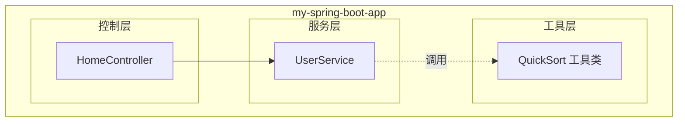
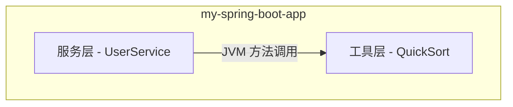
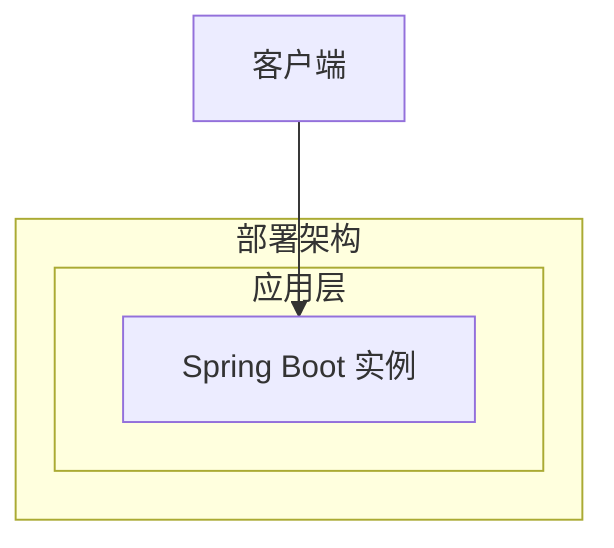

# Step 2: 架构与模块划分

## 功能架构
快速排序算法作为纯工具类，归属到项目现有 `com.example.myapp` 包结构下的工具层，无独立模块拆分需求。

**模块清单**

| 模块 | 职责 | 依赖 |
|------|------|------|
| QuickSort 工具类 | 提供快速排序算法实现，含 int[] 排序、泛型排序、自定义比较器排序 | 无外部依赖，仅依赖 JDK |
| UserService（已有） | 现有业务逻辑，可选调用 QuickSort | QuickSort |

## 应用集成架构
本需求为纯算法工具类，无外部系统集成、无网络调用、无数据库交互。

**集成关系说明：**

| 调用方 | 被调用方 | 协议 | 接口类型 | 说明 |
|--------|----------|------|----------|------|
| UserService | QuickSort | JVM 方法调用 | 静态方法 | 业务层按需调用排序工具类 |

## 部署架构
QuickSort 为纯工具类，随应用一起部署，无独立部署需求。部署架构沿用现有 Spring Boot 应用部署方式。

**部署说明：**
- 无独立部署需求，QuickSort 作为静态工具类随应用打包部署
- 无单点风险，工具类为无状态方法