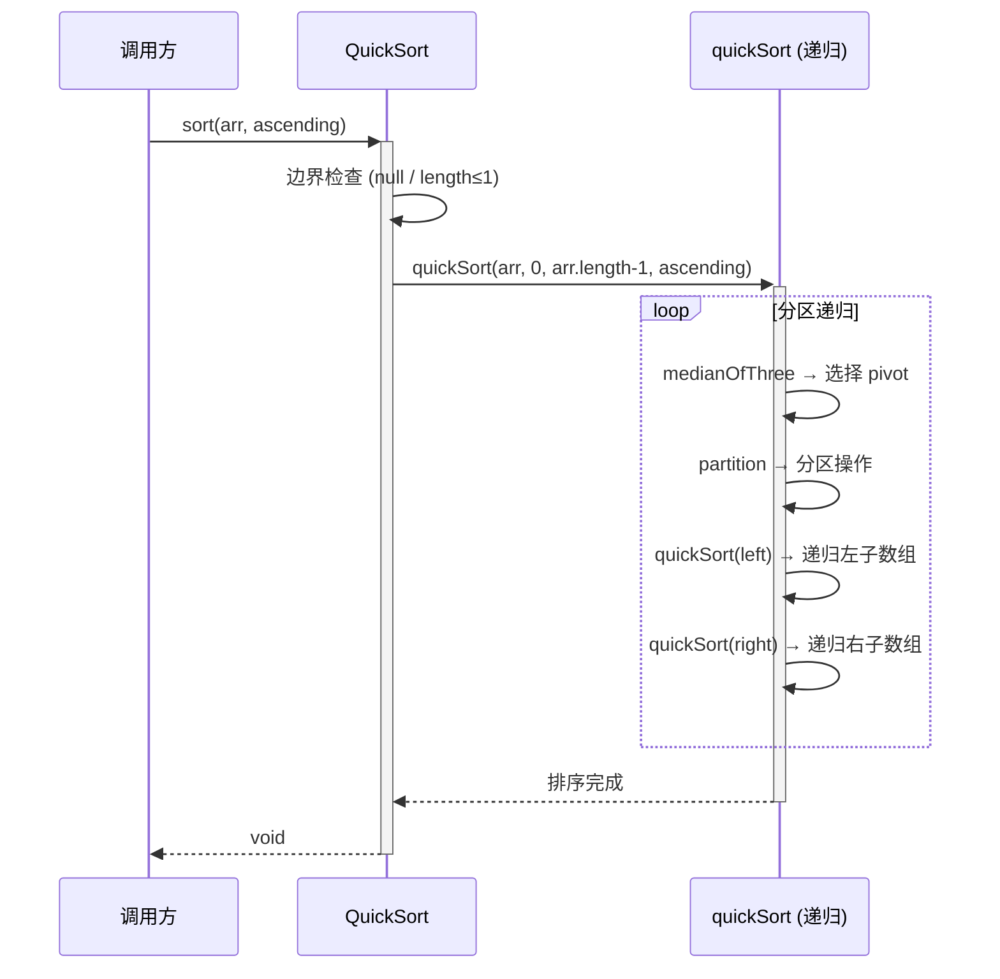

# Step 5: 功能模块设计 — QuickSort

## 5.1 QuickSort 工具类

### 5.1.1 表结构设计
本项不适用，原因：QuickSort 为纯算法工具类，不涉及数据库表。

### 5.1.1.x 枚举与常量定义

| 枚举名称 | 取值 | 含义 | 关联字段 |
|----------|------|------|----------|
| 本模块无枚举/常量定义 | — | — | — |

### 5.1.2 接口详细设计

#### S01 — 整数数组升序排序

- **方法签名**: `public static void sort(int[] arr)`
- **描述**: 对整数数组进行原地升序快速排序
- **入参**:

| 参数名称 | 类型 | 是否必填 | 描述 |
|----------|------|----------|------|
| arr | int[] | 是 | 待排序的整数数组，原地修改 |

- **出参**: void，数组原地排序
- **错误码**: 无（空数组和 null 安全处理，不抛异常）
- **业务规则**:
  - R01: arr 为 null 时，直接返回，不抛异常
  - R02: arr.length ≤ 1 时，直接返回（已有序）
  - R03: 使用三数取中法选择 pivot，避免最坏情况
  - R04: 默认升序排列

#### S02 — 整数数组排序（含方向）

- **方法签名**: `public static void sort(int[] arr, boolean ascending)`
- **描述**: 对整数数组进行原地快速排序，支持升序/降序
- **入参**:

| 参数名称 | 类型 | 是否必填 | 描述 |
|----------|------|----------|------|
| arr | int[] | 是 | 待排序的整数数组，原地修改 |
| ascending | boolean | 是 | true=升序，false=降序 |

- **出参**: void
- **错误码**: 无
- **业务规则**: 同 S01，额外根据 ascending 参数决定比较方向

#### S03 — 泛型数组排序

- **方法签名**: `public static <T extends Comparable<T>> void sort(T[] arr)`
- **描述**: 对实现了 Comparable 接口的泛型数组进行原地升序快速排序
- **入参**:

| 参数名称 | 类型 | 是否必填 | 描述 |
|----------|------|----------|------|
| arr | T[] | 是 | 待排序的泛型数组，元素须实现 Comparable |

- **出参**: void
- **错误码**: 无
- **业务规则**: 同 S01，比较使用 `Comparable.compareTo`

#### S04 — 泛型数组排序（含方向）

- **方法签名**: `public static <T extends Comparable<T>> void sort(T[] arr, boolean ascending)`
- **描述**: 泛型数组原地快速排序，支持升序/降序
- **入参**:

| 参数名称 | 类型 | 是否必填 | 描述 |
|----------|------|----------|------|
| arr | T[] | 是 | 待排序的泛型数组 |
| ascending | boolean | 是 | true=升序，false=降序 |

- **出参**: void

#### S05 — 自定义比较器排序

- **方法签名**: `public static <T> void sort(T[] arr, Comparator<T> comparator)`
- **描述**: 使用自定义比较器对泛型数组进行原地快速排序
- **入参**:

| 参数名称 | 类型 | 是否必填 | 描述 |
|----------|------|----------|------|
| arr | T[] | 是 | 待排序的泛型数组 |
| comparator | Comparator\<T\> | 是 | 自定义比较器 |

- **出参**: void
- **错误码**:

| 错误码 | 说明 |
|--------|------|
| IllegalArgumentException | comparator 为 null 时抛出 |

- **业务规则**:
  - R05: comparator 为 null 时抛出 IllegalArgumentException

### 5.1.3 子功能详细设计

#### 5.1.3.1 快速排序核心算法（F01, F02, F05, F06）

**处理时序图**:

**业务规则**:

| 规则编号 | 规则描述 | 校验时机 | 不满足时的处理 |
|----------|----------|----------|--------------|
| R01 | arr 为 null | 方法入口 | 直接返回，不抛异常 |
| R02 | arr.length ≤ 1 | 方法入口 | 直接返回，无需排序 |
| R03 | 三数取中选 pivot | 每次分区前 | 取 arr[lo]、arr[mid]、arr[hi] 的中位数作为 pivot |
| R04 | 分区操作 | 每次分区 | 双指针扫描，小于 pivot 放左侧，大于等于放右侧 |
| R05 | 递归终止条件 | 每次递归入口 | lo ≥ hi 时返回 |
| R06 | 小数组优化 | 子数组长度 < 10 | 切换为插入排序（可选优化） |

**异常场景**:

| 异常场景 | 处理方式 |
|----------|----------|
| 入参数组为 null | 直接返回，不抛异常 |
| 入参数组长度为 0 | 直接返回 |
| 入参数组长度为 1 | 直接返回（已有序） |
| 所有元素相同 | 分区均匀，O(n log n) 正常完成 |
| 已升序数组 | 三数取中优化避免 O(n²)，正常完成 |
| 已降序数组 | 三数取中优化避免 O(n²)，正常完成 |
| Comparator 为 null（S05） | 抛出 IllegalArgumentException |

**并发控制**:
- 并发场景：无，QuickSort 为无状态静态方法，每次调用操作独立数组
- 控制策略：无并发风险，原因：静态方法无共享可变状态，每次调用传入独立数组引用

**状态机设计**:
本模块无状态字段，不适用。

**技术选型方案对比**:

| 维度 | 方案A：经典快速排序（固定 pivot） | 方案B：三数取中快速排序 | 方案C：JDK Arrays.sort (Dual-Pivot) |
|------|------|------|------|
| 最坏时间复杂度 | O(n²)（已排序数组） | O(n²)（理论，实际极难触发） | O(n log n) |
| 平均时间复杂度 | O(n log n) | O(n log n) | O(n log n) |
| 实现复杂度 | 低 | 中 | 高（双轴分区） |
| 空间复杂度 | O(log n) | O(log n) | O(log n) |
| 学习/教学价值 | 高 | 高 | 低（现成实现） |
| 推荐 | ❌ | ✅ 推荐 | 备选（直接复用JDK） |

**推荐方案**：方案B — 三数取中快速排序。理由：在保持实现简洁性（贴近快速排序教学本质）的同时，有效避免最坏情况退化，兼顾实用性与可读性。

**模块自检 — 完备性对账表**:

| F编号 | 功能点 | 是否有设计 | 设计位置 |
|-------|--------|-----------|----------|
| F01 | 整数数组升序排序 | ✅ | S01 |
| F02 | 整数数组降序排序 | ✅ | S02 |
| F03 | 泛型数组排序 | ✅ | S03 |
| F04 | 自定义比较器排序 | ✅ | S05 |
| F05 | 三数取中优化 | ✅ | 5.1.3.1 核心算法 |
| F06 | 边界条件处理 | ✅ | 业务规则 R01-R02 + 异常场景表 |

**模块自检 — 过度设计检查**:
- ✅ 无：未引入 Spring 依赖、未引入数据库、未引入缓存、未引入消息队列
- ✅ 无：接口数量合理（5个公开方法覆盖所有场景），无冗余方法