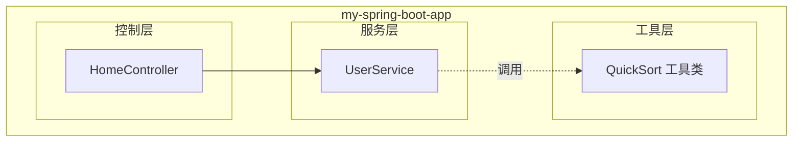
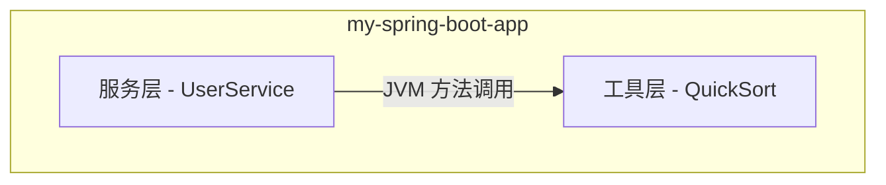
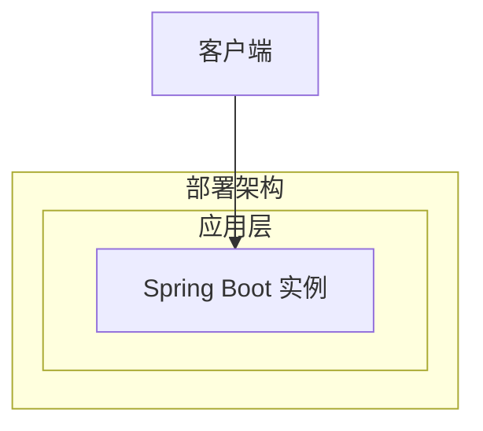
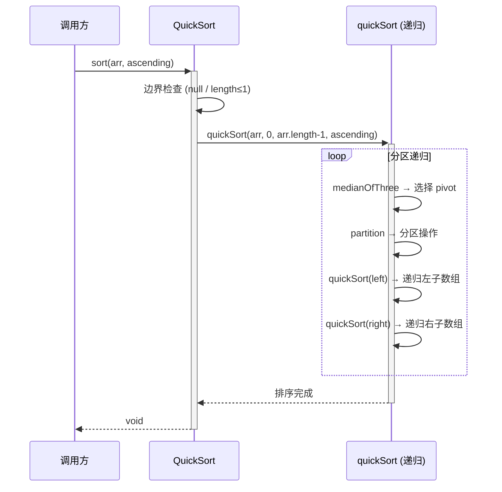

> **文档元信息**
>
> | 项目 | 内容 |
> |------|------|
> | 文档版本 | v1.0 |
> | 作者 | DTCoder |
> | 创建日期 | 2026-08-14 |
> | 需求来源 | 任务：实现一个快速排序算法 |
> | 评审状态 | 待评审 |

# 快速排序算法 系分设计

## 1. 需求与范围

### 背景与目标
在现有 Java Spring Boot 项目（`my-spring-boot-app`）中新增一个快速排序算法工具类，提供高效、通用的数组排序能力。快速排序（QuickSort）是经典的基于分治策略的排序算法，平均时间复杂度 O(n log n)，是实际应用中最常用的排序算法之一。

**目标**：实现一个正确、高效、边界安全的快速排序算法，供项目其他模块调用。

### 核心功能
1. 对整数数组进行快速排序（升序/降序）
2. 支持泛型数组排序（Comparable 对象）
3. 支持自定义比较器（Comparator）

### 约束与非功能要求
- 语言：Java 17
- 框架：Spring Boot 2.6.6（可独立于 Spring 容器使用）
- 算法正确性：所有边界条件（空数组、单元素、已排序、逆序、重复元素）均正确处理
- 时间复杂度：平均 O(n log n)，最坏 O(n²)，通过三数取中优化避免最坏情况
- 空间复杂度：O(log n)（递归栈深度）
- 原地排序，不创建额外数组

### 排除范围
- 不涉及外部排序（大数据量磁盘排序）
- 不涉及多线程并行排序
- 不涉及稳定排序保证（快速排序非稳定排序）
- 不涉及 Spring Bean 注入，仅作为纯工具类提供

### 需求功能清单与优先级

| 编号 | 功能点 | 优先级 | PRD 原始描述/章节 | 备注 |
|------|--------|--------|-------------------|------|
| F01 | 整数数组快速排序（升序） | P0 | 实现一个快速排序算法 | 核心功能 |
| F02 | 整数数组快速排序（降序） | P0 | 实现一个快速排序算法 | 通过参数控制排序方向 |
| F03 | 泛型数组排序（Comparable） | P1 | 实现一个快速排序算法 | 通用性扩展 |
| F04 | 自定义比较器排序 | P1 | 实现一个快速排序算法 | 通用性扩展 |
| F05 | 三数取中优化（避免最坏情况） | P1 | 实现一个快速排序算法 | 性能优化 |
| F06 | 边界条件处理（空数组/单元素/大量重复） | P2 | 实现一个快速排序算法 | 健壮性 |

### 假设与待确认项

| 编号 | 假设/待确认内容 | 当前假设 | 确认状态 |
|------|-----------------|----------|----------|
| A01 | 目标语言 | Java（基于仓库现有技术栈） | 待确认 |
| A02 | 是否需要 Spring Bean 管理 | 否，纯工具类 | 待确认 |
| A03 | 是否需要支持基本类型数组（int[]） | 是，除泛型外单独提供 int[] 重载 | 待确认 |
| A04 | 排序方向控制方式 | 通过 boolean ascending 参数，默认升序 | 待确认 |

---

## 2. 架构与模块

### 功能架构
快速排序算法作为纯工具类，归属到项目现有 `com.example.myapp` 包结构下的工具层，无独立模块拆分需求。

- **交互层说明**：HomeController 处理 HTTP 请求，不直接调用 QuickSort
- **核心服务层说明**：UserService 为现有业务逻辑层，可选调用 QuickSort 进行排序
- **工具层说明**：QuickSort 为纯静态工具类，提供排序能力

**模块清单**

| 模块 | 职责 | 依赖 |
|------|------|------|
| QuickSort 工具类 | 提供快速排序算法实现，含 int[] 排序、泛型排序、自定义比较器排序 | 无外部依赖，仅依赖 JDK |
| UserService（已有） | 现有业务逻辑，可选调用 QuickSort | QuickSort |

### 应用集成架构
本需求为纯算法工具类，无外部系统集成、无网络调用、无数据库交互。

**集成关系说明：**

| 调用方 | 被调用方 | 协议 | 接口类型 | 说明 |
|--------|----------|------|----------|------|
| UserService | QuickSort | JVM 方法调用 | 静态方法 | 业务层按需调用排序工具类 |

### 部署架构
QuickSort 为纯工具类，随应用一起部署，无独立部署需求。部署架构沿用现有 Spring Boot 应用部署方式。

**部署说明：**
- 无独立部署需求，QuickSort 作为静态工具类随应用打包部署
- 无单点风险，工具类为无状态方法

---

## 3. 数据模型与存储

### 实体清单
快速排序算法为纯计算工具，不涉及数据库持久化存储。所有数据均为方法入参的内存数组，无持久化实体。

| 实体名称 | 实体说明 | 所属模块 | 与其他实体的关系 |
|----------|----------|----------|-----------------|
| 本项不适用 | 快速排序为纯算法工具类，无数据库实体 | — | — |

### 实体关系图
本项不适用，原因：快速排序算法不涉及数据持久化，所有操作在内存中完成，无实体关系。

**模型说明：**
- 无持久化模型，所有数据为方法栈上的内存数组

---

## 4. 接口设计

> 快速排序为纯工具类，无 REST API 接口。以下接口为类方法签名级别的内部接口。

### 4.1 oneapi（Web 控制台接口）
本项不适用，原因：快速排序为工具类，不暴露 HTTP 接口。

### 4.2 OpenAPI（对外接口）
本项不适用，原因：快速排序为工具类，不暴露 HTTP 接口。

### 4.3 内部接口（Service 层 / 工具类方法）

| 编号 | 接口名称 | 类 | 方法签名 |
|------|----------|------|----------|
| S01 | 整数数组升序排序 | QuickSort | `public static void sort(int[] arr)` |
| S02 | 整数数组排序（含方向） | QuickSort | `public static void sort(int[] arr, boolean ascending)` |
| S03 | 泛型数组排序 | QuickSort | `public static <T extends Comparable<T>> void sort(T[] arr)` |
| S04 | 泛型数组排序（含方向） | QuickSort | `public static <T extends Comparable<T>> void sort(T[] arr, boolean ascending)` |
| S05 | 自定义比较器排序 | QuickSort | `public static <T> void sort(T[] arr, Comparator<T> comparator)` |

### 4.4 集成接口（Integration 层）
本项不适用，原因：无外部系统集成。

---

## 5. 功能模块设计

### 5.1 QuickSort 工具类

#### 5.1.1 表结构设计
本项不适用，原因：QuickSort 为纯算法工具类，不涉及数据库表。

#### 5.1.1.x 枚举与常量定义
本模块无枚举/常量定义。

#### 5.1.2 接口详细设计

##### S01 — 整数数组升序排序

- **方法签名**: `public static void sort(int[] arr)`
- **描述**: 对整数数组进行原地升序快速排序
- **入参**:

| 参数名称 | 类型 | 是否必填 | 描述 |
|----------|------|----------|------|
| arr | int[] | 是 | 待排序的整数数组，原地修改 |

- **出参**: void，数组原地排序

- **错误码**: 无（空数组和 null 安全处理，不抛异常）

- **业务规则**:
  - R01: arr 为 null 时，直接返回，不抛异常
  - R02: arr.length ≤ 1 时，直接返回（已有序）
  - R03: 使用三数取中法选择 pivot，避免最坏情况
  - R04: 默认升序排列

- **请求示例**: 不适用（内部方法调用）

- **响应示例**: 不适用（void 方法）

##### S02 — 整数数组排序（含方向）

- **方法签名**: `public static void sort(int[] arr, boolean ascending)`
- **描述**: 对整数数组进行原地快速排序，支持升序/降序
- **入参**:

| 参数名称 | 类型 | 是否必填 | 描述 |
|----------|------|----------|------|
| arr | int[] | 是 | 待排序的整数数组，原地修改 |
| ascending | boolean | 是 | true=升序，false=降序 |

- **出参**: void
- **业务规则**: 同 S01，额外根据 ascending 参数决定比较方向

##### S03 — 泛型数组排序

- **方法签名**: `public static <T extends Comparable<T>> void sort(T[] arr)`
- **描述**: 对实现了 Comparable 接口的泛型数组进行原地升序快速排序
- **入参**:

| 参数名称 | 类型 | 是否必填 | 描述 |
|----------|------|----------|------|
| arr | T[] | 是 | 待排序的泛型数组，元素须实现 Comparable |

- **出参**: void
- **业务规则**: 同 S01，比较使用 `Comparable.compareTo`

##### S04 — 泛型数组排序（含方向）

- **方法签名**: `public static <T extends Comparable<T>> void sort(T[] arr, boolean ascending)`
- **描述**: 泛型数组原地快速排序，支持升序/降序
- **入参**:

| 参数名称 | 类型 | 是否必填 | 描述 |
|----------|------|----------|------|
| arr | T[] | 是 | 待排序的泛型数组 |
| ascending | boolean | 是 | true=升序，false=降序 |

- **出参**: void

##### S05 — 自定义比较器排序

- **方法签名**: `public static <T> void sort(T[] arr, Comparator<T> comparator)`
- **描述**: 使用自定义比较器对泛型数组进行原地快速排序
- **入参**:

| 参数名称 | 类型 | 是否必填 | 描述 |
|----------|------|----------|------|
| arr | T[] | 是 | 待排序的泛型数组 |
| comparator | Comparator\<T\> | 是 | 自定义比较器 |

- **出参**: void

- **错误码**:

| 错误码 | 说明 |
|--------|------|
| IllegalArgumentException | comparator 为 null 时抛出 |

- **业务规则**:
  - R05: comparator 为 null 时抛出 IllegalArgumentException

#### 5.1.3 子功能详细设计

##### 5.1.3.1 快速排序核心算法（F01, F02, F05, F06）

**处理时序图**:

**业务规则**:

| 规则编号 | 规则描述 | 校验时机 | 不满足时的处理 |
|----------|----------|----------|--------------|
| R01 | arr 为 null | 方法入口 | 直接返回，不抛异常 |
| R02 | arr.length ≤ 1 | 方法入口 | 直接返回，无需排序 |
| R03 | 三数取中选 pivot | 每次分区前 | 取 arr[lo]、arr[mid]、arr[hi] 的中位数作为 pivot |
| R04 | 分区操作 | 每次分区 | 双指针扫描，小于 pivot 放左侧，大于等于放右侧 |
| R05 | 递归终止条件 | 每次递归入口 | lo ≥ hi 时返回 |
| R06 | 小数组优化 | 子数组长度 < 10 | 切换为插入排序（可选优化） |

**异常场景**:

| 异常场景 | 处理方式 |
|----------|----------|
| 入参数组为 null | 直接返回，不抛异常 |
| 入参数组长度为 0 | 直接返回 |
| 入参数组长度为 1 | 直接返回（已有序） |
| 所有元素相同 | 分区均匀，O(n log n) 正常完成 |
| 已升序数组 | 三数取中优化避免 O(n²)，正常完成 |
| 已降序数组 | 三数取中优化避免 O(n²)，正常完成 |
| Comparator 为 null（S05） | 抛出 IllegalArgumentException |

**并发控制**:
- 并发场景：无，QuickSort 为无状态静态方法，每次调用操作独立数组
- 控制策略：无并发风险，原因：静态方法无共享可变状态，每次调用传入独立数组引用

**状态机设计**:
本模块无状态字段，不适用。

**技术选型方案对比**:

| 维度 | 方案A：经典快速排序（固定 pivot） | 方案B：三数取中快速排序 | 方案C：JDK Arrays.sort (Dual-Pivot) |
|------|------|------|------|
| 最坏时间复杂度 | O(n²)（已排序数组） | O(n²)（理论，实际极难触发） | O(n log n) |
| 平均时间复杂度 | O(n log n) | O(n log n) | O(n log n) |
| 实现复杂度 | 低 | 中 | 高（双轴分区） |
| 空间复杂度 | O(log n) | O(log n) | O(log n) |
| 学习/教学价值 | 高 | 高 | 低（现成实现） |
| 推荐 | ❌ | ✅ 推荐 | 备选（直接复用JDK） |

**推荐方案**：方案B — 三数取中快速排序。理由：在保持实现简洁性（贴近快速排序教学本质）的同时，有效避免最坏情况退化，兼顾实用性与可读性。

**模块自检 — 完备性对账表**:

| F编号 | 功能点 | 是否有设计 | 设计位置 |
|-------|--------|-----------|----------|
| F01 | 整数数组升序排序 | ✅ | S01 |
| F02 | 整数数组降序排序 | ✅ | S02 |
| F03 | 泛型数组排序 | ✅ | S03 |
| F04 | 自定义比较器排序 | ✅ | S05 |
| F05 | 三数取中优化 | ✅ | 5.1.3.1 核心算法 |
| F06 | 边界条件处理 | ✅ | 业务规则 R01-R02 + 异常场景表 |

**模块自检 — 过度设计检查**:
- ✅ 无：未引入 Spring 依赖、未引入数据库、未引入缓存、未引入消息队列
- ✅ 无：接口数量合理（5个公开方法覆盖所有场景），无冗余方法

---

## 6. 非功能性需求设计

### 6.1 高可用性
本项不适用，原因：QuickSort 为纯计算工具类，无网络调用、无外部依赖，不存在服务不可用场景。每次调用为同步方法执行，方法本身无故障点。

### 6.2 可扩展性
- **水平扩展**：不适用，工具类为无状态静态方法，随应用副本数自然扩展
- **垂直扩展**：不适用，排序性能受 CPU 和内存限制，与部署规模无关
- **架构可扩展性**：通过方法重载 + 泛型 + Comparator 接口，已支持任意可比较类型扩展；后续可增加并行排序变体（如 Arrays.parallelSort 风格），通过新增方法实现，不影响现有接口

### 6.3 稳定性/可靠性
- 边界条件全覆盖：null 输入、空数组、单元素数组、大量重复元素、已排序/逆序数组
- 三数取中优化：将最坏情况 O(n²) 概率降至极低
- 递归深度控制：平均 O(log n)，对于超大数据集（n > 10⁶），递归栈在安全范围内（深度约 20 层）
- 极端大数据集（n > 10⁷）：建议上游调用方评估是否使用 JDK 内置 Dual-Pivot QuickSort

### 6.4 安全性设计

#### 6.4.1 账户系统方案
本项不适用，原因：QuickSort 为工具类，不涉及用户账户。

#### 6.4.2 授权 & 访问控制

##### 6.4.2.1 是否实现水平权限检查
不涉及数据库查询、公共数据查询。

##### 6.4.2.2 是否实现垂直权限检查
不涉及数据库查询或为公共数据查询。

##### 6.4.2.3 是否检查登录态
本项不适用，原因：QuickSort 为工具类，不涉及 HTTP 请求。

#### 6.4.3 数据防护方案

##### 6.4.3.1 是否对敏感数据加密存储
本项不适用，原因：QuickSort 不处理敏感数据，不涉及持久化存储。

##### 6.4.3.2 是否对敏感数据展示进行脱敏
本项不适用，原因：QuickSort 不涉及数据展示。

### 6.5 监控/统计/日志/告警
本项不适用，原因：QuickSort 为同步工具方法，执行时间极短（毫秒级），无需独立监控埋点。若调用方需监控排序耗时，应在调用方侧自行埋点。

---

## 7. 变更三板斧

### 7.1 可监控
本项不适用，原因：QuickSort 为同步工具方法，执行时间极短（毫秒级），无独立监控需求。如需监控，调用方可在调用前后自行记录耗时日志。

### 7.2 可灰度
本项不适用，原因：QuickSort 为新增工具类，不涉及存量功能替换或变更。首次上线即为全量，无灰度需求。

### 7.3 可应急
- **开关控制**：不适用，QuickSort 为静态工具方法，调用方通过是否引入 import 和方法调用来控制使用，无需运行时开关
- **回滚**：如发现算法缺陷，删除 QuickSort 类并移除调用方引用即可回退；无数据库变更，无上下游兼容性问题
- **安全回退路径**：调用方替换为 JDK 内置 `Arrays.sort()` 即可恢复功能