> **文档元信息**
>
> | 项目 | 内容 |
> |------|------|
> | 文档版本 | v1.0 |
> | 作者 | DTCoder |
> | 创建日期 | 2026-08-20 |
> | 需求来源 | 用户需求：帮我实现固定资产配置管理功能 |
> | 评审状态 | 待评审 |

# 固定资产配置管理 系分设计

## 1. 需求与范围

### 背景与目标

当前仓库 `my-spring-boot-app` 是一个基于 Spring Boot 2.6.6 + Spring Data JPA + Thymeleaf + H2 的演示应用，已具备 `Item`（物品）与 `User`（用户）的 CRUD 能力，采用 Controller–Service–Repository 分层与全局异常处理（`GlobalExceptionHandler`）。

需求要求新增「固定资产配置管理」功能。固定资产（Fixed Asset）区别于普通库存物品，强调长期持有、按期折旧、价值随时间分摊。本功能聚焦于固定资产的**配置层**管理——即资产分类、资产配置模板（含折旧方法、使用年限、残值率等折旧参数）的维护，为后续固定资产实物台账、折旧计算提供配置基线。

**目标**：
- 建立多级资产分类体系，支撑分类树形浏览与级联选择。
- 建立资产配置模板，统一管理各类资产的折旧方法、使用年限、残值率等参数。
- 提供分类与配置的增删改查及启停能力，保证配置数据一致性。
- 复用现有分层架构与异常处理机制，保持与 Item 模块一致的代码风格。

### 核心功能

1. 资产分类管理：分类的创建、编辑、查看、停用/启用、树形展示。
2. 资产配置管理：配置模板的创建、编辑、查看、删除、停用/启用、按分类查询。
3. 折旧方法配置：通过枚举/常量定义年限平均法、工作量法、双倍余额递减法、年数总和法，供配置模板引用。
4. 配置校验：分类编码唯一、配置编码唯一、使用年限与残值率合理性校验。

### 约束与非功能要求

- 技术栈约束：复用 Spring Boot 2.6.6 / JPA / Thymeleaf / H2，不引入新中间件。
- 数据库规范：遵循 `references/db.md`——表名/字段名小写下划线、整形单列主键、`datetime` 不用 `timestamp`、金额用 `decimal`、禁用 enum 类型与外键。
- 性能：单表数据量预期 < 5 万，无需分库分表；分类树查询需缓存或一次加载。
- 安全：所有写操作需登录态校验；分类与配置数据为租户内公共配置数据。
- 兼容：不破坏现有 Item/User 模块与全局异常处理。

### 排除范围

- 固定资产实物台账（卡片）管理——本期仅做配置层，实物台账后续迭代。
- 自动折旧计算与折旧明细账生成——本期仅定义折旧参数，不执行计算。
- 资产盘点、调拨、报废等实物生命周期流程。
- 多租户隔离实现——本期假设单租户，预留 `tenant_id` 字段但不启用隔离逻辑。
- 外部系统集成（财务系统、ERP 同步）。

### 需求功能清单与优先级

| 编号 | 功能点 | 优先级 | PRD 原始描述/章节 | 备注 |
|------|--------|--------|-------------------|------|
| F01 | 资产分类-创建 | P0 | 固定资产配置管理 / 分类管理 | 支持父分类、编码、名称、级次 |
| F02 | 资产分类-编辑 | P0 | 同上 | 不允许循环引用 |
| F03 | 资产分类-查看/树形展示 | P0 | 同上 | 一次加载构建树 |
| F04 | 资产分类-停用/启用 | P1 | 同上 | 停用分类下不允许新建配置 |
| F05 | 资产分类-删除 | P2 | 同上 | 仅叶子且无关联配置可删 |
| F06 | 资产配置-创建 | P0 | 固定资产配置管理 / 配置管理 | 含折旧方法、年限、残值率 |
| F07 | 资产配置-编辑 | P0 | 同上 | 已被引用时限制关键字段修改 |
| F08 | 资产配置-查看/列表 | P0 | 同上 | 支持按分类、关键字查询 |
| F09 | 资产配置-停用/启用 | P1 | 同上 | 停用后不可被新台账引用 |
| F10 | 资产配置-删除 | P2 | 同上 | 无引用时可删 |
| F11 | 折旧方法配置 | P0 | 固定资产配置管理 / 折旧参数 | 枚举常量定义，不建独立表 |

### 假设与待确认项

| 编号 | 假设/待确认内容 | 当前假设 | 确认状态 |
|------|-----------------|----------|----------|
| A01 | 是否需要多级分类及最大级次 | 需要多级，最大 3 级（一级/二级/三级），通过 `level` 字段控制 | 待确认 |
| A02 | 折旧方法是否需要可扩展为自定义公式 | 本期仅内置 4 种标准方法（枚举），不支持自定义公式 | 待确认 |
| A03 | 残值率取值范围 | 0%–20%，保留 4 位小数（0.0000–0.2000） | 待确认 |
| A04 | 使用年限单位与范围 | 以月为单位，1–600 月（50 年） | 待确认 |
| A05 | 是否启用多租户 | 预留 `tenant_id` 字段，本期不启用隔离逻辑，默认值 0 | 待确认 |
| A06 | 配置被引用的判定依据 | 本期无实物台账，引用计数恒为 0，删除/停用不阻断；台账上线后以台账表关联计数为准 | 待确认 |
| A07 | 登录态与权限方案 | 复用现有应用无独立鉴权现状，写接口默认要求登录态（通过拦截器），角色权限本期不实现 | 待确认 |

## 2. 架构与模块

### 功能架构

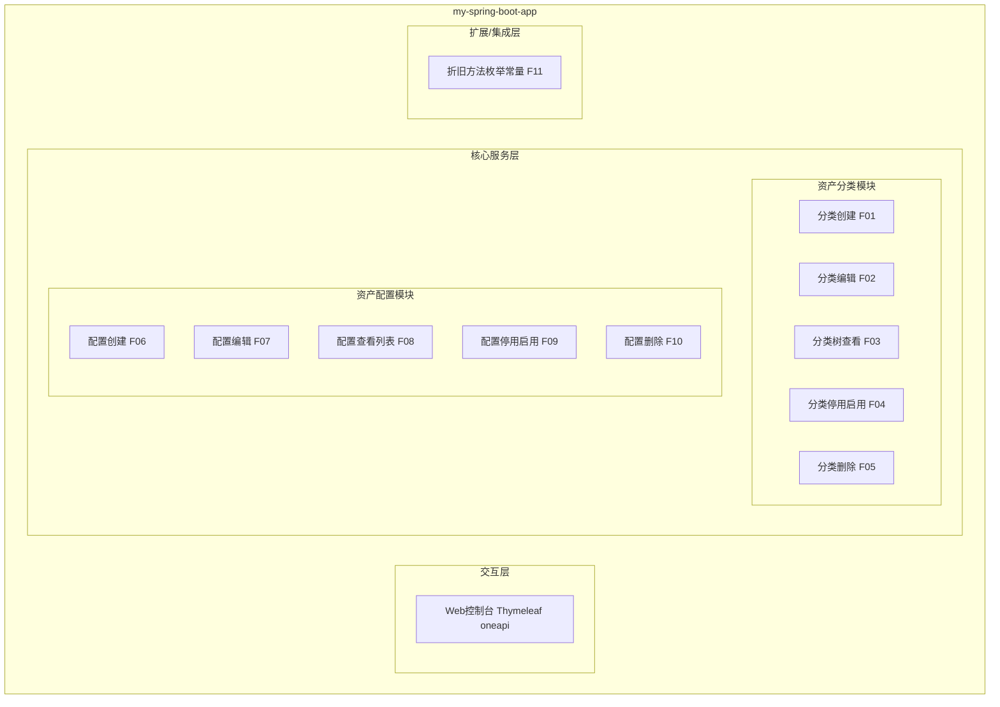

- 交互层说明：通过 Thymeleaf 渲染的 Web 控制台提供分类与配置的管理页面，HTTP 接口走 oneapi（`/api` 前缀）。
- 核心服务层说明：
  - 资产分类模块：负责分类树结构维护、级次控制、循环引用校验、停用级联约束。
  - 资产配置模块：负责配置模板 CRUD、折旧参数校验、按分类与关键字检索、启停管理。
- 扩展/集成层说明：折旧方法以枚举常量形式提供，供配置模块引用，本期无外部系统集成。

**模块清单**

| 模块 | 职责 | 依赖 |
|------|------|------|
| 资产分类模块 | 资产分类树维护、级次与循环引用校验、停用级联约束 | 数据库 |
| 资产配置模块 | 资产配置模板 CRUD、折旧参数校验、检索、启停 | 资产分类模块、折旧方法枚举 |
| 折旧方法枚举 | 提供标准折旧方法常量与说明 | 无 |

### 应用集成架构

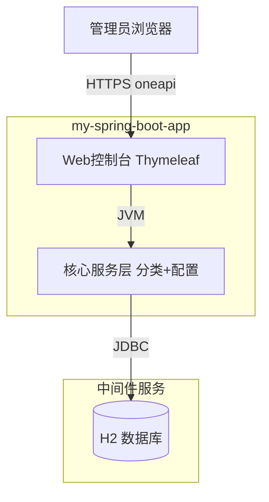

**集成关系说明：**

| 调用方 | 被调用方 | 协议 | 接口类型 | 说明 |
|--------|----------|------|----------|------|
| 管理员浏览器 | 应用 Web控制台 | HTTPS | oneapi REST | 分类与配置管理页面及表单提交 |
| 应用核心服务层 | H2 数据库 | JDBC | SQL | 分类、配置表读写 |

### 部署架构

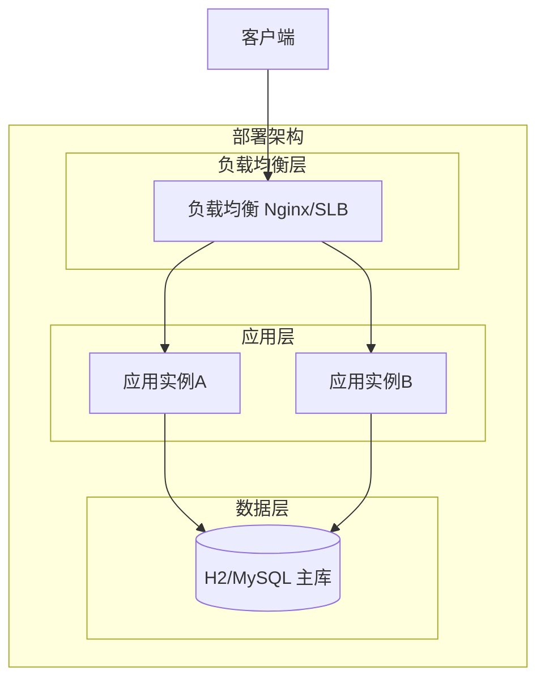

**部署说明：**
- **负载均衡层**：Nginx/SLB 反向代理，转发至应用实例。
- **应用层**：多实例无状态部署，配置数据存于共享数据库；本期演示环境为单实例 + H2 内存库，生产建议替换为 MySQL 主从。
- **数据层**：生产环境采用 MySQL 主从；H2 仅用于开发演示。

## 3. 数据模型与存储

### 实体清单

| 实体名称 | 实体说明 | 所属模块 | 与其他实体的关系 |
|----------|----------|----------|-----------------|
| asset_category | 资产分类，支持多级树形结构 | 资产分类模块 | 自引用父子关系（多对一父、一对多子） |
| asset_config | 资产配置模板，含折旧参数 | 资产配置模块 | 多对一关联 asset_category |

### 实体关系图

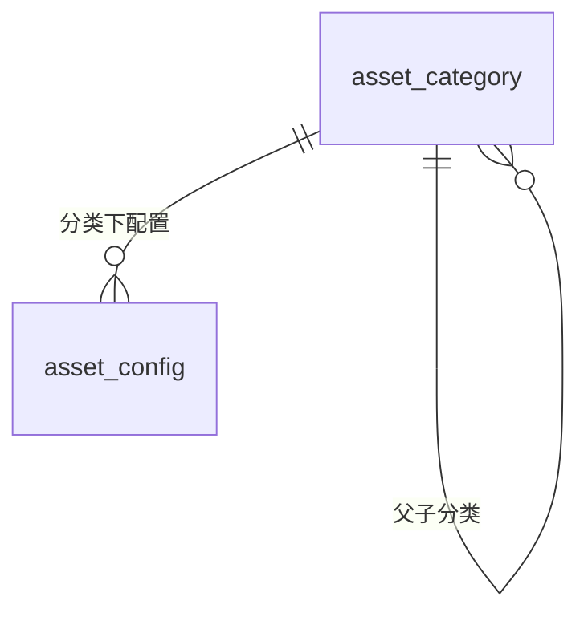

**模型说明：**
- `asset_category` 通过 `parent_id` 自引用实现多级分类，根分类 `parent_id` 为 0；`level` 标识级次（1/2/3）。
- `asset_config` 通过 `category_id` 关联所属分类，一个分类下可有多个配置模板。
- 折旧方法不建独立实体，以 `depreciation_method` 字段 + 枚举常量方式存储。

## 4. 接口设计

### 4.1 oneapi（Web 控制台接口）

| 编号 | 接口名称 | 方法 | 路径 | 模块 |
|------|----------|------|------|------|
| W01 | 分类树查看 | GET | /api/asset-categories/tree | 资产分类模块 |
| W02 | 分类详情 | GET | /api/asset-categories/{id} | 资产分类模块 |
| W03 | 创建分类 | POST | /api/asset-categories | 资产分类模块 |
| W04 | 编辑分类 | POST | /api/asset-categories/{id} | 资产分类模块 |
| W05 | 停用/启用分类 | POST | /api/asset-categories/{id}/status | 资产分类模块 |
| W06 | 删除分类 | POST | /api/asset-categories/{id}/delete | 资产分类模块 |
| W07 | 配置列表 | GET | /api/asset-configs | 资产配置模块 |
| W08 | 配置详情 | GET | /api/asset-configs/{id} | 资产配置模块 |
| W09 | 创建配置 | POST | /api/asset-configs | 资产配置模块 |
| W10 | 编辑配置 | POST | /api/asset-configs/{id} | 资产配置模块 |
| W11 | 停用/启用配置 | POST | /api/asset-configs/{id}/status | 资产配置模块 |
| W12 | 删除配置 | POST | /api/asset-configs/{id}/delete | 资产配置模块 |

> 说明：沿用现有 Item 模块风格，写操作采用 POST 表单提交 + 重定向（PRG 模式），列表/详情走 GET。`/api` 前缀为 oneapi 约定。

### 4.2 OpenAPI（对外接口）

本项不适用，原因：本期为内部配置管理，无对外集成需求。

### 4.3 内部接口（Service 层）

| 编号 | 接口名称 | 类 | 方法签名 |
|------|----------|------|----------|
| S01 | 构建分类树 | AssetCategoryService | CategoryTreeNode buildCategoryTree() |
| S02 | 查询分类 | AssetCategoryService | Optional<AssetCategory> findById(Long id) |
| S03 | 保存分类 | AssetCategoryService | AssetCategory save(AssetCategory category) |
| S04 | 更新分类 | AssetCategoryService | AssetCategory update(Long id, AssetCategory category) |
| S05 | 切换分类状态 | AssetCategoryService | void toggleStatus(Long id, Integer status) |
| S06 | 删除分类 | AssetCategoryService | void deleteById(Long id) |
| S07 | 校验分类可删 | AssetCategoryService | void assertDeletable(Long id) |
| S08 | 配置分页查询 | AssetConfigService | Page<AssetConfig> search(String keyword, Long categoryId, Pageable pageable) |
| S09 | 查询配置 | AssetConfigService | Optional<AssetConfig> findById(Long id) |
| S10 | 保存配置 | AssetConfigService | AssetConfig save(AssetConfig config) |
| S11 | 更新配置 | AssetConfigService | AssetConfig update(Long id, AssetConfig config) |
| S12 | 切换配置状态 | AssetConfigService | void toggleStatus(Long id, Integer status) |
| S13 | 删除配置 | AssetConfigService | void deleteById(Long id) |

### 4.4 集成接口（Integration 层）

本项不适用，原因：本期无外部系统集成。

## 5. 功能模块设计

### 全局约定

- **错误码格式**：`{MODULE}_{SEQ}`，模块前缀：`ASSET_CAT`（资产分类）、`ASSET_CFG`（资产配置）。
- **通用出参结构**：沿用现有应用风格，页面接口返回 Thymeleaf 视图名 + Model；如后续提供 JSON 接口，统一为 `{code, msg, data}`，`code` 为 `OK`/错误码。
- **模块映射表**：

| 模块 | 错误码前缀 | 主要实体 |
|------|-----------|----------|
| 资产分类模块 | ASSET_CAT | asset_category |
| 资产配置模块 | ASSET_CFG | asset_config |

### 5.1 资产分类模块

#### 5.1.1 表结构设计

##### 5.1.1.1 asset_category（资产分类表）

| 字段名 | 数据类型 | 约束 | 默认值 | 说明 |
|--------|----------|------|--------|------|
| id | bigint | PK, 自增 | - | 系统自增主键 |
| code | varchar(50) | NOT NULL | - | 分类编码，租户内唯一 |
| name | varchar(100) | NOT NULL | - | 分类名称 |
| parent_id | bigint | NOT NULL | 0 | 父分类ID，根分类为0 |
| level | tinyint | NOT NULL | 1 | 级次：1/2/3 |
| path | varchar(500) | NOT NULL | - | 分类路径，如 `/1/5/12/`，便于树查询 |
| status | tinyint | NOT NULL | 1 | 状态：1启用 0停用 |
| tenant_id | bigint | NOT NULL | 0 | 租户ID，预留 |
| remark | varchar(500) | NULL | NULL | 备注 |
| gmt_create | datetime | NOT NULL | CURRENT_TIMESTAMP | 创建时间 |
| gmt_modified | datetime | NOT NULL | CURRENT_TIMESTAMP | 修改时间 |

**索引：**
- PK: `pk_asset_category` (id)
- UK: `uk_asset_category_code` (tenant_id, code)
- IDX: `idx_asset_category_parent` (parent_id)
- IDX: `idx_asset_category_path` (path)

##### 5.1.1.2 枚举与常量定义

| 枚举名称 | 取值 | 含义 | 关联字段 |
|----------|------|------|----------|
| CategoryStatus | 1 | 启用 | asset_category.status |
| CategoryStatus | 0 | 停用 | asset_category.status |
| CategoryLevel | 1 | 一级分类 | asset_category.level |
| CategoryLevel | 2 | 二级分类 | asset_category.level |
| CategoryLevel | 3 | 三级分类 | asset_category.level |

#### 5.1.2 接口详细设计

##### W01 分类树查看

- **URI**: GET /api/asset-categories/tree
- **描述**: 返回全部启用分类的树形结构，供页面级联选择与树形浏览。
- **入参**: 无
- **出参**:

| 参数名称 | 类型 | 描述 |
|----------|------|------|
| code | String | 结果code |
| msg | String | 提示信息 |
| data | Array | 分类树节点列表 |
| data[].id | Long | 分类ID |
| data[].code | String | 分类编码 |
| data[].name | String | 分类名称 |
| data[].parentId | Long | 父分类ID |
| data[].level | Integer | 级次 |
| data[].status | Integer | 状态 |
| data[].children | Array | 子节点列表 |

- **错误码**:

| 错误码 | 说明 |
|--------|------|
| ASSET_CAT_001 | 分类数据加载失败 |

- **业务规则**: 仅返回启用状态分类；按 `level`、`code` 排序。
- **请求示例**: `GET /api/asset-categories/tree`
- **响应示例**:
```json
{
  "code": "OK",
  "msg": "SUCCESS",
  "data": [
    {
      "id": 1,
      "code": "OFFICE",
      "name": "办公设备",
      "parentId": 0,
      "level": 1,
      "status": 1,
      "children": [
        {
          "id": 5,
          "code": "OFFICE_PC",
          "name": "电脑",
          "parentId": 1,
          "level": 2,
          "status": 1,
          "children": []
        }
      ]
    }
  ]
}
```

##### W03 创建分类

- **URI**: POST /api/asset-categories
- **描述**: 新建资产分类，校验编码唯一、级次与父分类一致性、循环引用。
- **入参**:

| 参数名称 | 类型 | 是否必填 | 描述 |
|----------|------|----------|------|
| code | String | 是 | 分类编码，租户内唯一 |
| name | String | 是 | 分类名称，1-100字符 |
| parentId | Long | 否 | 父分类ID，为空或0表示根分类 |
| remark | String | 否 | 备注，≤500字符 |

- **出参**:

| 参数名称 | 类型 | 描述 |
|----------|------|------|
| code | String | 结果code |
| msg | String | 提示信息 |
| data | Object | 新建分类信息 |

- **错误码**:

| 错误码 | 说明 |
|--------|------|
| ASSET_CAT_002 | 分类编码已存在 |
| ASSET_CAT_003 | 父分类不存在 |
| ASSET_CAT_004 | 超过最大级次（3级） |
| ASSET_CAT_005 | 父分类已停用，不可新增子分类 |

- **业务规则**: R01 编码唯一；R02 父分类存在且启用；R03 子分类级次=父级次+1 且≤3；R04 自动维护 `path`。
- **请求示例**:
```json
{
  "code": "OFFICE_PC",
  "name": "电脑",
  "parentId": 1,
  "remark": "办公用电脑"
}
```
- **响应示例**:
```json
{
  "code": "OK",
  "msg": "分类创建成功",
  "data": { "id": 5, "code": "OFFICE_PC", "name": "电脑" }
}
```

##### W04 编辑分类

- **URI**: POST /api/asset-categories/{id}
- **描述**: 编辑分类名称、备注；编码不可改，父分类不可改（避免循环引用风险）。
- **入参**:

| 参数名称 | 类型 | 是否必填 | 描述 |
|----------|------|----------|------|
| id | Long | 是 | 分类ID（路径参数） |
| name | String | 是 | 分类名称 |
| remark | String | 否 | 备注 |

- **出参**: 同 W03 出参结构。
- **错误码**:

| 错误码 | 说明 |
|--------|------|
| ASSET_CAT_006 | 分类不存在 |
| ASSET_CAT_007 | 分类已停用，不可编辑 |

- **业务规则**: R05 仅启用状态可编辑；R06 编码与父分类不允许变更。
- **请求示例**:
```json
{ "name": "办公电脑", "remark": "更新备注" }
```
- **响应示例**:
```json
{ "code": "OK", "msg": "分类更新成功", "data": {} }
```

##### W05 停用/启用分类

- **URI**: POST /api/asset-categories/{id}/status
- **描述**: 切换分类启停状态；停用时级联停用所有子分类。
- **入参**:

| 参数名称 | 类型 | 是否必填 | 描述 |
|----------|------|----------|------|
| id | Long | 是 | 分类ID（路径参数） |
| status | Integer | 是 | 目标状态：1启用 0停用 |

- **出参**: 通用出参结构。
- **错误码**:

| 错误码 | 说明 |
|--------|------|
| ASSET_CAT_006 | 分类不存在 |
| ASSET_CAT_008 | 父分类已停用，子分类不可启用 |

- **业务规则**: R07 停用时级联停用所有子孙分类（按 `path` 前缀匹配）；R08 启用子分类前需父分类已启用。
- **请求示例**:
```json
{ "status": 0 }
```
- **响应示例**:
```json
{ "code": "OK", "msg": "状态更新成功", "data": {} }
```

##### W06 删除分类

- **URI**: POST /api/asset-categories/{id}/delete
- **描述**: 删除叶子分类，且无关联资产配置时方可删除。
- **入参**:

| 参数名称 | 类型 | 是否必填 | 描述 |
|----------|------|----------|------|
| id | Long | 是 | 分类ID（路径参数） |

- **出参**: 通用出参结构。
- **错误码**:

| 错误码 | 说明 |
|--------|------|
| ASSET_CAT_006 | 分类不存在 |
| ASSET_CAT_009 | 存在子分类，不可删除 |
| ASSET_CAT_010 | 分类下存在资产配置，不可删除 |

- **业务规则**: R09 仅叶子分类可删；R10 关联配置数为 0 方可删；R11 删除后维护兄弟节点排序无需调整。
- **请求示例**: `POST /api/asset-categories/5/delete`
- **响应示例**:
```json
{ "code": "OK", "msg": "分类删除成功", "data": {} }
```

#### 5.1.3 子功能详细设计

##### 5.1.3.1 分类创建（F01）

- 处理时序图
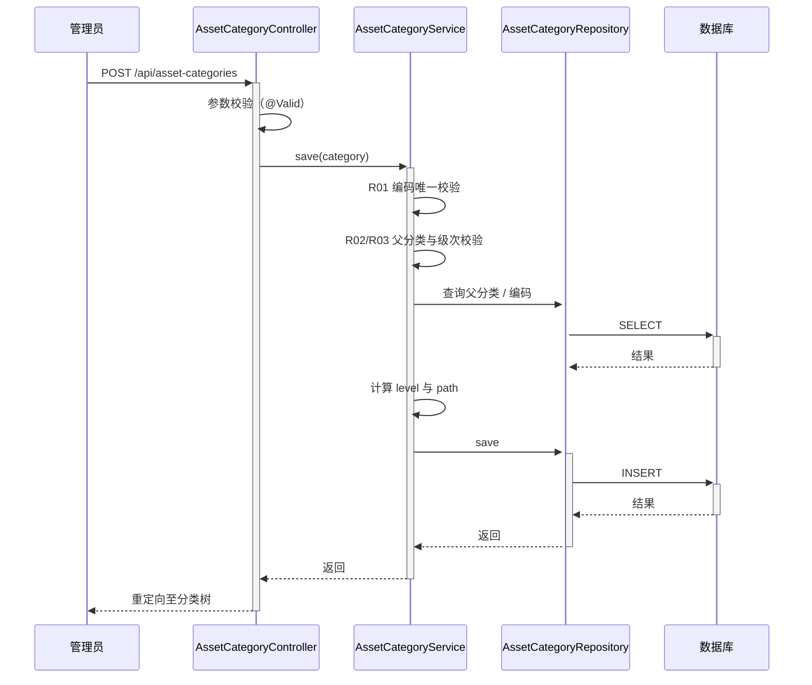

**业务规则：**
| 规则编号 | 规则描述 | 校验时机 | 不满足时的处理 |
|----------|----------|----------|--------------|
| R01 | 分类编码租户内唯一 | 创建时 | 返回 ASSET_CAT_002 |
| R02 | 父分类存在且启用 | 创建时 | 返回 ASSET_CAT_003 / ASSET_CAT_005 |
| R03 | 子分类级次=父级次+1 且≤3 | 创建时 | 返回 ASSET_CAT_004 |
| R04 | 自动维护 path（父path+自身id+/） | 创建时 | 由系统自动生成 |

**异常场景：**
| 异常场景 | 处理方式 |
|----------|----------|
| 并发插入相同编码 | 唯一索引拦截，捕获 DataIntegrityViolationException 转为 ASSET_CAT_002 |
| 父分类在保存前被停用 | 重新校验父分类状态，返回 ASSET_CAT_005 |

**并发控制（如涉及数据写入）：**
- 并发场景：同一编码被并发创建。
- 控制策略：唯一索引 `uk_asset_category_code` 兜底 + Service 层先查校验；无需分布式锁，原因：单表低并发配置场景，唯一索引足够保证一致性。

##### 5.1.3.2 分类停用/启用（F04）

- 处理时序图
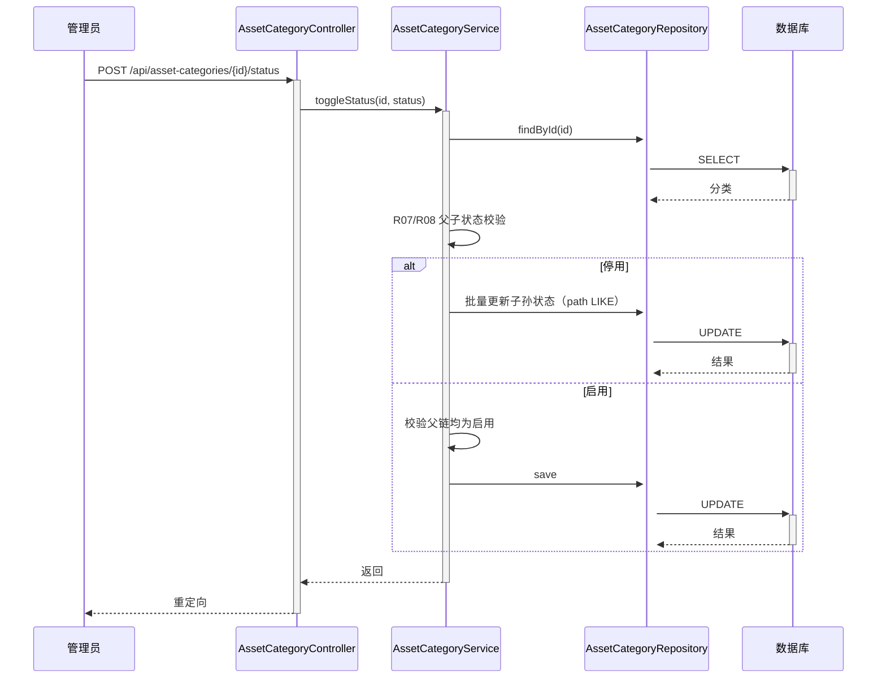

**业务规则：**
| 规则编号 | 规则描述 | 校验时机 | 不满足时的处理 |
|----------|----------|----------|--------------|
| R07 | 停用时级联停用所有子孙分类 | 停用时 | 系统自动级联 |
| R08 | 启用子分类前父分类须已启用 | 启用时 | 返回 ASSET_CAT_008 |

**异常场景：**
| 异常场景 | 处理方式 |
|----------|----------|
| 级联停用过程中部分失败 | 整体事务回滚，返回系统错误 |

**并发控制：**
- 并发场景：管理员同时停用父分类与启用其子分类。
- 控制策略：事务 + `path` 前缀批量更新；启用时重新校验父链状态。低风险，无需额外锁。

**状态机设计（asset_category.status）：**
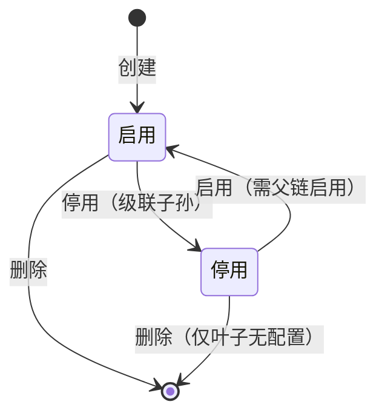

**状态流转规则：**
| 当前状态 | 目标状态 | 流转条件 | 前置校验 | 触发动作 |
|----------|----------|----------|----------|----------|
| 启用 | 停用 | 管理员停用 | 无 | 级联停用子孙分类 |
| 停用 | 启用 | 管理员启用 | 父链均为启用 | 无 |
| 启用/停用 | 删除 | 管理员删除 | 叶子且无关联配置 | 物理删除 |

### 5.2 资产配置模块

#### 5.2.1 表结构设计

##### 5.2.1.1 asset_config（资产配置表）

| 字段名 | 数据类型 | 约束 | 默认值 | 说明 |
|--------|----------|------|--------|------|
| id | bigint | PK, 自增 | - | 系统自增主键 |
| code | varchar(50) | NOT NULL | - | 配置编码，租户内唯一 |
| name | varchar(100) | NOT NULL | - | 配置名称 |
| category_id | bigint | NOT NULL | - | 所属分类ID |
| depreciation_method | varchar(30) | NOT NULL | - | 折旧方法枚举值 |
| useful_life_months | int | NOT NULL | - | 使用年限（月），1-600 |
| salvage_value_rate | decimal(6,4) | NOT NULL | 0.0000 | 残值率，0.0000-0.2000 |
| unit | varchar(20) | NULL | NULL | 计量单位，如台/辆 |
| status | tinyint | NOT NULL | 1 | 状态：1启用 0停用 |
| tenant_id | bigint | NOT NULL | 0 | 租户ID，预留 |
| remark | varchar(500) | NULL | NULL | 备注 |
| gmt_create | datetime | NOT NULL | CURRENT_TIMESTAMP | 创建时间 |
| gmt_modified | datetime | NOT NULL | CURRENT_TIMESTAMP | 修改时间 |

**索引：**
- PK: `pk_asset_config` (id)
- UK: `uk_asset_config_code` (tenant_id, code)
- IDX: `idx_asset_config_category` (category_id)
- IDX: `idx_asset_config_status` (status)

##### 5.2.1.2 枚举与常量定义

| 枚举名称 | 取值 | 含义 | 关联字段 |
|----------|------|------|----------|
| DepreciationMethod | STRAIGHT_LINE | 年限平均法（直线法） | asset_config.depreciation_method |
| DepreciationMethod | WORKLOAD | 工作量法 | asset_config.depreciation_method |
| DepreciationMethod | DOUBLE_DECLINING | 双倍余额递减法 | asset_config.depreciation_method |
| DepreciationMethod | SUM_OF_YEARS | 年数总和法 | asset_config.depreciation_method |
| ConfigStatus | 1 | 启用 | asset_config.status |
| ConfigStatus | 0 | 停用 | asset_config.status |

#### 5.2.2 接口详细设计

##### W07 配置列表

- **URI**: GET /api/asset-configs
- **描述**: 分页查询资产配置，支持按分类、关键字检索。
- **入参**:

| 参数名称 | 类型 | 是否必填 | 描述 |
|----------|------|----------|------|
| keyword | String | 否 | 名称/编码模糊匹配 |
| categoryId | Long | 否 | 按分类过滤 |
| status | Integer | 否 | 状态过滤 |
| page | Integer | 否 | 页码，默认0 |
| size | Integer | 否 | 每页条数，默认10 |

- **出参**:

| 参数名称 | 类型 | 描述 |
|----------|------|------|
| code | String | 结果code |
| msg | String | 提示信息 |
| data | Object | 分页对象 |
| data.content | Array | 配置列表 |
| data.totalElements | Long | 总条数 |

- **错误码**:

| 错误码 | 说明 |
|--------|------|
| ASSET_CFG_001 | 配置查询失败 |

- **业务规则**: 按 `gmt_modified` 倒序；`categoryId` 支持按分类 `path` 前缀匹配（含子孙分类）。
- **请求示例**: `GET /api/asset-configs?keyword=电脑&categoryId=1&page=0&size=10`
- **响应示例**:
```json
{
  "code": "OK",
  "msg": "SUCCESS",
  "data": {
    "content": [
      {
        "id": 10,
        "code": "CFG_PC_001",
        "name": "办公电脑配置",
        "categoryId": 5,
        "depreciationMethod": "STRAIGHT_LINE",
        "usefulLifeMonths": 60,
        "salvageValueRate": 0.0500,
        "status": 1
      }
    ],
    "totalElements": 1
  }
}
```

##### W09 创建配置

- **URI**: POST /api/asset-configs
- **描述**: 新建资产配置模板，校验编码唯一、分类启用、折旧参数合理性。
- **入参**:

| 参数名称 | 类型 | 是否必填 | 描述 |
|----------|------|----------|------|
| code | String | 是 | 配置编码，租户内唯一 |
| name | String | 是 | 配置名称，1-100字符 |
| categoryId | Long | 是 | 所属分类ID |
| depreciationMethod | String | 是 | 折旧方法枚举值 |
| usefulLifeMonths | Integer | 是 | 使用年限（月），1-600 |
| salvageValueRate | BigDecimal | 是 | 残值率，0.0000-0.2000 |
| unit | String | 否 | 计量单位 |
| remark | String | 否 | 备注 |

- **出参**: 通用出参结构。
- **错误码**:

| 错误码 | 说明 |
|--------|------|
| ASSET_CFG_002 | 配置编码已存在 |
| ASSET_CFG_003 | 所属分类不存在或已停用 |
| ASSET_CFG_004 | 折旧方法取值非法 |
| ASSET_CFG_005 | 使用年限须在1-600之间 |
| ASSET_CFG_006 | 残值率须在0-0.2之间 |

- **业务规则**: R12 编码唯一；R13 分类存在且启用；R14 折旧方法为合法枚举；R15 年限1-600；R16 残值率0-0.2。
- **请求示例**:
```json
{
  "code": "CFG_PC_001",
  "name": "办公电脑配置",
  "categoryId": 5,
  "depreciationMethod": "STRAIGHT_LINE",
  "usefulLifeMonths": 60,
  "salvageValueRate": 0.0500,
  "unit": "台",
  "remark": "通用办公电脑"
}
```
- **响应示例**:
```json
{ "code": "OK", "msg": "配置创建成功", "data": { "id": 10 } }
```

##### W10 编辑配置

- **URI**: POST /api/asset-configs/{id}
- **描述**: 编辑配置名称、折旧参数、单位、备注；编码与分类不可改。
- **入参**:

| 参数名称 | 类型 | 是否必填 | 描述 |
|----------|------|----------|------|
| id | Long | 是 | 配置ID（路径参数） |
| name | String | 是 | 配置名称 |
| depreciationMethod | String | 是 | 折旧方法 |
| usefulLifeMonths | Integer | 是 | 使用年限（月） |
| salvageValueRate | BigDecimal | 是 | 残值率 |
| unit | String | 否 | 计量单位 |
| remark | String | 否 | 备注 |

- **出参**: 通用出参结构。
- **错误码**:

| 错误码 | 说明 |
|--------|------|
| ASSET_CFG_007 | 配置不存在 |
| ASSET_CFG_008 | 配置已停用，不可编辑 |

- **业务规则**: R17 仅启用状态可编辑；R18 编码与分类不允许变更；折旧参数仍按 R14-R16 校验。
- **请求示例**:
```json
{ "name": "办公电脑配置V2", "depreciationMethod": "STRAIGHT_LINE", "usefulLifeMonths": 48, "salvageValueRate": 0.0500, "unit": "台" }
```
- **响应示例**:
```json
{ "code": "OK", "msg": "配置更新成功", "data": {} }
```

##### W11 停用/启用配置

- **URI**: POST /api/asset-configs/{id}/status
- **描述**: 切换配置启停状态。
- **入参**:

| 参数名称 | 类型 | 是否必填 | 描述 |
|----------|------|----------|------|
| id | Long | 是 | 配置ID（路径参数） |
| status | Integer | 是 | 目标状态：1启用 0停用 |

- **出参**: 通用出参结构。
- **错误码**:

| 错误码 | 说明 |
|--------|------|
| ASSET_CFG_007 | 配置不存在 |
| ASSET_CFG_009 | 所属分类已停用，配置不可启用 |

- **业务规则**: R19 启用配置时所属分类须为启用；R20 停用后不可被新台账引用（台账上线后生效）。
- **请求示例**:
```json
{ "status": 0 }
```
- **响应示例**:
```json
{ "code": "OK", "msg": "状态更新成功", "data": {} }
```

##### W12 删除配置

- **URI**: POST /api/asset-configs/{id}/delete
- **描述**: 删除配置；本期无台账引用，可直接删；台账上线后需校验引用计数。
- **入参**:

| 参数名称 | 类型 | 是否必填 | 描述 |
|----------|------|----------|------|
| id | Long | 是 | 配置ID（路径参数） |

- **出参**: 通用出参结构。
- **错误码**:

| 错误码 | 说明 |
|--------|------|
| ASSET_CFG_007 | 配置不存在 |
| ASSET_CFG_010 | 配置已被台账引用，不可删除 |

- **业务规则**: R21 本期引用计数恒为0，可直接删；R22 台账上线后引用计数>0 不可删。
- **请求示例**: `POST /api/asset-configs/10/delete`
- **响应示例**:
```json
{ "code": "OK", "msg": "配置删除成功", "data": {} }
```

#### 5.2.3 子功能详细设计

##### 5.2.3.1 配置创建（F06）

- 处理时序图
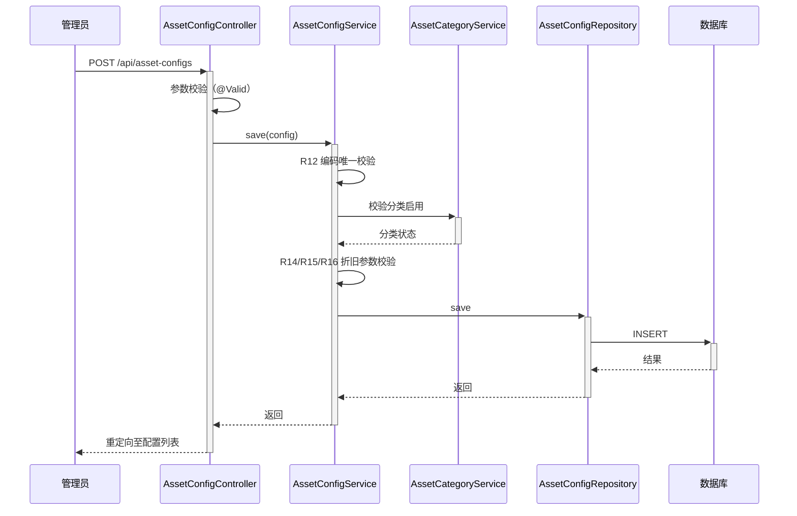

**业务规则：**
| 规则编号 | 规则描述 | 校验时机 | 不满足时的处理 |
|----------|----------|----------|--------------|
| R12 | 配置编码租户内唯一 | 创建时 | 返回 ASSET_CFG_002 |
| R13 | 所属分类存在且启用 | 创建时 | 返回 ASSET_CFG_003 |
| R14 | 折旧方法为合法枚举 | 创建时 | 返回 ASSET_CFG_004 |
| R15 | 使用年限1-600 | 创建时 | 返回 ASSET_CFG_005 |
| R16 | 残值率0-0.2 | 创建时 | 返回 ASSET_CFG_006 |

**异常场景：**
| 异常场景 | 处理方式 |
|----------|----------|
| 并发插入相同编码 | 唯一索引兜底，转 ASSET_CFG_002 |
| 分类在保存前被停用 | 重新校验分类状态，返回 ASSET_CFG_003 |

**并发控制：**
- 并发场景：同一编码并发创建。
- 控制策略：唯一索引 `uk_asset_config_code` 兜底 + Service 层先查校验；无需分布式锁。

##### 5.2.3.2 配置停用/启用（F09）

- 处理时序图
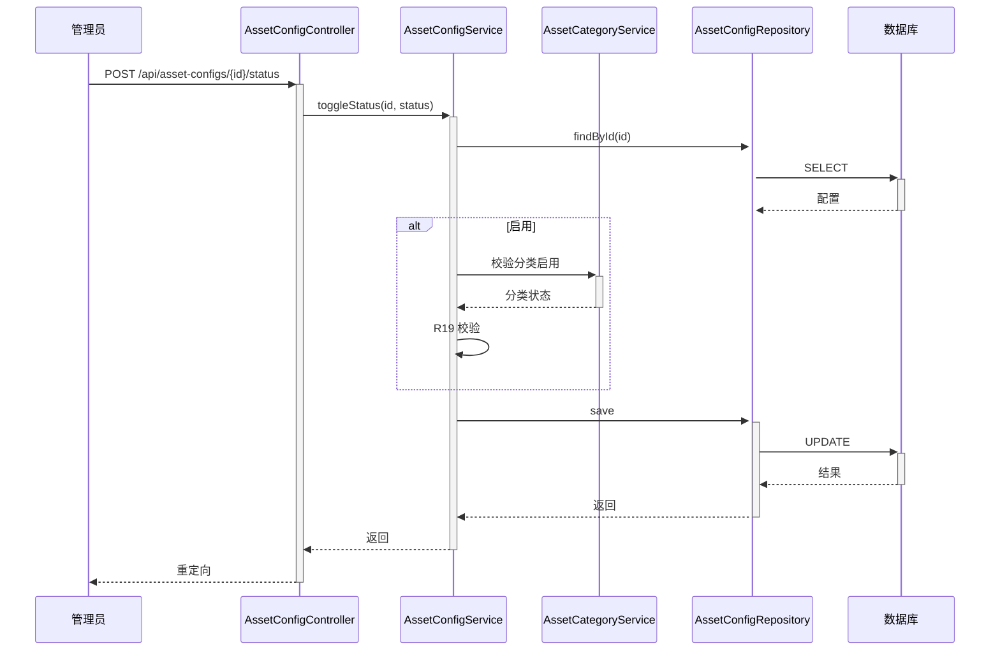

**业务规则：**
| 规则编号 | 规则描述 | 校验时机 | 不满足时的处理 |
|----------|----------|----------|--------------|
| R19 | 启用配置时所属分类须启用 | 启用时 | 返回 ASSET_CFG_009 |
| R20 | 停用后不可被新台账引用 | 停用时 | 台账上线后由台账侧校验 |

**异常场景：**
| 异常场景 | 处理方式 |
|----------|----------|
| 分类在启用前被停用 | 重新校验，返回 ASSET_CFG_009 |

**并发控制：**
- 并发场景：管理员同时停用分类与启用其下配置。
- 控制策略：启用配置时重新校验分类状态；低风险。

**状态机设计（asset_config.status）：**
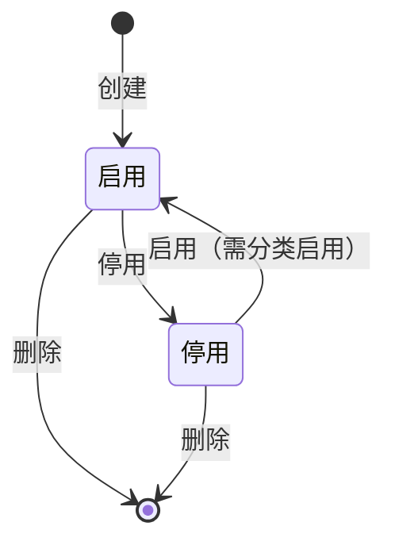

**状态流转规则：**
| 当前状态 | 目标状态 | 流转条件 | 前置校验 | 触发动作 |
|----------|----------|----------|----------|----------|
| 启用 | 停用 | 管理员停用 | 无 | 无 |
| 停用 | 启用 | 管理员启用 | 分类启用 | 无 |
| 启用/停用 | 删除 | 管理员删除 | 无引用 | 物理删除 |

### 5.3 跨模块时序

##### 5.3.1 配置创建跨模块调用

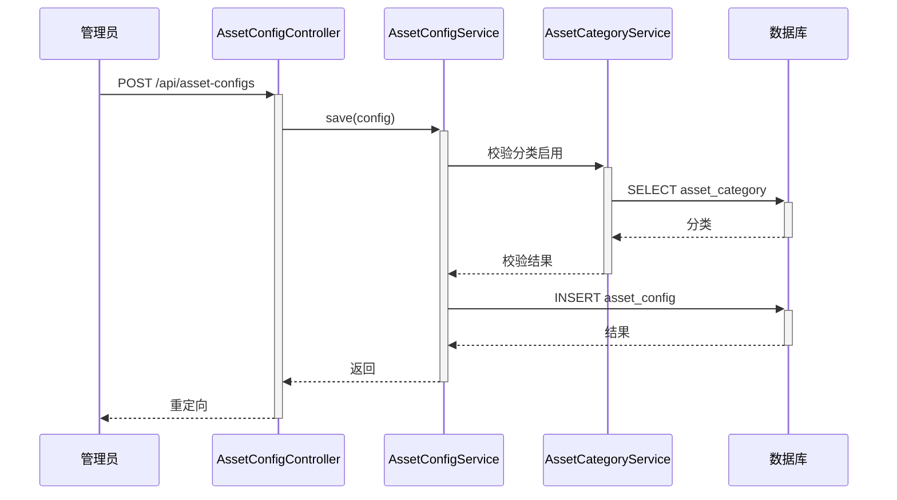

### 5.4 技术选型方案对比

##### 5.4.1 分类树构建方案

| 方案 | 描述 | 优点 | 缺点 |
|------|------|------|------|
| 方案A：全量加载内存构建 | 一次查询全部启用分类，内存中按 parentId 组装树 | 实现简单，查询次数少 | 数据量大时内存占用高 |
| 方案B：递归查询子分类 | 按层级递归查询数据库 | 内存占用低 | N+1 查询，性能差 |
| 方案C：path 前缀 + 内存构建 | 利用 path 字段一次查询，内存排序构建 | 查询高效，支持子孙范围查询 | 需维护 path 字段 |

**推荐方案**：方案C（path 前缀 + 内存构建）。
**推荐理由**：分类数据量小（<1000），一次查询即可；`path` 字段同时支撑级联停用与按分类范围查询配置，复用性高。

##### 5.4.2 折旧方法管理方案

| 方案 | 描述 | 优点 | 缺点 |
|------|------|------|------|
| 方案A：枚举常量 | 折旧方法以 Java 枚举 + DB 字段存储 | 实现简单，校验方便 | 新增方法需改代码发版 |
| 方案B：独立配置表 | 建 depreciation_method 表存储方法 | 可动态扩展 | 本期方法固定，过度设计 |

**推荐方案**：方案A（枚举常量）。
**推荐理由**：本期仅 4 种标准方法，变动频率低，枚举足够；后续如需自定义公式再升级为配置表。

### 5.5 模块自检

##### 5.5.1 资产分类模块自检

| 检查项 | 结果 | 说明 |
|--------|------|------|
| F01-F05 均有设计 | 通过 | 创建/编辑/查看/停用/删除全覆盖 |
| 状态机完整 | 通过 | 启用↔停用、删除流转完整 |
| 并发风险识别 | 通过 | 编码唯一索引兜底 |
| 过度设计检查 | 通过 | 未引入分布式锁、未建多余表 |

##### 5.5.2 资产配置模块自检

| 检查项 | 结果 | 说明 |
|--------|------|------|
| F06-F10 均有设计 | 通过 | CRUD + 启停全覆盖 |
| 折旧参数校验完整 | 通过 | 方法/年限/残值率均校验 |
| 跨模块依赖合理 | 通过 | 配置依赖分类，单向无环 |
| 过度设计检查 | 通过 | 折旧方法用枚举未建表 |

## 6. 非功能性需求设计

### 6.1 高可用性

- 应用多实例无状态部署，配置数据存共享数据库；单实例故障不影响整体。
- H2 内存库仅用于演示，生产替换 MySQL 主从，数据库层高可用由 DBA 保障。
- 第三方依赖：本期无外部系统集成，无降级需求。

### 6.2 可扩展性

- 水平扩缩容：应用无状态，可通过增加实例横向扩展。
- 折旧方法可扩展：枚举方案后续可升级为配置表，字段 `depreciation_method` 兼容字符串存储。
- 多租户预留：`tenant_id` 字段已预留，后续启用隔离无需改表结构。

### 6.3 稳定性/可靠性

- 分类树查询数据量小（<1000），性能稳定。
- 配置列表分页查询，单页默认 10 条，最大 100 条，防止大结果集。
- 边界场景：级次超 3、残值率超 0.2、年限超 600 均有校验拦截。

### 6.4 安全性设计

#### 6.4.1 账户系统方案

本项不适用，原因：本期复用现有应用无独立鉴权现状，不实现登录注册；后续接入统一鉴权时由安全评审。

#### 6.4.2 授权&访问控制

##### 6.4.2.1 是否实现水平权限检查

本项不适用，原因：分类与配置为租户内公共配置数据，非用户私有数据，不涉及水平权限隔离。

##### 6.4.2.2 是否实现垂直权限检查

本项不适用，原因：本期不实现角色权限，后续接入角色体系时补充。

##### 6.4.2.3 是否检查登录态

- 假设：所有写操作（POST）需登录态，通过全局拦截器校验；查询（GET）可匿名访问配置数据。
- 实现：新增登录态拦截器，对 `/api/asset-categories/**`、`/api/asset-configs/**` 的 POST 请求校验登录态。

#### 6.4.3 数据防护方案

##### 6.4.3.1 是否对敏感数据加密存储

本项不适用，原因：分类与配置数据为非敏感业务配置，无身份证、银行卡等敏感信息。

##### 6.4.3.2 是否对敏感数据展示进行脱敏

本项不适用，原因：无敏感字段需脱敏；日志打印避免输出完整请求体即可。

### 6.5 监控/统计/日志/告警

- 关键操作日志：分类与配置的增删改、启停操作记录操作人、时间、变更内容。
- 异常监控：`GlobalExceptionHandler` 捕获的异常输出 ERROR 日志。
- 性能监控：分类树查询、配置列表查询耗时统计（后续接入监控平台）。

## 7. 变更三板斧

### 7.1 可监控

- 服务埋点：分类树查询、配置列表查询、配置创建/编辑/启停接口埋点，记录调用次数、处理结果、处理耗时。
- 关键业务埋点：分类级联停用、配置折旧参数变更记录业务日志。
- 三方服务埋点：本期无三方服务，不适用。

### 7.2 可灰度

- 灰度方案对比：

| 方案 | 描述 | 优点 | 缺点 |
|------|------|------|------|
| 方案A：按租户尾号灰度 | 按 tenant_id 尾号引流 | 精准控制 | 本期单租户不适用 |
| 方案B：功能开关灰度 | 通过配置开关控制新功能可见性 | 实现简单，适合新功能 | 需维护开关 |

**推荐方案**：方案B（功能开关灰度）。
**推荐理由**：本期为全新功能模块，通过应用配置开关 `feature.asset-config.enabled` 控制菜单与接口可见性，灰度范围可控。

### 7.3 可应急

- 功能开关：`feature.asset-config.enabled` 可快速关闭新功能入口，切回无该功能状态。
- 数据回滚：本期为新增表，无旧数据兼容问题；如配置数据有误，可通过删除新增配置回滚，不影响 Item/User 模块。
- 上下游兼容：本期无下游依赖（台账未上线），回滚无上下游影响。
- 应急原则：优先使用功能开关关闭入口，避免数据回滚。

---

## 8. 方案检查（Step 9 checklist）

| 检查项 | 结果 | 说明 |
|------|------|------|
| 模块划分合理性检查 | 通过 | 分类、配置、折旧枚举职责单一，无循环依赖，无功能点超 50% 的模块 |
| 依赖关系合理性 | 通过 | 配置单向依赖分类，无下游异常影响（本期无下游） |
| 单点问题检查（部署层面） | 通过 | 应用多实例无状态，DB 主从；演示环境单实例为已知限制 |
| 表模型设计范式检查 | 通过 | 满足第三范式，分类自引用与配置关联均无传递依赖冗余；path 为查询优化冗余字段，已说明一致性维护 |
| 隐私安全检查 | 通过 | 无敏感信息，无需脱敏 |
| 兼容性检查（接口） | 通过 | 全部为新增接口，不影响现有 Item/User 接口 |
| 兼容性检查（表） | 通过 | 全部为新增表，不影响现有 items/users 表 |
| 数据迁移检查 | 通过 | 新增表无初始化数据需求；可预置根分类与标准折旧方法枚举 |
| 一致性检查（功能点） | 通过 | F01-F11 在第5章均有对应设计 |
| 一致性检查（表） | 通过 | asset_category、asset_config 在第5章均有完整表结构定义 |
| 一致性检查（接口） | 通过 | W01-W12 在第5章均有详细定义 |
| 一致性检查（枚举） | 通过 | CategoryStatus/CategoryLevel/DepreciationMethod/ConfigStatus 与表字段说明一致 |
| 状态机完整性检查 | 通过 | asset_category.status、asset_config.status 均有状态机图，无孤岛状态 |
| 并发风险检查 | 通过 | 编码唯一索引兜底，低并发配置场景无需分布式锁；方案对比见 5.4 |
| 单点问题检查（定时任务层面） | 不适用 | 本期无定时任务 |
| 非功能性设计可行性检查 | 通过 | 多实例部署、分页查询、登录态拦截器均可落地 |
| 变更三板斧设计可行性检查（可监控） | 通过 | 接口埋点与业务日志可行 |
| 变更三板斧设计可行性检查（可灰度） | 通过 | 功能开关方案可行，已推荐方案B |
| 变更三板斧设计可行性检查（可应急） | 通过 | 功能开关关闭入口，无上下游依赖，应急简单快速 |

> 检查过程中未发现需修复项，文档无需同步更新。
