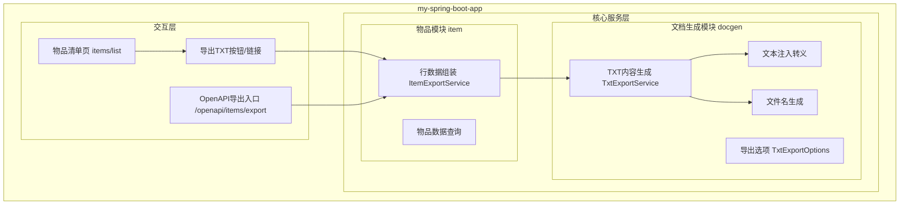
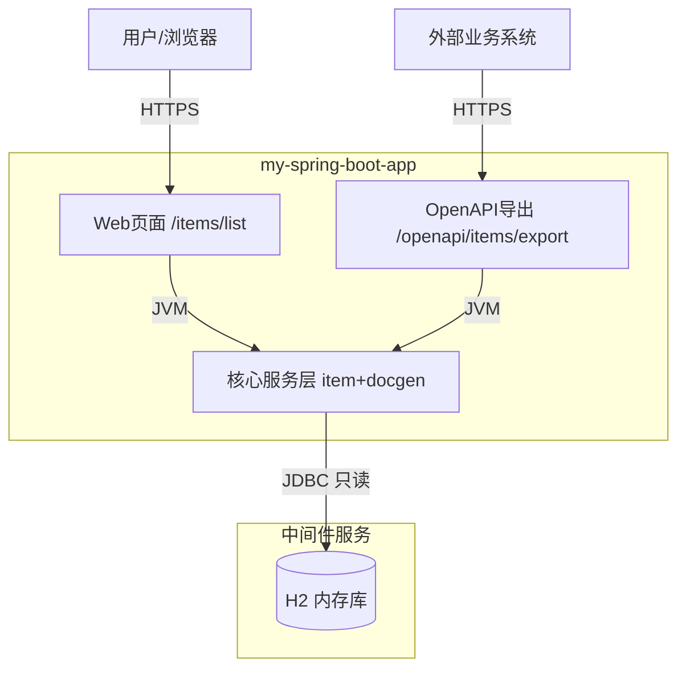
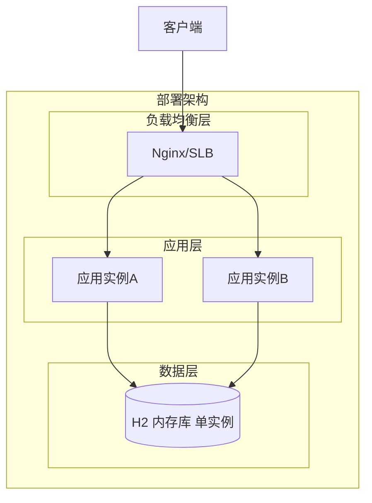
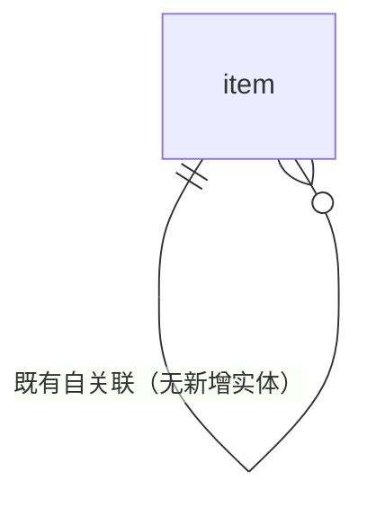
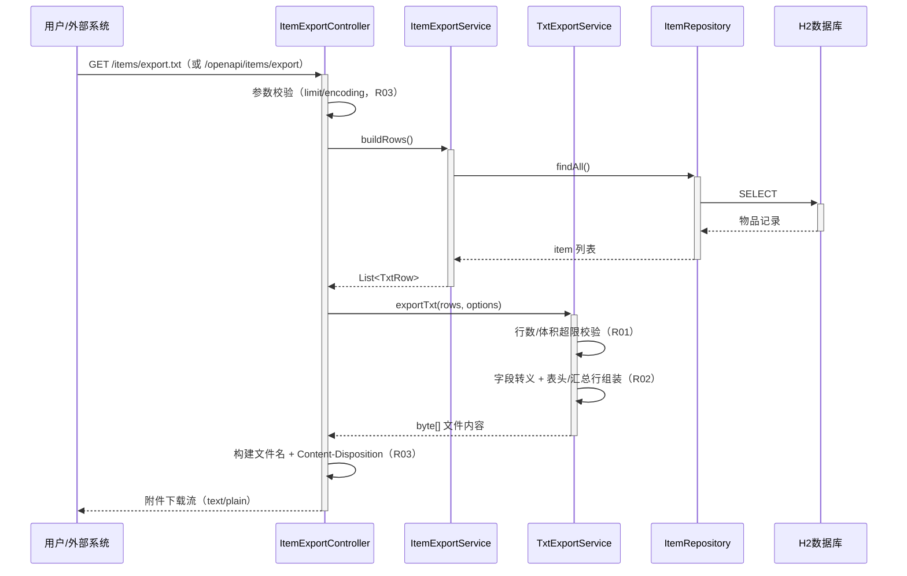

> **文档元信息**
>
> | 项目 | 内容 |
> |------|------|
> | 文档版本 | v1.0 |
> | 作者 | DTCoder（系统分析设计 Agent） |
> | 创建日期 | 2026-08-20 |
> | 需求来源 | 用户需求「帮我生成一个txt文档」（流水线 design 阶段任务） |
> | 评审状态 | 待评审 |

# TXT 文档生成与导出功能 系分设计

## 1. 需求与范围

### 背景与目标
用户需要一个「生成 txt 文档」的能力。结合当前仓库 `my-spring-boot-app`（Spring Boot 2.6.6 / Java 17 / Thymeleaf / Spring Data JPA / H2 内存库，物品清单管理 demo）的既有事实，本设计将需求落地为：**把业务数据（物品清单）生成 TXT 文本文档并提供下载**，同时沉淀可复用的**通用 TXT 文档生成能力**（docgen 模块），便于后续扩展到其他业务数据。

- 目标 1：物品清单页一键导出 TXT 文件下载（浏览器）。
- 目标 2：提供 OpenAPI REST 接口供外部/自动化按需导出。
- 目标 3：TXT 生成逻辑通用化、零新增依赖、无新增存储。

### 核心功能
- F01：物品清单页提供「导出 TXT」入口，点击后浏览器直接下载 `.txt` 文件。
- F02：对外 OpenAPI 接口按需导出物品清单 TXT 文档。
- F03：TXT 内容格式化：表头行 + 数据行 + 汇总行，UTF-8 编码，规范文件名。
- F04：通用 TXT 生成服务：任意「行列表数据」→ TXT 字节流，可复用。

### 约束与非功能要求
- 技术栈：Java 17 / Spring Boot 2.6.6，遵循仓库现有 Controller–Service 分层，**不引入新依赖**。
- 编码 UTF-8，换行 CRLF（`\r\n`）；响应头 `Content-Disposition: attachment`。
- 单次导出上限：1 万行 / 10 MB，超限拒绝并返回业务错误码。
- 安全：文本注入转义（制表符/换行/回车/控制字符）；导出文件名白名单固定，防路径穿越。
- 权限：demo 应用无登录态、物品为公共数据（假设 A03，见假设表）。

### 排除范围
- 不做 TXT 文档的在线预览、持久化存储、历史导出记录。
- 不做 csv/docx/pdf 等其他格式导出（docgen 模块预留扩展点，见 6.2）。
- 不新增数据库表（导出为即时计算产物，不落库）。

### 需求功能清单与优先级

| 编号 | 功能点 | 优先级 | PRD 原始描述/章节 | 备注 |
|------|--------|--------|-------------------|------|
| F01 | 页面触发导出 TXT 并下载 | P0 | 需求「帮我生成一个txt文档」 | 物品清单页入口 |
| F02 | OpenAPI 对外导出接口 | P1 | 同上 | 供外部系统/自动化调用 |
| F03 | TXT 内容格式化（表头/数据行/汇总行） | P0 | 同上 | UTF-8、CRLF |
| F04 | 通用 TXT 生成服务 | P1 | 同上 | 跨模块复用 |

### 假设与待确认项

| 编号 | 假设/待确认内容 | 当前假设 | 确认状态 |
|------|-----------------|----------|----------|
| A01 | 导出数据源 | 物品（item）清单数据 | 待确认 |
| A02 | 文件编码 | UTF-8（暂不加 BOM，记事本兼容性良好） | 待确认 |
| A03 | 是否校验登录态 | demo 无认证体系，暂不校验（公共数据） | 待确认 |
| A04 | 文件命名规则 | `items-yyyyMMdd-HHmmss.txt` | 待确认 |
| A05 | 单次导出行数上限 | 1 万行（O01 可配 limit，最大 10 万） | 待确认 |

## 2. 架构与模块

### 方案对比（模块归属选型）

| 方案 | 说明 | 优点 | 缺点 |
|------|------|------|------|
| A：独立 docgen 模块 | 通用 TxtExportService + item 业务适配 | 单一职责、可复用、可扩展到其他业务 | 多一层抽象 |
| B：并入 item 模块 | ItemController 内直接拼接生成 | 改动最小 | 通用能力无法复用，职责混杂 |

**推荐方案 A**，理由：需求「生成 txt 文档」本质是通用文档生成能力，独立模块职责单一、符合分层惯例，且与模板/架构图「核心服务层多模块」结构一致；item 通过适配层提供数据行。

### 功能架构



- **交互层说明**：Thymeleaf 页面（物品清单页）承载 W01 页面导出入口；OpenAPI 导出入口承载 O01 外部调用。
- **核心服务层说明**：item 模块负责物品数据查询与行数据组装；docgen 模块负责通用 TXT 生成、转义、文件名，不依赖业务模块（被依赖方）。
- **扩展/集成层说明**：本系统无外部扩展/集成组件（不适用）。

**模块清单**

| 模块 | 职责 | 依赖 |
|------|------|------|
| 交互层 controllers | 导出 HTTP 入口、参数校验、响应头设置 | item/docgen 模块 |
| 物品模块 item | 物品查询（ItemRepository）、行数据组装（ItemExportService） | ItemRepository（既有） |
| 文档生成模块 docgen | TXT 内容生成、转义、文件名、导出选项 | 无（纯计算） |

**依赖方向（无循环依赖）**：controllers → item → repository；controllers → docgen。

### 应用集成架构



**集成关系说明：**

| 调用方 | 被调用方 | 协议 | 接口类型 | 说明 |
|--------|----------|------|----------|------|
| 用户浏览器 | 应用 Web 页面 | HTTPS | oneapi（页面导航） | 点击导出按钮触发下载 |
| 外部业务系统 | 应用 OpenAPI 入口 | HTTPS | openapi REST | 按需导出 txt 文档 |
| 应用核心服务层 | H2 数据库 | JDBC | SQL | 只读查询物品数据 |

### 部署架构



**部署说明：**
- **负载均衡层**：Nginx/SLB，HTTPS 终结；导出下载走同一入口。
- **应用层**：多副本（≥2）水平扩展，导出为无状态请求，任意实例可服务。
- **数据层**：demo 使用 H2 内存库（单实例）；假设 A06：生产若需持久化数据源，替换为 MySQL 主从，属既有项改造，不在本次范围。

## 3. 数据模型与存储

**本项不适用，原因**：TXT 文档导出为**即时计算产物**，不落库、无新增实体/表/缓存/MQ 需求；数据源仅读取既有 `item` 实体（属 item 模块既有表），本功能不产生任何持久化数据。

| 实体名称 | 实体说明 | 所属模块 | 与其他实体的关系 |
|----------|----------|----------|-----------------|
| item（既有，只读引用） | 物品实体（id/名称/描述/价格等既有字段） | item | 无新增关系 |

### 实体关系图



**模型说明**：本功能不引入新实体、不改变既有表结构；导出内容由内存即时构建，符合「日志/临时产物不落库」规范。

## 4. 接口设计

### 4.1 oneapi（Web 控制台接口）

| 编号 | 接口名称 | 方法 | 路径 | 模块 |
|------|----------|------|------|------|
| W01 | 页面导出 TXT 下载 | GET | /items/export.txt | item/docgen |

### 4.2 OpenAPI（对外接口）

| 编号 | 接口名称 | 方法 | 路径 | 模块 |
|------|----------|------|------|------|
| O01 | 对外导出物品 TXT 文档 | GET | /openapi/items/export | item/docgen |

### 4.3 内部接口（Service 层）

| 编号 | 接口名称 | 类 | 方法签名 |
|------|----------|------|----------|
| S01 | 通用 TXT 生成 | TxtExportService | `byte[] exportTxt(List<TxtRow> rows, TxtExportOptions options)` |
| S02 | 物品行数据组装 | ItemExportService | `List<TxtRow> buildRows()` |
| S03 | 文件名生成 | TxtExportService | `String buildFileName(String prefix)` |

### 4.4 集成接口（Integration 层）

本项不适用，原因：无外部系统集成。

## 5. 功能模块设计

### 5.1 全局约定

- **错误码格式**：`{MODULE}_{SEQ}`，本功能模块前缀 `DOCGEN`。
- **通用出参结构**：`{result, msg, data}`（仅 O01 失败时返回 JSON；成功时直接返回文件流）。
- **编码与换行**：UTF-8，CRLF（`\r\n`）；字段分隔符为制表符 `\t`。
- **错误码清单**：

| 错误码 | 说明 |
|--------|------|
| DOCGEN_001 | 数据组装失败（数据源异常） |
| DOCGEN_002 | 导出内容超限（行数/体积） |
| DOCGEN_003 | 参数非法（limit 越界、encoding 不支持） |

**模块映射**：错误码前缀 `DOCGEN` 对应 文档生成模块 docgen（含 item 适配）；W01/O01 均由 docgen 能力支撑。

### 5.2 文档生成模块 docgen

#### 5.2.1 表结构设计

本模块无新增表（本项不适用，原因：导出为即时计算产物，无持久化）。本模块同时**无枚举/常量字段定义**。

#### 5.2.2 接口详细设计

##### W01 页面导出 TXT 下载

- **URI**: GET /items/export.txt
- **描述**: 物品清单页「导出TXT」入口，浏览器直接下载 `.txt` 附件。
- **入参**:

| 参数名称 | 类型 | 是否必填 | 描述 |
|----------|------|----------|------|
| （无查询参数） | - | - | 导出当前全部物品清单 |

- **出参**: `text/plain;charset=UTF-8` 文件流
  - `Content-Disposition: attachment; filename="items-{yyyyMMdd-HHmmss}.txt"`
  - 内容：表头行（`ID	名称	描述	价格`）+ 数据行 + 汇总行（`共 N 条记录`）

- **错误码**:

| 错误码 | 说明 |
|--------|------|
| DOCGEN_001 | 数据组装失败 |
| DOCGEN_002 | 导出内容超限 |

- **业务规则**: 见 R01~R03；成功响应为文件流，不使用 JSON 出参结构。
- **请求示例**: 浏览器访问 `GET /items/export.txt`
- **响应示例**（文件内容）:

```text
ID	名称	描述	价格
1	苹果	红富士	5.50
2	香蕉	进口香蕉	3.20
共 2 条记录
```

##### O01 对外导出物品 TXT 文档

- **URI**: GET /openapi/items/export
- **描述**: 外部系统/自动化按需导出物品清单 txt 文档。
- **入参**:

| 参数名称 | 类型 | 是否必填 | 描述 |
|----------|------|----------|------|
| limit | Integer | 否 | 导出行数上限，默认 10000，最大 100000 |
| encoding | String | 否 | 编码，默认 utf-8，仅支持 utf-8/gbk |

- **出参**:

| 参数名称 | 类型 | 描述 |
|----------|------|------|
| （成功）body | 文件流 | 同 W01 文件内容，Content-Disposition attachment |
| result | String | 失败时返回结果 code（如 ERROR） |
| msg | String | 失败时提示信息 |
| data | Object | 失败时为 null |

- **错误码**:

| 错误码 | 说明 |
|--------|------|
| DOCGEN_001 | 数据组装失败 |
| DOCGEN_002 | 导出内容超限 |
| DOCGEN_003 | 参数非法（limit 越界 / encoding 不支持） |

- **业务规则**: 复用 S01+S02；`limit` 与默认上限取较小值；参数非法返回 JSON 出参结构。
- **请求示例**: `GET /openapi/items/export?limit=100&encoding=utf-8`
- **响应示例**（成功）:

```text
ID	名称	描述	价格
1	苹果	红富士	5.50
共 1 条记录
```

- **响应示例**（失败）:

```json
{
  "result": "ERROR",
  "msg": "DOCGEN_003 参数非法：limit 超出最大限制 100000",
  "data": null
}
```

#### 5.2.3 子功能详细设计

##### 5.2.3.1 导出 TXT 文档（F01/F02/F03）

- 处理时序图



**业务规则：**

| 规则编号 | 规则描述 | 校验时机 | 不满足时的处理 |
|----------|----------|----------|--------------|
| R01 | 导出内容 ≤ 1 万行且 ≤ 10MB | 生成前 | 返回错误码 DOCGEN_002，提示「导出内容超限」 |
| R02 | 字段值含 `\t`/`\r`/`\n` 的字符替换为空格后再输出 | 生成时 | 转义后输出，防文本结构注入 |
| R03 | 文件名仅由白名单前缀 + `yyyyMMdd-HHmmss` 组成 | 生成时 | 固定格式，杜绝路径穿越 |

**异常场景：**

| 异常场景 | 处理方式 |
|----------|----------|
| 数据源为空（无物品） | 正常输出表头 + 汇总行「共 0 条记录」 |
| ItemRepository 查询异常 | 捕获并返回 DOCGEN_001（msg 提示稍后重试），记录 error 日志 |
| 参数非法（limit>100000 / encoding 不支持） | DOCGEN_003，返回 JSON 出参结构 |
| 生成内容超限 | DOCGEN_002，拒绝输出文件流 |

**事务说明**：本功能为纯只读 + 即时计算，无事务、无回滚策略（不适用）。

**并发控制：**
- 并发场景：无明显共享可变状态；导出为无状态请求。
- 控制策略：无需加锁；如导出 QPS 超阈值由「限流」兜底（见 6.3）。无并发风险，原因：纯读 + 即时计算。

**状态机设计：** 本功能无状态字段实体（不适用）。

#### 5.2.4 技术选型方案对比

| 方案 | 说明 | 优点 | 缺点 |
|------|------|------|------|
| A：原生 StringBuilder 逐行拼接 | Java 原生实现，UTF-8 编码输出 | 零依赖、可控、量级内性能足够 | 需自行处理转义细节 |
| B：引入模板引擎/Commons IO | 模板渲染或 IO 工具库辅助 | 复用成熟组件 | 与现有依赖不符，增加依赖面 |

**推荐方案 A**，理由：导出量级小（≤1 万行）、无状态即时计算，原生 String 拼接 + `getBytes(StandardCharsets.UTF_8)` 即可，符合仓库「不引入不必要依赖」的惯例，且便于转义逻辑精确控制。

### 5.3 物品模块 item（适配层）

- **表结构设计**：复用既有 item 表，本项不适用（无新增表/字段）。
- **内部接口 S02**：`ItemExportService.buildRows()` —— 读取 `ItemRepository.findAll()`，将实体映射为 `List<TxtRow>`（ID/名称/描述/价格），字段顺序与表头约定一致（R02 转义在 docgen 统一处理）。
- **子功能**：物品清单查询（F01 数据源）；异常场景同 5.2.3；无并发写入风险（只读）。

## 6. 非功能性需求设计

### 6.1 高可用性
- 导出为无状态请求，多副本部署（≥2 实例），单实例故障由 SLB 摘除，其余实例继续服务。
- 数据源（H2）异常时：捕获异常返回 DOCGEN_001 并提示重试，不级联影响其他功能。
- 不适用项：无第三方依赖、无缓存/MQ 依赖，故无降级链路设计。

### 6.2 可扩展性
- docgen 模块通用化：`TxtExportService` 输入为通用 `List<TxtRow>` + `TxtExportOptions`，后续任何业务（如用户清单、订单清单）仅需新增适配 Service。
- 格式扩展：如需 csv，仅变更分隔符/扩展名选项（TxtExportOptions 预留 `separator`、`fileExtension` 字段，本次仅实现 txt 默认值）。

### 6.3 稳定性/可靠性
- 边界保护：单次导出硬上限 1 万行 / 10MB（R01），防内存溢出；O01 的 `limit` 参数二次校验。
- 生成超时兜底：单次生成耗时 >10s 直接放弃并返回 DOCGEN_001（假设 A07：以配置文件 `docgen.export.timeout-ms=10000` 承载）。
- 限流：对 O01 接口做简单限流（如 60 次/分钟/IP，假设 A08），防滥用拖垮应用。

### 6.4 安全性设计

#### 6.4.1 账户系统方案
本项不适用，原因：demo 应用无账户体系，未使用无认证服务（A03 假设：暂不校验登录态，公共数据）。

#### 6.4.2 授权&访问控制

##### 6.4.2.1 是否实现水平权限检查
本项不适用，原因：导出数据为公共物品清单，不涉及用户私有数据查询；如后续接入认证，需补充按租户过滤。

##### 6.4.2.2 是否实现垂直权限检查
本项不适用，原因：demo 无角色体系，导出接口为公共能力（A03 假设）。

##### 6.4.2.3 是否检查登录态
暂不检查（A03 假设：demo 无认证）；若部署到公网环境，需在网关/拦截器补充登录态校验，列入待确认项。

#### 6.4.3 数据防护方案

##### 6.4.3.1 是否对敏感数据加密存储
本项不适用，原因：导出的 item 数据不含身份证/银行卡等敏感字段。

##### 6.4.3.2 是否对敏感数据展示进行脱敏
本项不适用，原因：item 数据无敏感信息；文档导出为下载文件，不涉及前端展示脱敏。日志中仅打印行数/耗时，不打印明细内容。

### 6.5 监控/统计/日志/告警
- 埋点：导出请求次数、成功数、失败数（按错误码）、平均耗时、平均行数、导出体积。
- 日志：W01/O01 请求与结果摘要（含行数、耗时、文件大小），异常打印 error 日志（含错误码）。
- 告警：失败率 >5% 或单次耗时 >10s 触发告警。

## 7. 变更三板斧

### 7.1 可监控
- 服务埋点：Controller 层对 W01/O01 记录「调用入口、处理结果、处理耗时、导出行数/体积」；错误码 DOCGEN_001/002/003 分别收敛告警。
- 三方埋点：无三方服务（不适用）。

### 7.2 可灰度
- demo 场景风险低，默认全量开放；如需灰度，可按租户尾号引流（当前无租户体系，A09 假设），或按配置比例引流。
- 结论：本次提供配置开关实现「渐进开放」能力，见 7.3。

### 7.3 可应急
- 开关控制：配置项 `docgen.export.enabled`（默认 true）——置 false 时 W01 入口隐藏、O01 返回 JSON 提示「导出功能维护中」，实现秒级关闭，无需发版。
- 回滚兜底：本次无表结构变更、无协议破坏性变更，回滚只需发布上一版本包；回滚时无需考虑上下游兼容（未引入外部耦合）。

---

## 8. 方案检查清单（Step 9 检查结果）

| 检查项 | 结果 |
|--------|------|
| 模块划分合理性（单一职责/无循环依赖/无超50%功能点模块） | ✅ 通过：docgen 与 item 职责分离，依赖方向单向 |
| 依赖关系合理性（下游异常时可用性） | ✅ 通过：数据源异常降级为错误码返回，应用其他功能不受影响 |
| 单点问题（部署层面） | ✅ 通过：多副本 + SLB；H2 为 demo 已知单点（A06 假设） |
| 表模型设计范式 | ✅ 通过/不适用：无新增表，不涉及范式问题 |
| 隐私安全检查 | ✅ 通过：无敏感字段；日志不输出明细 |
| 兼容性检查（接口） | ✅ 通过：全部为新增接口，不影响既有调用方 |
| 兼容性检查（表） | ✅ 通过：无表变更 |
| 数据迁移检查 | ✅ 通过：无新增表/迁移 |
| 一致性检查（功能点） | ✅ 通过：F01（W01+S02）、F02（O01）、F03（R01~R03）、F04（S01）均有对应设计 |
| 一致性检查（表） | ✅ 通过：Step 3 无新增实体，Step 5 无表结构定义（对应） |
| 一致性检查（接口） | ✅ 通过：W01/O01/S01/S02/S03 均在 5.2 有详细定义 |
| 一致性检查（枚举） | ✅ 通过：本功能无枚举字段 |
| 状态机完整性 | ✅ 通过/不适用：无状态字段实体 |
| 并发风险检查 | ✅ 通过：无共享可变状态，无需加锁（限流兜底） |
| 单点问题（定时任务） | ✅ 通过/不适用：无定时任务 |
| 非功能性设计可行性 | ✅ 通过：无新依赖、原生实现可落地 |
| 可监控设计可行性 | ✅ 通过：Controller 埋点与错误码收敛可行 |
| 可灰度设计可行性 | ✅ 通过：配置开关渐进开放，无需灰度时直接全量 |
| 可应急设计可行性 | ✅ 通过：开关关闭 + 回滚发布包，无表/协议兼容负担 |

**修复记录**：检查过程中无「不通过」项，未触发文档修复。