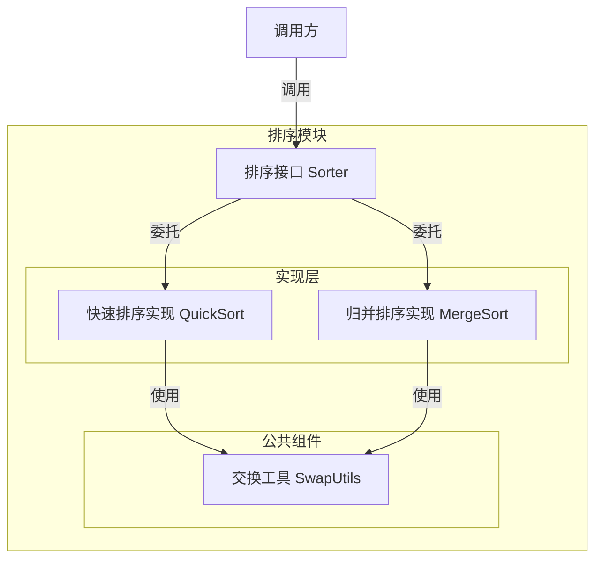
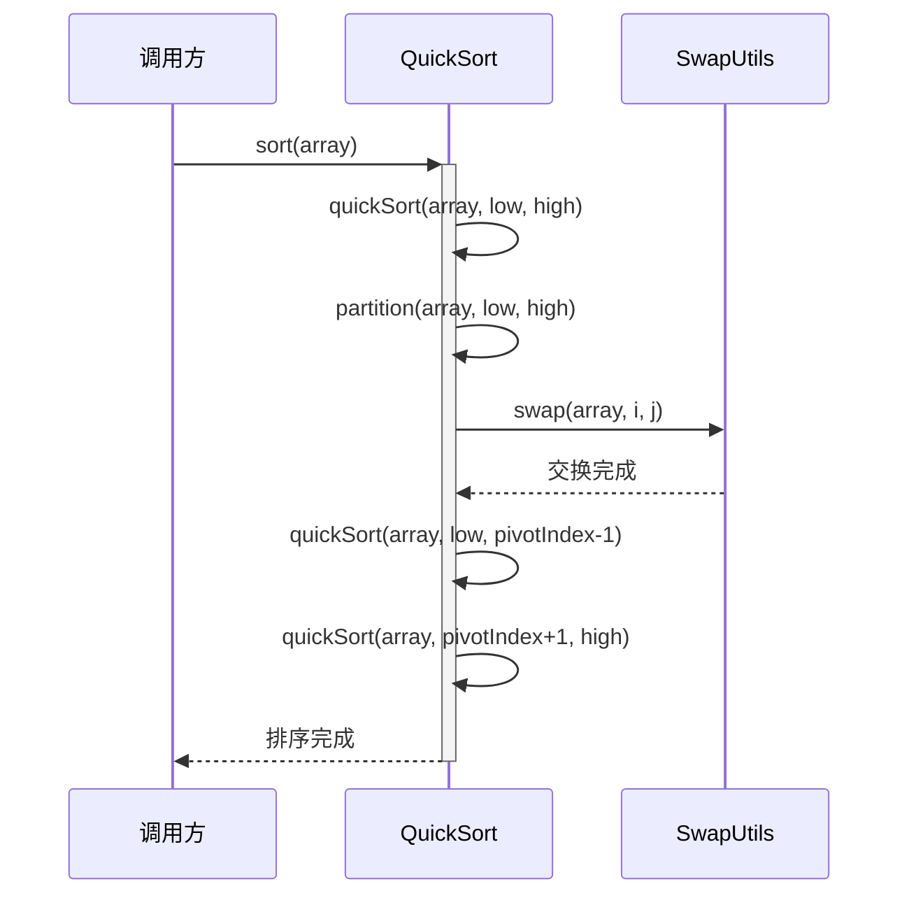
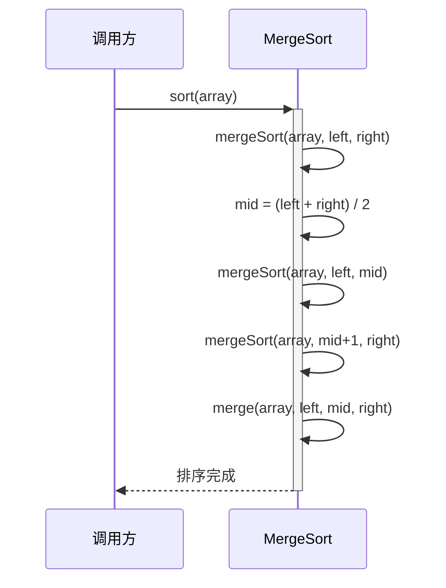

> **文档元信息**
>
> | 项目 | 内容 |
> |------|------|
> | 文档版本 | v1.0 |
> | 作者 | AiWork |
> | 创建日期 | 2026-09-15 |
> | 需求来源 | 用户口头需求：用Java实现一个递归排序 |
> | 评审状态 | 待评审 |

# Java递归排序 系分设计

## 1. 需求与范围

### 背景与目标
为用户提供一套基于Java语言的递归排序实现方案，支持常见的递归排序算法（如快速排序、归并排序等），并提供统一的调用入口和扩展能力，便于后续集成到更大的排序工具链或业务模块中。

### 核心功能
| 编号 | 功能点 | 优先级 | 需求来源 | 备注 |
|------|--------|--------|----------|------|
| F01 | 提供快速排序（QuickSort）递归实现 | P0 | 用户原始需求 | 基准值为递归排序典型代表 |
| F02 | 提供归并排序（MergeSort）递归实现 | P1 | 用户原始需求 | 稳定排序，适用于大数据量 |
| F03 | 提供排序算法统一调用接口 | P1 | 自主推导 | 降低多算法切换的耦合度 |
| F04 | 支持可扩展的新增排序算法注册 | P1 | 自主推导 | 预留后续扩展点 |

### 约束与非功能要求
- **语言约束**：Java（JDK 8+）
- **性能约束**：递归实现需考虑栈溢出风险，对大数据量需给出优化建议
- **可维护性**：代码需具备可读性、可测试性
- **无持久化需求**：纯内存操作，不涉及数据库或文件存储

### 排除范围
- 非递归（迭代）排序算法实现（如需，可后续扩展）
- 外部数据源读取（如从文件、数据库加载待排序数据）
- 分布式排序或并行排序（如需，可后续扩展）
- 图形化界面（GUI）或Web接口封装

### 需求功能清单与优先级
（已在核心功能部分列出，见上表）

### 假设与待确认项
| 编号 | 假设/待确认内容 | 当前假设 | 确认状态 |
|------|-----------------|----------|----------|
| A01 | 排序数据类型 | 假设为整数数组（int[]），泛型支持T[]可后续扩展 | 待确认 |
| A02 | 排序稳定性要求 | 假设无强制稳定性要求，推荐快速排序作为默认实现 | 待确认 |
| A03 | 数据规模上限 | 假设单批次数据量不超过 10^6 量级，超出时建议改为迭代实现或增加栈深度 | 待确认 |

---

## 2. 架构与模块

### 功能架构

**模块清单**

| 模块 | 职责 | 依赖 |
|------|------|------|
| 排序接口层 | 定义统一的排序接口（Sorter），对外屏蔽具体实现差异 | 无 |
| 排序实现层 | 包含各递归排序算法的具体实现（QuickSort、MergeSort等） | 排序接口层、公共组件 |
| 公共组件层 | 提供通用的工具方法（如swap、merge等） | 无 |

### 应用集成架构
本项不适用，原因：本项目为纯算法库级模块，不涉及外部系统、数据库、缓存、消息队列等集成点。

### 部署架构
本项不适用，原因：本项目为纯算法库，随业务应用一起打包部署（JAR依赖），无独立部署单元。

---

## 3. 数据模型与存储

本项不适用，原因：本项目为纯内存排序算法库，不涉及数据库或持久化存储，无需定义实体关系和数据模型。

---

## 4. 接口设计

### 4.1 oneapi（Web 控制台接口）
本项不适用，原因：本项目为底层算法库，不提供Web控制台接口。

### 4.2 OpenAPI（对外接口）
本项不适用，原因：本项目为底层算法库，不对外暴露HTTP接口。

### 4.3 内部接口（Service 层 / 算法层）

| 编号 | 接口名称 | 类 | 方法签名 | 说明 |
|------|----------|------|----------|------|
| S01 | 排序接口 | Sorter | `void sort(T[] array)` | 统一排序入口，泛型支持可比较对象 |
| S02 | 快速排序 | QuickSort | `void sort(T[] array)` | 基于分治的快速排序递归实现 |
| S03 | 归并排序 | MergeSort | `void sort(T[] array)` | 基于分治的归并排序递归实现 |

### 4.4 集成接口（Integration 层）
本项不适用，原因：本项目无外部依赖系统。

---

## 5. 功能模块设计

### 5.1 排序算法模块

#### 5.1.1 表结构设计
本项不适用，原因：无数据库表设计需求。

#### 5.1.2 接口详细设计

##### S01 排序接口（Sorter）
- **URI**: 无（Java接口）
- **描述**: 定义统一的排序行为契约，所有具体排序算法均需实现此接口
- **入参**:

| 参数名称 | 类型 | 是否必填 | 描述 |
|----------|------|----------|------|
| array | T[] | 是 | 待排序数组，元素需实现Comparable接口 |

- **出参**: 无（原地排序，修改入参数组）

- **业务规则**:
  - 入参为null时，抛出IllegalArgumentException
  - 数组长度 <= 1 时，无需排序，直接返回
  - 排序结果保证非递减序

##### S02 快速排序（QuickSort）
- **描述**: 采用分治策略，选取基准值将数组划分为左右两部分，递归排序子区间
- **核心步骤**:
  1. 选择基准值（pivot）
  2. 分区操作（partition）：将数组分为 <pivot 和 >=pivot 两部分
  3. 递归对左右子区间重复步骤 1-2
- **复杂度**: 平均 O(n log n)，最坏 O(n²)
- **稳定性**: 不稳定

##### S03 归并排序（MergeSort）
- **描述**: 采用分治策略，将数组逐层二分至最小单元，再逐层合并有序子数组
- **核心步骤**:
  1. 将数组从中间位置分为左右两半
  2. 递归对左右两半分别排序
  3. 合并两个有序子数组
- **复杂度**: 稳定 O(n log n)
- **稳定性**: 稳定

#### 5.1.3 子功能详细设计

##### 5.1.3.1 快速排序（F01）

**处理时序图**

**业务规则：**
| 规则编号 | 规则描述 | 校验时机 | 不满足时的处理 |
|----------|----------|----------|--------------|
| R01 | 基准值选择策略 | 分区前 | 默认采用末尾元素作为pivot，可扩展为三数取中法 |
| R02 | 递归终止条件 | 每次递归进入前 | low >= high 时直接返回，终止递归 |
| R03 | 分区后子区间长度校验 | 分区后 | 确保子区间长度严格小于父区间，防止无限递归 |

**异常场景：**
| 异常场景 | 处理方式 |
|----------|----------|
| 入参为null | 抛出 IllegalArgumentException("Input array cannot be null") |
| 数组为空或仅含1个元素 | 直接返回，无需处理 |
| 递归深度过大导致栈溢出（大数据量） | 建议：数据量 > 10^6 时，改用迭代实现或增大JVM栈深度（-Xss参数） |

**并发控制：**
本项不适用，原因：纯本地内存操作，无共享状态，无并发冲突风险。

**状态机设计：**
本项不适用，原因：排序过程为无状态计算，不存在实体状态流转。

##### 5.1.3.2 归并排序（F02）

**处理时序图**

**业务规则：**
| 规则编号 | 规则描述 | 校验时机 | 不满足时的处理 |
|----------|----------|----------|--------------|
| R04 | 二分边界正确性 | 每次递归 | left < right 时继续二分，否则终止 |
| R05 | 合并后数组有序性 | 合并完成后 | 逐元素比较确保左半部分 <= 右半部分 |

**异常场景：**
| 异常场景 | 处理方式 |
|----------|----------|
| 入参为null | 抛出 IllegalArgumentException("Input array cannot be null") |
| 数组为空或仅含1个元素 | 直接返回，无需处理 |
| 辅助数组空间不足 | 在merge方法内动态创建临时数组，空间复杂度O(n) |

**并发控制：**
本项不适用，原因：同快速排序，纯本地内存操作，无共享状态。

---

## 6. 非功能性需求设计

### 6.1 高可用性
本项不适用，原因：本项目为纯算法库，无服务化运行，不涉及高可用性设计。

### 6.2 可扩展性
- **算法扩展**：通过 `Sorter` 接口定义统一契约，新增排序算法只需实现该接口即可接入
- **泛型支持**：当前支持 Comparable 对象排序，后续可扩展为支持自定义 Comparator

### 6.3 稳定性/可靠性
- **边界处理**：空数组、单元素数组均能正确返回，不抛出异常
- **栈溢出防护**：
  - 快速排序：数据量较大时建议改用迭代实现或三数取中法优化
  - 归并排序：递归深度为 log₂(n)，10^6 数据量下递归深度约 20，栈溢出风险极低
- **性能基准**（参考值）：
  | 算法 | 平均时间复杂度 | 最坏时间复杂度 | 空间复杂度 | 稳定性 |
  |------|-------------|-------------|-----------|--------|
  | 快速排序 | O(n log n) | O(n²) | O(log n) | 不稳定 |
  | 归并排序 | O(n log n) | O(n log n) | O(n) | 稳定 |

### 6.4 安全性设计
本项不适用，原因：本项目为纯算法库，不涉及用户认证、权限控制、敏感数据处理等安全场景。

### 6.5 监控/统计/日志/告警
本项不适用，原因：本项目为纯算法库，不独立运行，由调用方在需要时自行埋点监控。

---

## 7. 变更三板斧

### 7.1 可监控
本项不适用，原因：本项目为纯算法库，无独立运行服务，不涉及运行时监控埋点。
- 建议：调用方在调用排序接口前后自行记录耗时、数据量等指标。

### 7.2 可灰度
本项不适用，原因：本项目为纯算法库，无独立发布单元，灰度由调用方在业务层控制（如A/B测试选择不同Sorter实现）。

### 7.3 可应急
本项不适用，原因：本项目为纯算法库，不存在线上故障应急回滚场景。
- 建议：调用方保留旧版排序实现，作为新算法出现问题时的降级备选。

---

## 8. 方案检查总结

| 检查项 | 检查结果 | 说明 |
|--------|--------|------|
| 模块划分合理性 | 通过 | 职责单一，无循环依赖 |
| 依赖关系合理性 | 通过 | 无外部依赖，仅依赖JDK |
| 单点问题（部署层面） | 不适用 | 无独立部署单元 |
| 表模型设计范式 | 不适用 | 无数据库表设计 |
| 隐私安全 | 不适用 | 无敏感数据处理 |
| 接口兼容性 | 通过 | Sorter接口稳定，新增实现不影响调用方 |
| 功能点一致性 | 通过 | F01~F04均有对应设计 |
| 并发风险 | 通过 | 无共享状态，无并发风险 |
| 非功能性设计可行性 | 通过 | 性能、边界条件均有说明 |
