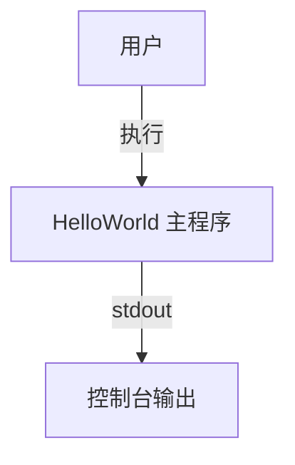
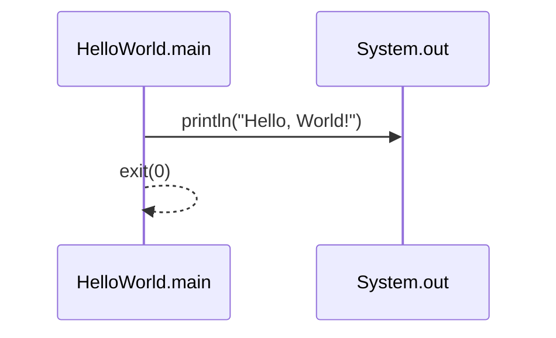

# 系统分析设计文档：Hello World

> **文档元信息**
>
> | 项目 | 内容 |
> |------|------|
> | 文档版本 | v1.0 |
> | 作者 | DTCoder |
> | 创建日期 | 2026-08-06 |
> | 状态 | 草稿 |

## 1. 需求分析

### 1.1 业务背景
用户需要一个最简可运行示例（Hello World），用于验证开发环境、构建链路或作为入门演示。

### 1.2 功能需求
- **FR-001**：程序启动后在标准输出打印 `Hello, World!`。
- **FR-002**：程序正常退出，返回码为 0。

### 1.3 非功能需求
- **NFR-001**：无外部依赖，单文件即可编译/运行。
- **NFR-002**：启动时间 < 1s。

## 2. 架构设计

### 2.1 整体架构
采用单层控制台应用架构，无分层、无中间件。



### 2.2 技术选型
| 维度 | 选择 | 理由 |
|------|------|------|
| 语言 | Java 17+ | 与 dtazziboot 技术栈一致 |
| 构建 | Maven / Gradle 均可 | 单类无需复杂构建 |
| 运行 | JDK 直接运行 | 零框架开销 |

## 3. 模块设计

### 3.1 模块清单
| 模块 | 职责 | 关键类 |
|------|------|--------|
| hello-world | 入口与输出 | `HelloWorld` |

### 3.2 核心流程


## 4. 接口设计

### 4.1 对外接口
无 HTTP/RPC 接口；仅命令行入口。

### 4.2 内部接口
| 方法 | 签名 | 说明 |
|------|------|------|
| main | `public static void main(String[] args)` | JVM 入口 |

## 5. 数据模型设计

### 5.1 持久化
无数据库、无文件存储。

### 5.2 内存模型
仅使用字符串常量 `"Hello, World!"`，无自定义对象。

## 6. 部署设计

### 6.1 打包
```bash
javac HelloWorld.java
```

### 6.2 运行
```bash
java HelloWorld
```

### 6.3 环境要求
- JDK ≥ 17
- 操作系统：Linux / macOS / Windows

## 7. 风险与决策记录

| ID | 决策 | 理由 |
|----|------|------|
| DEC-001 | 不使用 Spring Boot | Hello World 无需框架，保持最简 |
| DEC-002 | 单文件实现 | 降低认知与构建复杂度 |

## 8. 附录

### 8.1 参考代码片段
```java
public class HelloWorld {
    public static void main(String[] args) {
        System.out.println("Hello, World!");
    }
}
```
