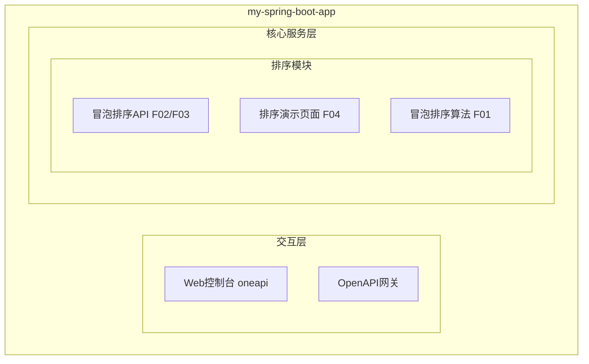
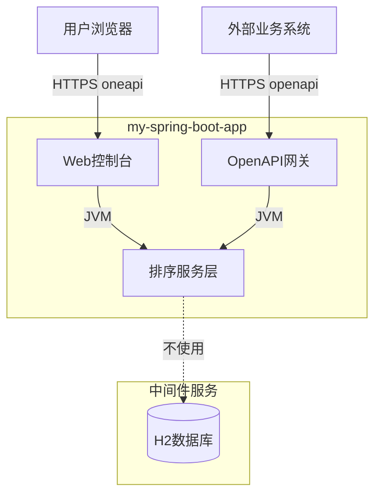
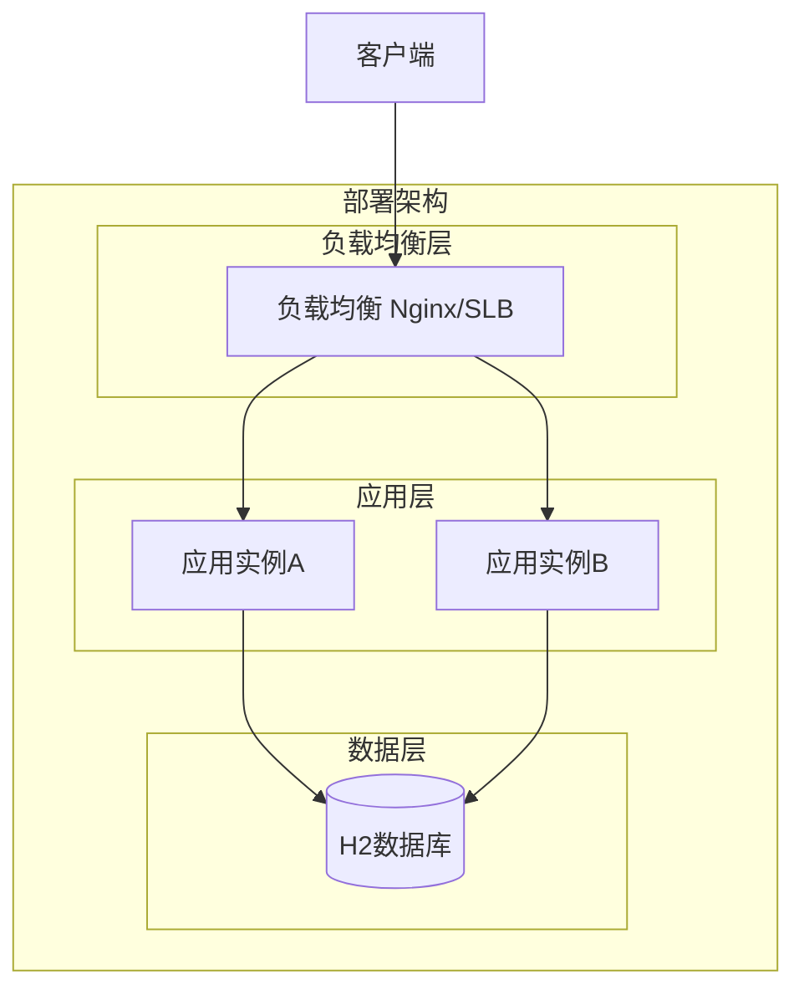
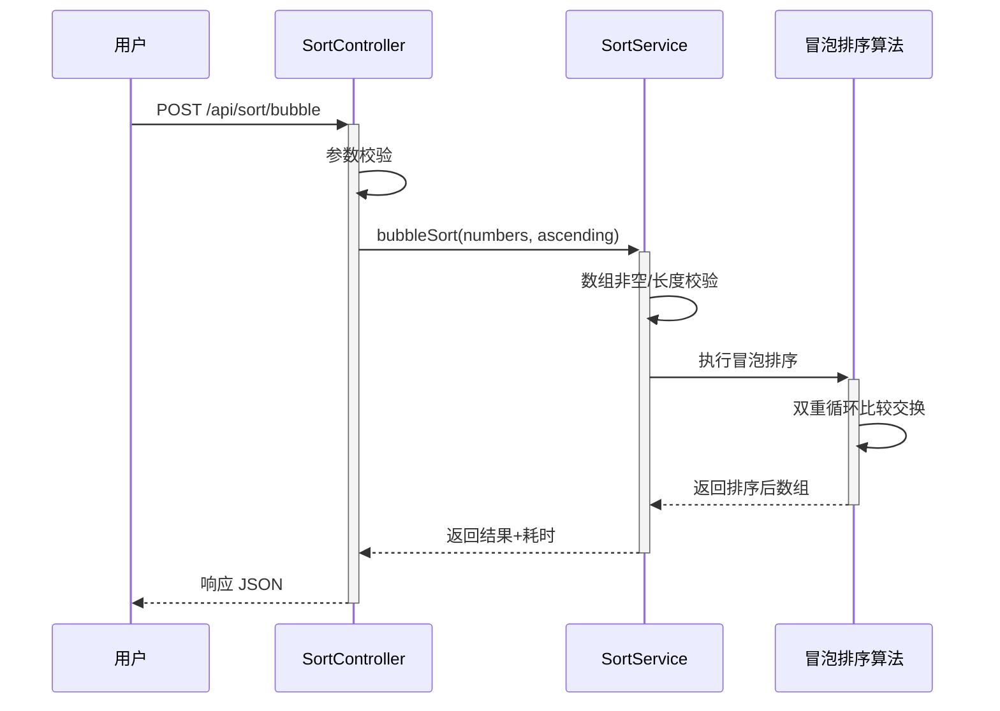
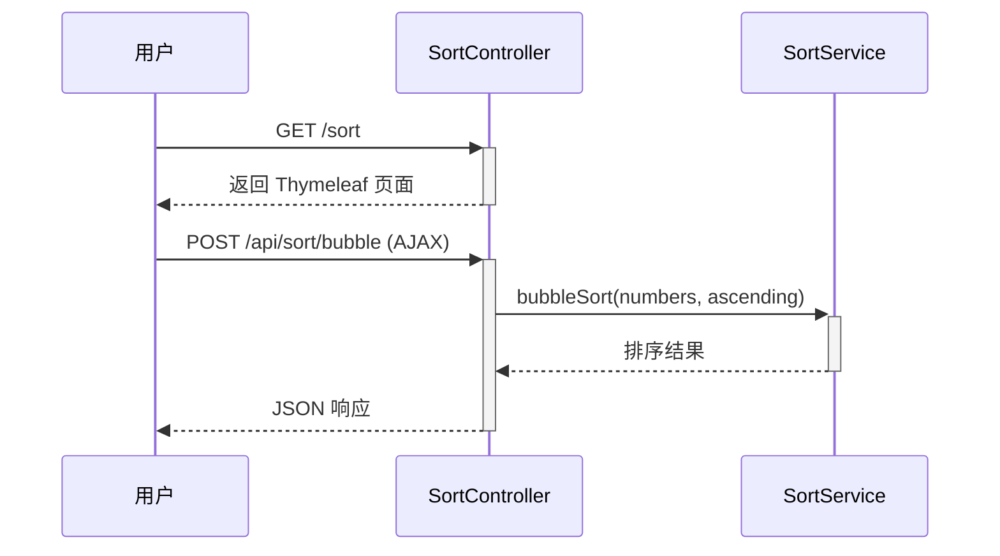

> **文档元信息**
>
> | 项目 | 内容 |
> |------|------|
> | 文档版本 | v1.0 |
> | 作者 | AiWork |
> | 创建日期 | 2026-09-15 |
> | 需求来源 | "实现一个冒泡排序" |
> | 评审状态 | 待评审 |

# 冒泡排序 系分设计

## 1. 需求与范围

### 背景与目标

在现有 Spring Boot 应用（my-spring-boot-app）中实现一个冒泡排序功能。冒泡排序是一种简单的比较排序算法，通过反复交换相邻的逆序元素，使大元素逐步"浮"到数组末尾。目标是提供一套可复用的排序服务，通过 REST API 接收整数数组并返回排序结果，同时提供 Web 页面进行可视化演示。

### 核心功能

1. **冒泡排序算法实现**：对输入的整数数组执行冒泡排序，返回升序排列结果。
2. **REST API 接口**：提供 oneapi 和 OpenAPI 两类接口，接收数组参数返回排序结果。
3. **Web 演示页面**：提供 Thymeleaf 页面，用户可输入数组并查看排序结果。

### 约束与非功能要求

- 时间复杂度：O(n²)，适用于小规模数据（建议 ≤1000 个元素）。
- 空间复杂度：O(1)，原地排序。
- 输入校验：数组元素必须为整数，数组长度 ≤1000。
- 排序方向：默认升序，支持通过参数指定降序。

### 排除范围

- 不实现其他排序算法（快速排序、归并排序等）。
- 不持久化排序历史记录。
- 不支持非整数类型排序（字符串、浮点数等）。
- 不做分布式/并发排序优化。

### 需求功能清单与优先级

| 编号 | 功能点 | 优先级 | PRD 原始描述/章节 | 备注 |
|------|--------|--------|-------------------|------|
| F01 | 冒泡排序核心算法实现 | P0 | "实现一个冒泡排序" | SortService.bubbleSort(int[], boolean) |
| F02 | oneapi REST 接口 | P0 | "实现一个冒泡排序" | POST /api/sort/bubble |
| F03 | OpenAPI 对外接口 | P1 | "实现一个冒泡排序" | POST /openapi/sort/bubble |
| F04 | Web 演示页面 | P1 | "实现一个冒泡排序" | Thymeleaf 页面 /sort |

### 假设与待确认项

| 编号 | 假设/待确认内容 | 当前假设 | 确认状态 |
|------|-----------------|----------|----------|
| A01 | 排序数据类型 | 整数数组（int[]），最通用场景 | 待确认 |
| A02 | 排序方向 | 默认升序，可通过参数指定降序 | 待确认 |
| A03 | 数组最大长度 | 1000，防止 O(n²) 性能问题 | 待确认 |
| A04 | 是否持久化 | 不持久化，纯算法无业务存储需求 | 待确认 |
| A05 | board-knowledge-search 不可用 | 工具环境无此 skill，需求简单无影响 | 待确认 |

## 2. 架构与模块

### 功能架构



- 交互层说明：Web 控制台通过 oneapi 提供 REST 接口和 Thymeleaf 页面；OpenAPI 网关提供对外标准接口。
- 核心服务层说明：排序模块包含算法核心（SortService）、API 接口（SortController）、Web 演示页面三个功能点。
- 扩展/集成层说明：本项不适用，原因：冒泡排序为纯计算功能，无外部系统依赖。

**模块清单**

| 模块 | 职责 | 依赖 |
|------|------|------|
| 排序模块 | 接收数组输入，执行冒泡排序，返回排序结果 | 无外部依赖，仅 JVM 内计算 |

### 应用集成架构



**集成关系说明：**

| 调用方 | 被调用方 | 协议 | 接口类型 | 说明 |
|--------|----------|------|----------|------|
| 用户浏览器 | 应用 Web控制台 | HTTPS | oneapi REST | 排序 API 和演示页面 |
| 外部业务系统 | 应用 OpenAPI网关 | HTTPS | openapi REST | 对外排序接口 |
| 应用排序服务层 | 数据库 | - | - | 不涉及，纯内存计算 |

### 部署架构



**部署说明：**
- **负载均衡层**：Nginx/SLB 负载均衡，将请求分发到应用实例。
- **应用层**：Spring Boot 应用多实例部署，无状态，支持水平扩展。
- **数据层**：H2 内存数据库（已有配置），排序功能不涉及数据库操作。

## 3. 数据模型与存储

### 实体清单

| 实体名称 | 实体说明 | 所属模块 | 与其他实体的关系 |
|----------|----------|----------|-----------------|

本项不适用，原因：冒泡排序为纯内存计算功能，无业务实体需要持久化，不涉及数据库表设计。

### 实体关系图

本项不适用，原因：无业务实体，无实体关系。

**模型说明：**
- 冒泡排序功能接收整数数组输入，在内存中完成排序后返回结果，全程不涉及数据库读写操作。
- 现有 H2 数据库及 User/Item 实体与本功能无关。

## 4. 接口设计

### 4.1 oneapi（Web 控制台接口）

| 编号 | 接口名称 | 方法 | 路径 | 模块 |
|------|----------|------|------|------|
| W01 | 冒泡排序 | POST | /api/sort/bubble | 排序模块 |

### 4.2 OpenAPI（对外接口）

| 编号 | 接口名称 | 方法 | 路径 | 模块 |
|------|----------|------|------|------|
| O01 | 冒泡排序 | POST | /openapi/sort/bubble | 排序模块 |

### 4.3 内部接口（Service 层）

| 编号 | 接口名称 | 类 | 方法签名 |
|------|----------|------|----------|
| S01 | 冒泡排序 | SortService | int[] bubbleSort(int[] arr, boolean ascending) |

### 4.4 集成接口（Integration 层）

本项不适用，原因：冒泡排序无外部系统集成需求。

## 5. 功能模块设计

### 全局约定

| 约定项 | 约定内容 |
|--------|----------|
| 错误码格式 | {MODULE}_{SEQ}，模块前缀 SORT |
| 通用出参结构 | { code, msg, data } |
| code 含义 | "OK" 表示成功，其他为错误码 |
| msg 含义 | 成功为 "SUCCESS"，失败为错误描述 |

### 5.1 排序模块

#### 5.1.1 表结构设计

本项不适用，原因：冒泡排序为纯内存计算功能，不涉及数据库表设计，无持久化需求。

##### 5.1.1.1 枚举与常量定义

| 枚举名称 | 取值 | 含义 | 关联字段 |
|----------|------|------|----------|
| 排序方向 | ASC | 升序 | 请求参数 ascending=true |
| 排序方向 | DESC | 降序 | 请求参数 ascending=false |

#### 5.1.2 接口详细设计

##### W01 冒泡排序（oneapi）

- **URI**: POST /api/sort/bubble
- **描述**: 接收整数数组，执行冒泡排序，返回排序结果
- **入参**:

| 参数名称 | 类型 | 是否必填 | 描述 |
|----------|------|----------|------|
| numbers | int[] | 是 | 待排序的整数数组，长度 1~1000 |
| ascending | boolean | 否 | 排序方向，true=升序（默认），false=降序 |

- **出参**:

| 参数名称 | 类型 | 描述 |
|----------|------|------|
| code | String | 结果 code，"OK" 表示成功 |
| msg | String | 提示信息 |
| data | Object | 业务数据 |
| data.sortedNumbers | int[] | 排序后的整数数组 |
| data.elapsedMillis | long | 排序耗时（毫秒） |

- **错误码**:

| 错误码 | 说明 |
|--------|------|
| SORT_001 | 数组为空 |
| SORT_002 | 数组长度超过 1000 |
| SORT_003 | 数组包含非整数元素 |

- **业务规则**: 参数校验通过后执行冒泡排序，记录耗时并返回。

- **请求示例**:
```json
{
  "numbers": [5, 3, 8, 1, 9, 2],
  "ascending": true
}
```

- **响应示例**:
```json
{
  "code": "OK",
  "msg": "SUCCESS",
  "data": {
    "sortedNumbers": [1, 2, 3, 5, 8, 9],
    "elapsedMillis": 0
  }
}
```

##### O01 冒泡排序（OpenAPI）

- **URI**: POST /openapi/sort/bubble
- **描述**: 对外提供冒泡排序接口，入参出参与 W01 完全一致
- **入参**: 同 W01
- **出参**: 同 W01
- **错误码**: 同 W01
- **业务规则**: 同 W01
- **请求示例**: 同 W01
- **响应示例**: 同 W01

#### 5.1.3 子功能详细设计

##### 5.1.3.1 冒泡排序算法执行（F01）

- 处理时序图


**业务规则：**

| 规则编号 | 规则描述 | 校验时机 | 不满足时的处理 |
|----------|----------|----------|--------------|
| R01 | numbers 不能为 null 或空数组 | 接口入口 | 返回 SORT_001，提示"数组为空" |
| R02 | numbers 长度 ≤ 1000 | 接口入口 | 返回 SORT_002，提示"数组长度超过1000" |
| R03 | numbers 元素必须为整数 | 接口入口 | 返回 SORT_003，提示"数组包含非整数元素" |
| R04 | ascending 默认为 true | 参数缺失时 | 使用默认值 true（升序） |

**异常场景：**

| 异常场景 | 处理方式 |
|----------|----------|
| numbers 为 null | 返回 SORT_001 |
| numbers 为空数组 | 返回 SORT_001 |
| numbers 长度 > 1000 | 返回 SORT_002 |
| 排序过程中 OOM | 返回 500 错误，记录日志 |

**并发控制（如涉及数据写入）：**
- 并发场景：无并发风险，原因：冒泡排序为纯内存计算，无共享可变状态。每次请求创建独立数组副本，不涉及数据竞争。
- 控制策略：无并发风险，原因：方法无副作用，不修改共享状态。

**状态机设计（如实体存在状态字段）：**
本项不适用，原因：冒泡排序无状态字段，不涉及状态流转。

##### 5.1.3.2 Web 演示页面（F04）

- 处理时序图


**业务规则：**

| 规则编号 | 规则描述 | 校验时机 | 不满足时的处理 |
|----------|----------|----------|--------------|
| R05 | 页面输入用逗号分隔的整数 | 前端提交时 | 前端 JS 校验提示 |
| R06 | 页面展示原始数组和排序后数组 | 响应返回后 | - |

**异常场景：**

| 异常场景 | 处理方式 |
|----------|----------|
| 输入格式不合法 | 前端 JS 提示"请输入逗号分隔的整数" |
| 服务器返回错误 | 页面展示错误信息 |

**并发控制：** 无并发风险，原因同 F01。

**状态机设计：** 本项不适用，原因同 F01。

#### 技术选型方案对比

| 决策项 | 方案A | 方案B | 推荐 | 理由 |
|--------|-------|-------|------|------|
| 排序算法 | 标准冒泡排序（双重循环） | 优化冒泡排序（提前终止标记） | 方案B | 优化版在已排序时可提前终止，减少无效比较，实现仍简单 |
| API 返回格式 | 仅返回排序后数组 | 返回排序后数组+耗时 | 方案B | 提供耗时信息便于性能观察，不影响接口简洁性 |
| Web 页面 | 独立页面 | 嵌入现有首页 | 方案A | 独立页面职责清晰，不影响现有页面 |

推荐方案：采用优化冒泡排序 + 返回排序后数组与耗时 + 独立 Thymeleaf 页面。

#### 模块自检

**完备性对账表：**

| 功能点 | 对应设计 | 是否完备 |
|--------|----------|----------|
| F01 冒泡排序算法 | 5.1.3.1 子功能设计 | ✅ |
| F02 oneapi REST 接口 | W01 接口详细设计 | ✅ |
| F03 OpenAPI 对外接口 | O01 接口详细设计 | ✅ |
| F04 Web 演示页面 | 5.1.3.2 子功能设计 | ✅ |

**过度设计检查：**
- 无数据库表设计：✅ 合理，纯内存计算
- 无状态机：✅ 合理，无状态字段
- 无并发控制：✅ 合理，无共享可变状态
- 优化冒泡排序：✅ 合理，简单有效

## 6. 非功能性需求设计

### 6.1 高可用性

冒泡排序为纯内存计算，无外部依赖，不存在因下游异常导致不可用的场景。Spring Boot 应用本身多实例部署，任一实例故障时负载均衡自动切换。不涉及降级和容错切换。

### 6.2 可扩展性

应用层无状态，支持水平扩缩容。排序计算在单节点 JVM 内完成，无需分布式协调。新增其他排序算法时，可在 SortService 中扩展新方法，不影响现有接口。

### 6.3 稳定性/可靠性

- 边界场景：空数组、单元素数组直接返回，不做排序操作。
- 大数组场景：数组长度限制 1000，防止 O(n²) 性能恶化。
- 输入合法性：参数校验确保数据类型正确，非法输入返回明确错误码。
- 排序结果确定性：冒泡排序为稳定排序，相同元素相对顺序不变。

### 6.4 安全性设计

#### 6.4.1 账户系统方案
本项不适用，原因：排序 API 为公共计算接口，不需要登录态校验。

#### 6.4.2 授权&访问控制
##### 6.4.2.1 是否实现水平权限检查
不涉及，原因：排序功能为公共计算服务，不涉及资源归属。

##### 6.4.2.2 是否实现垂直权限检查
不涉及，原因：排序功能为公共计算服务，不需要角色权限。

##### 6.4.2.3 是否检查登录态
不检查登录态，原因：排序为公共计算接口，面向所有用户开放。/api/sort/bubble 和 /openapi/sort/bubble 配置白名单。

#### 6.4.3 数据防护方案
##### 6.4.3.1 是否对敏感数据加密存储
不涉及，原因：无敏感数据，不持久化任何数据。

##### 6.4.3.2 是否对敏感数据展示进行脱敏
不涉及，原因：排序数据为用户输入的整数数组，无敏感信息。

### 6.5 监控/统计/日志/告警

- 接口调用日志：记录请求参数（数组长度）、耗时、返回码。
- 性能监控：监控排序耗时，超过阈值（如 100ms）告警。
- 异常监控：监控 SORT_001~003 错误码出现频率。

## 7. 变更三板斧

### 7.1 可监控

- 接口埋点：SortController 接口记录调用次数、处理耗时、返回码。
- 算法埋点：SortService.bubbleSort 记录数组长度和排序耗时。
- 日志级别：正常调用 INFO，参数校验失败 WARN，异常 ERROR。
- 告警规则：排序耗时 >100ms 或错误率 >1% 时告警。

### 7.2 可灰度

- 灰度策略：本功能为新增功能，不影响现有逻辑，无需灰度。
- 如需灰度：可通过请求头 X-Sort-Version 控制使用新旧逻辑，按租户尾号灰度引流。
- 当前方案：直接全量发布，原因：新增独立模块和接口，不修改现有代码，无回归风险。

### 7.3 可应急

- 开关控制：预留 `sort.bubble.enabled` 配置开关，关闭后接口返回 SORT_004 "功能已关闭"。
- 回滚方案：新增模块独立，回滚仅需移除 SortController、SortService 及页面模板，不影响现有功能。
- 上下游兼容性：新增接口，不修改现有接口，回滚对上下游无影响。

## 8. 方案检查 Checklist

| 检查项 | 结果 | 说明 |
|--------|------|------|
| 模块划分合理性检查 | 通过 | 单一排序模块，职责清晰，无循环依赖，无功能点超 50% 的模块 |
| 依赖关系合理性检查 | 通过 | 无外部依赖，纯内存计算，下游异常不影响本系统 |
| 单点问题检查（部署层面） | 通过 | 多实例无状态部署，负载均衡消除单点 |
| 表模型设计范式检查 | 不适用 | 无数据库表，纯内存计算 |
| 隐私安全检查 | 不适用 | 无敏感数据，不持久化 |
| 兼容性检查（接口） | 通过 | 全新接口，不影响现有接口 |
| 兼容性检查（表） | 不适用 | 无数据库表变更 |
| 数据迁移检查 | 不适用 | 无数据库表，无数据迁移 |
| 一致性检查（功能点） | 通过 | F01~F04 在 Step 5 均有对应设计 |
| 一致性检查（表） | 不适用 | 无数据库实体 |
| 一致性检查（接口） | 通过 | W01、O01、S01 在 Step 5 均有详细定义 |
| 一致性检查（枚举） | 通过 | 排序方向枚举 ASC/DESC 与接口参数 ascending 一致 |
| 状态机完整性检查 | 不适用 | 无状态字段实体 |
| 并发风险检查 | 通过 | 无并发风险，纯内存无共享可变状态 |
| 单点问题检查（定时任务层面） | 不适用 | 无定时任务 |
| 非功能性设计可行性检查 | 通过 | 非功能设计均基于现有 Spring Boot 能力，落地可行 |
| 变更三板斧设计可行性检查（可监控） | 通过 | 接口+算法埋点设计可行 |
| 变更三板斧设计可行性检查（可灰度） | 通过 | 新增独立模块无回归风险，直接发布可行 |
| 变更三板斧设计可行性检查（可应急） | 通过 | 配置开关+独立模块回滚，方案简单快速 |
