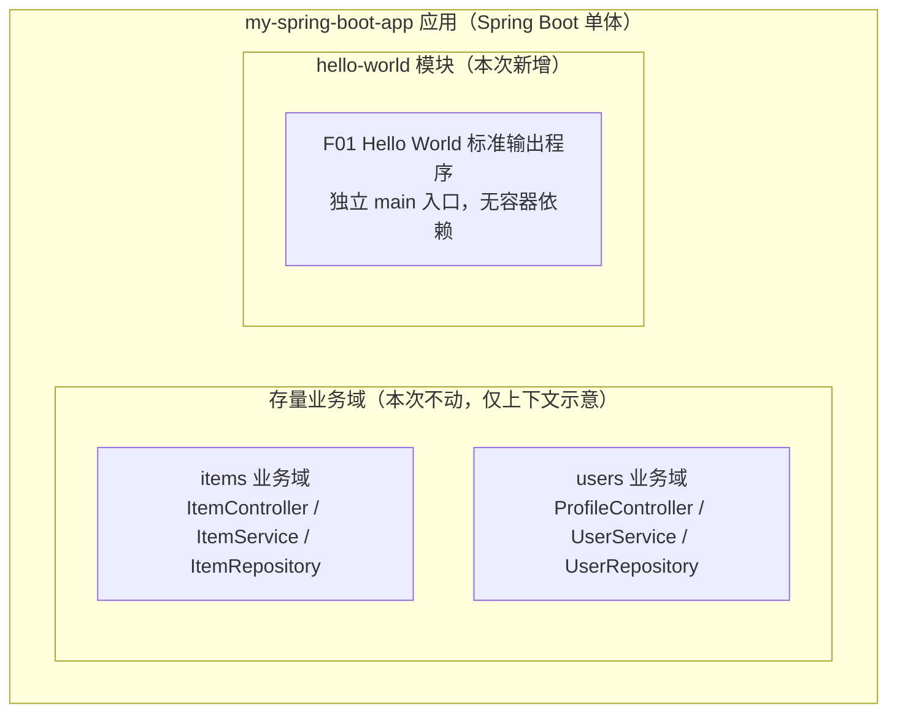
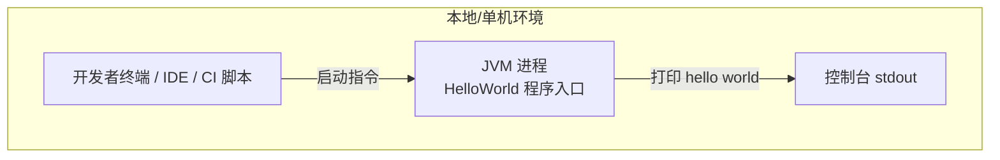
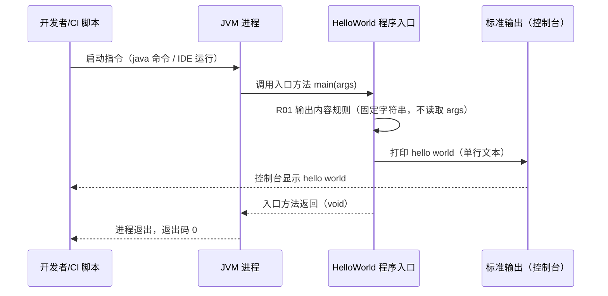

> **文档元信息**
>
> | 项目 | 内容 |
> |------|------|
> | 文档版本 | v1.0 |
> | 作者 | AiWork 系分流程（流程实例 20260915-092453-K4W） |
> | 创建日期 | 2026-09-15 |
> | 需求来源 | 任务需求原文："写一个java文件，输出hello world" |
> | 评审状态 | 待评审 |

# Hello World 输出程序 系分设计

## 1. 需求与范围

### 背景与目标

仓库 ranxitest 现有一个 Spring Boot 2.6.6 / Java 17 / Maven 单体演示应用 `my-spring-boot-app`，包含 items、users 两个业务域（Controller–Service–Repository 分层，H2 内存库，Thymeleaf 模板）。本需求为最小功能演示诉求：交付一个可独立运行、结果确定、可快速验证的 Hello World 输出程序，同时作为仓库构建与运行链路的最小验证载体。

**做什么**：在现有仓库中新增一个 Java 文件，程序运行后向控制台标准输出打印字符串 `hello world`，随后正常退出。
**给谁用**：开发者本人（本地运行验证）、CI 流水线（构建链路验证）。无终端业务用户。
**边界**：仅新增一个 Java 文件；不修改任何存量代码、配置与模板。

### 核心功能

新增一个独立 Java 程序，执行后在控制台标准输出精确字符串 `hello world`，并以退出码 0 正常结束进程。

### 约束与非功能要求

| 类别 | 约束内容 |
|------|----------|
| 语言/运行时 | Java 17，与 `my-spring-boot-app/pom.xml` 的 `java.version=17` 保持一致 |
| 构建 | Maven（仓库现有唯一构建工具，文件须位于 Maven 标准源码目录以纳入编译范围） |
| 改动范围 | 仅新增一个 Java 文件，零存量代码修改 |
| 可靠性 | 输出内容确定、无随机性；不依赖外部输入；进程正常退出 |
| 依赖 | 仅依赖 JDK 标准库，不引入新第三方依赖，不依赖 Spring 容器启动 |

### 排除范围

- 不涉及数据库、缓存、MQ、文件/对象存储等任何持久化或中间件
- 不新增或修改任何 HTTP 接口（oneapi / OpenAPI 均不涉及）
- 不修改现有 Controller / Service / Repository / 异常处理器 / Thymeleaf 模板
- 不涉及鉴权、租户隔离、多环境配置、日志框架接入

### 需求功能清单与优先级

| 编号 | 功能点 | 优先级 | PRD 原始描述/章节 | 备注 |
|------|--------|--------|-------------------|------|
| F01 | Hello World 标准输出程序 | P0 | 需求原文："写一个java文件，输出hello world" | 新增单一 Java 文件，含可运行程序入口 |

### 假设与待确认项

| 编号 | 假设/待确认内容 | 当前假设 | 确认状态 |
|------|-----------------|----------|----------|
| A01 | 输出内容的大小写与措辞 | 输出精确字符串 `hello world`（全小写，与需求原文一致） | 待确认 |
| A02 | 输出通道 | 标准输出 stdout（System.out），非日志框架、非 HTTP 响应体 | 待确认 |
| A03 | 运行方式 | 通过 main 程序入口直接运行（`java` 命令或 IDE），无需启动 Spring 容器 | 待确认 |
| A04 | 文件位置与类名 | `my-spring-boot-app/src/main/java/com/example/myapp/HelloWorld.java`，类名 `HelloWorld` | 待确认 |
| A05 | 输出后行为 | 打印后进程以退出码 0 正常退出，无交互、无驻留 | 待确认 |

## 2. 架构与模块

### 架构判定

- 检查已有架构文档：仓库不存在 `docs/ARCHITECTURE.md` 与 `docs/modules/`，无正式架构文档；以代码实地结构为准（Spring Boot 单体，Controller–Service–Repository 分层）。
- 本次需求为单文件新增，不改变现有单体架构形态，不引入新服务、新中间件。
- 无外部系统集成，部署形态明确（本地单机 JVM 进程运行）→ 按模板规则，功能架构 / 集成架构 / 部署架构三部分简化合并输出。

### 功能架构

- 交互层说明：本项不适用，原因：F01 为命令行直接运行的程序入口，不提供 Web 控制台与 OpenAPI 交互入口。
- 核心服务层说明：hello-world 模块为本次唯一新增模块，职责单一——向标准输出打印 `hello world`；与存量 items/users 业务域零耦合（无相互引用）。
- 扩展/集成层说明：本项不适用，原因：无外部系统集成需求。

### 模块清单

| 模块 | 职责 | 依赖 |
|------|------|------|
| hello-world 模块（新增） | 提供独立的 Hello World 标准输出程序：程序入口接收启动调用，向 stdout 打印精确字符串 `hello world` 后正常退出 | 仅 JDK 标准库；不依赖应用内其他模块、不依赖 Spring 容器、不依赖中间件 |

模块划分检查：单一职责（一个模块一个功能点）；无循环依赖（新模块无任何出向依赖）；无功能点超 50% 集中的模块。

### 应用集成架构

本项不适用，原因：需求范围内无外部系统调用方与被调用方，无数据库/缓存/MQ 等中间件连接，应用集成关系为空集。唯一交互关系为：开发者在本机以 JVM 进程方式启动该程序，通过控制台 stdout 接收输出。

### 部署架构

**部署说明：**
- **负载均衡层**：本项不适用，原因：无网络服务形态，不存在流量入口。
- **应用层**：单进程、单次执行、执行完毕即退出的 JVM 程序；无常驻实例、无副本诉求；文件随 `my-spring-boot-app` 一并纳入 Maven 构建（`mvn compile`）与产物 jar。
- **数据层**：本项不适用，原因：无任何持久化。
- 公有云/私有化多机房部署假设在本需求中不成立，已在假设表 A03 中记录运行方式假设。

## 3. 数据模型与存储

### 实体清单

本项不适用，原因：需求为向标准输出打印固定字符串的一次性程序，无任何业务数据的产生、读取、存储诉求，不涉及实体识别。

| 实体名称 | 实体说明 | 所属模块 | 与其他实体的关系 |
|----------|----------|----------|-----------------|
| （无） | 本需求无持久化实体 | - | - |

### 实体关系图

本项不适用，原因：实体清单为空，无关系可表达。

### 缓存 / MQ

本项不适用，原因：无热点数据诉求、无异步消息诉求，不引入 Redis/MQ 等组件。

### 租户隔离

本项不适用，原因：无多租户场景与持久化数据，不涉及 tenant_id 设计。

### 命名规范遵循说明

因无表/字段设计，`references/db.md` 中命名规范在本需求中无适用对象；后续若该程序演进为持久化功能，表设计须遵循该规范（小写+下划线、pk_/uk_/idx_ 索引前缀、id/gmt_create/gmt_modified 三标配字段等）。

## 4. 接口设计

### 4.1 oneapi（Web 控制台接口）

本项不适用，原因：F01 为命令行运行的程序入口，不提供 `/api` 前缀的 Web 控制台接口；不修改存量 `HomeController`、`ItemController`、`ProfileController`。

### 4.2 OpenAPI（对外接口）

本项不适用，原因：需求表述为"输出"而非"对外提供服务"，无外部系统调用方，不新增 `/openapi` 前缀接口。

### 4.3 内部接口（Service 层）

本项不适用，原因：hello-world 模块为独立程序入口，不定义 Service 层接口，也不被应用内其他模块调用；与存量 items/users 业务域零耦合。

### 4.4 集成接口（Integration 层）

本项不适用，原因：无外部系统集成，不定义 Integration/Client 层接口。

### 程序入口说明（非接口，供索引）

F01 的对外触达点不是 HTTP/RPC 接口，而是 JVM 程序入口（标准入口方法，接收命令行参数数组，本需求不读取该参数）。其详细约定（方法名、形参、返回、退出码）在第 5 章 hello-world 模块的接口详细设计中以表格形式定义。

## 5. 功能模块设计

### 5.0 全局约定与模块映射

- **错误码格式**：默认约定为 `{MODULE}_{SEQ}`。本次不适用，原因：F01 无业务错误分支（见 5.1.3 异常场景表），不产生错误码。若后续演进引入校验逻辑，错误码建议为 `HELLO_XXX` 格式。
- **通用出参结构**：默认约定为 `{code, msg, data}`。本次不适用，原因：无 HTTP 接口，程序出参形态为"标准输出字符串 + 进程退出码"。
- **其他全局约定**：输出通道统一为标准输出（stdout）；不引入日志框架（避免为一个打印动作引入依赖）；不使用标准错误流。

**模块映射表**

| 模块 | 对应设计章节 | 主要承载类（规划） | 覆盖功能点 |
|------|--------------|--------------------|------------|
| hello-world 模块 | 5.1 | `com.example.myapp.HelloWorld`（新增单文件） | F01 |

### 5.1 hello-world 模块

#### 5.1.1 表结构设计

本项不适用，原因：模块无持久化诉求，不涉及表结构（见第 3 章）。

##### 枚举与常量定义

本模块无枚举/常量定义。输出字符串 `hello world` 为唯一字面量，直接在程序入口方法内使用，无需抽离常量（单点使用，抽离反而增加间接层）。

#### 5.1.2 接口详细设计（程序入口约定）

本模块无 HTTP/RPC 接口，此处定义唯一的程序入口约定：

- **入口名称**：HelloWorld 程序入口（JVM 标准入口方法）
- **描述**：接收 JVM 启动调用，向标准输出打印 `hello world` 后返回，进程以退出码 0 结束。
- **入参**：

| 参数名称 | 类型 | 是否必填 | 描述 |
|----------|------|----------|------|
| args | 字符串数组 | 否（可为空数组） | 命令行参数；本需求不读取、不校验、不使用，仅占位满足 JVM 入口方法规范 |

- **出参**：

| 参数名称 | 类型 | 描述 |
|----------|------|------|
| （无返回值） | void | 入口方法无返回值 |
| stdout | 文本流 | 精确字符串 `hello world`（含换行，由标准输出行语义决定） |
| exit code | 整数 | 0（正常输出后正常退出） |

- **错误码**：无（无错误分支，见异常场景表）。
- **业务规则**：见 5.1.3.1 业务规则表。
- **请求/响应示例**：本项不适用，原因：非 HTTP 接口，无请求响应报文；交互形态为"启动指令 → 控制台文本行"。

#### 5.1.3 子功能详细设计

##### 5.1.3.1 Hello World 标准输出（F01）

- 处理时序图

**业务规则：**

| 规则编号 | 规则描述 | 校验时机 | 不满足时的处理 |
|----------|----------|----------|--------------|
| R01 | 输出内容为精确字符串 `hello world`（全小写，与需求原文一致），不拼接时间戳、变量或装饰字符 | 输出时（固定字面量，编译期即确定） | 不适用，原因：字面量固定，无动态内容，不存在不满足路径 |
| R02 | 输出通道为标准输出 stdout，禁止使用标准错误流 | 输出时 | 不适用，原因：通道由设计固定为标准输出 |
| R03 | 输出完成后进程以退出码 0 正常退出，不驻留、不等待输入 | 入口方法返回后 | 不适用，原因：无交互逻辑，方法返回即触发正常退出 |
| R04 | 不读取、不解析命令行参数 args | 入口执行全程 | 不适用，原因：代码路径不含参数访问 |

**异常场景：**

| 异常场景 | 处理方式 |
|----------|----------|
| 极端场景：标准输出流已被关闭/重定向失败 | 不做应用层捕获，交由 JVM 默认行为处理（打印内部错误并以非 0 退出码结束）；原因：demo 级程序，无重试与降级价值 |
| 其他运行时异常 | 无其他异常源：不访问文件、网络、数据库、外部配置；主路径仅含一次标准输出调用 |

**并发控制（如涉及数据写入）：**
- 并发场景：无并发冲突。原因：单线程、单次执行、无共享可变状态、无数据写入。
- 控制策略：无并发风险，原因：程序内不存在跨线程共享数据；多次独立启动互为独立进程，互不干扰。

**状态机设计（如实体存在状态字段）：**
本项不适用，原因：无含状态字段的实体，程序为无状态一次性执行。

#### 5.1.4 技术选型方案对比

| 方案 | 说明 | 优点 | 缺点 |
|------|------|------|------|
| A. 独立 main 入口类（推荐） | 在 `com.example.myapp` 包下新增 `HelloWorld` 类，含 JVM 标准入口方法，直接向标准输出打印 | ① 改动最小（单文件新增）；② 无 Spring 容器与第三方依赖，`javac/java`、IDE 或 `mvn` 均可直接运行验证；③ 不影响存量功能与应用启动行为；④ 与需求字面（"一个java文件，输出"）完全一致 | 不经过 Spring 上下文，无法顺带验证容器启动链路 |
| B. Spring Boot 启动钩子（CommandLineRunner 实现类） | 应用启动时由容器回调输出 `hello world` | 可验证 Spring 容器启动与 Bean 装配链路 | ① 每次启动应用都会输出，语义超出需求；② 验证需完整启动 Web 应用（慢，需占用端口）；③ 输出时机绑定应用生命周期，无法独立运行 |
| C. HTTP 接口（新增 Controller，路径如 `/api/hello`） | 通过 Web 接口返回 `hello world` | 可网络访问、可被其他系统验证 | ① 需求为"输出"而非"提供接口"，属范围蔓延；② 需启动服务并占用端口；③ 引入 Controller 层与出参结构设计，改动面与设计复杂度不成比例 |

**推荐方案**：方案A。
**推荐理由**：以最小改动满足需求字面语义；验证路径最短（无需启动容器）；对存量代码零影响、回滚成本为零（删除文件即恢复）；符合"风险最低/改动最小/符合现有架构惯例"的决策优先级。方案B/C 的能力诉求在当前需求中不存在，若未来出现"应用启动时输出"或"网络访问输出"诉求，可再按增量演进（方案A 不阻塞任何后续演进）。

#### 5.1.5 模块自检

**完备性对账表：**

| 功能点 | 需求原文依据 | 设计落点 | 是否覆盖 |
|--------|--------------|----------|----------|
| F01 写一个 java 文件 | "写一个java文件" | 5.1.2 程序入口约定 + 5.1.4 方案A（单文件新增，路径见 A04 假设） | ✅ |
| F01 输出 hello world | "输出hello world" | 5.1.3.1 时序图 + 业务规则 R01/R02 | ✅ |

**过度设计检查：**

| 检查项 | 结论 |
|--------|------|
| 是否引入不必要的分层（Service/Repository/DTO） | 否：单类单方法承载，无多余抽象 |
| 是否引入不必要依赖（日志框架/配置文件/常量类） | 否：仅 JDK 标准库 |
| 是否引入不必要的扩展点 | 否：无可预见的复用诉求；若演进需求出现，按增量设计重新系分 |

## 6. 非功能性需求设计

### 6.1 高可用性

本项不适用，原因：本地一次性进程，非常驻服务；无上下游依赖、无流量模型、无降级与容错切换场景。程序失败域极小且可即时重跑（幂等：重复执行结果一致）。

### 6.2 可扩展性

本项不适用，原因：无水平/垂直扩缩容诉求（无常驻负载）。设计上保留演进空间：方案A（独立入口类）不阻塞后续向"启动钩子输出"或"HTTP 接口输出"形态演进（见 5.1.4 方案对比）。

### 6.3 稳定性/可靠性

- 输出为编译期确定的固定字符串，无随机性、无外部输入依赖（不读取命令行参数、环境变量、文件、网络）。
- 任意环境、任意次数执行结果一致；执行完成后进程确定性退出（退出码 0），无悬挂风险。
- 边界场景：args 传入任意内容（含空、超长、特殊字符）均不影响输出——参数不被读取（规则 R04）。

### 6.4 安全性设计

#### 6.4.1 账户系统方案

本项不适用，原因：无登录、注册、找密等账户功能，不引入任何认证方案。

#### 6.4.2 授权&访问控制

- 6.4.2.1 水平权限检查：不涉及数据库查询、公共数据查询。原因：程序无任何数据访问，无用户资源归属概念。
- 6.4.2.2 垂直权限检查：不涉及数据库查询或公共数据查询。原因：无角色与权限模型，运行主体为本地启动进程。
- 6.4.2.3 登录态检查：本项不适用，原因：非 HTTP 服务，无会话与登录态概念，无需白名单或拦截器。

#### 6.4.3 数据防护方案

- 6.4.3.1 敏感数据加密存储：本项不适用，原因：无任何数据存储，无身份证、银行卡等敏感信息，无 AK/SK 托管。
- 6.4.3.2 敏感数据展示脱敏：本项不适用，原因：输出内容为公开演示字符串，不含个人敏感信息，无脱敏诉求。

### 6.5 监控/统计/日志/告警

本项不适用，原因：毫秒级一次性进程，无常驻监控对象与告警阈值诉求；标准输出即运行结果的自然观测通道，进程退出码（0=成功/非 0=失败）即为机器可判定的健康信号，可直接被 CI 脚本消费。

## 7. 变更三板斧

### 7.1 可监控

- 运行结果直接以标准输出呈现，人可读；进程退出码（0=成功）为机器可判定判据，CI 可据此判断执行结果。
- 处理耗时为毫秒级单次打印，无性能埋点价值；无三方服务调用，无外部依赖埋点对象。
- 结论：以"stdout 内容 + 退出码"作为全部可观测手段，不引入额外埋点设计。

### 7.2 可灰度

本项不适用，原因：全新单文件功能，无存量流量、无新旧逻辑并存窗口、无租户/用户维度可切流；发布即对全体（实际上仅影响执行该程序的人）生效，且对存量功能零影响。不存在需要灰度验证的风险面。

### 7.3 可应急

- 新增文件与存量代码零耦合：不被任何存量类引用，不改动 pom.xml、配置文件与模板。
- 应急方案（从简从快）：直接删除该文件即可完全恢复仓库原状，秒级完成，无数据回滚、无上下游兼容性问题。
- 不设计运行时开关：为一次性 demo 程序增加开关属过度设计；文件级删除/回滚即为最简单快速的应急手段。
- 回滚依赖关系：无。该文件无伴随变更（无 DDL、无配置、无数据），回滚不引发任何关联问题。

## 8. 方案检查（19 项 checklist 执行结果）

| # | 检查项 | 结论 | 说明 |
|---|--------|------|------|
| 1 | 模块划分合理性检查 | 通过 | 单一模块承载单一功能点 F01，职责单一；新模块无出向依赖，无循环依赖；仅 1 个功能点，不存在功能点超 50% 的模块（见 2 模块清单） |
| 2 | 依赖关系合理性 | 通过 | 无外部集成依赖与下游系统；唯一依赖为 JDK 标准库，无下游异常传导路径（见 2 集成架构不适用判定） |
| 3 | 单点问题检查（部署层面） | 不适用 | 原因：无服务化部署形态，为一次性 JVM 进程，执行完毕即退出，不存在常驻单点概念 |
| 4 | 表模型设计范式检查 | 不适用 | 原因：无表设计（见 3 实体清单为空） |
| 5 | 隐私安全检查 | 通过 | 输出内容为公开演示字符串，无敏感信息，无需脱敏标识（见 6.4.3.2） |
| 6 | 兼容性检查（接口） | 不适用 | 原因：不修改任何存量接口，也不新增对外接口，无旧调用方兼容问题 |
| 7 | 兼容性检查（表） | 不适用 | 原因：无表变更（零 DDL） |
| 8 | 数据迁移检查 | 不适用 | 原因：无新增表初始化数据需求，无变更表迁移策略诉求 |
| 9 | 一致性检查（功能点） | 通过 | F01 在 5.1.2（入口约定）、5.1.3.1（时序图+规则表）有完整对应设计 |
| 10 | 一致性检查（表） | 不适用 | 原因：Step 3 实体清单为空，Step 5 无表结构定义义务 |
| 11 | 一致性检查（接口） | 不适用 | 原因：Step 4 四类接口清单均为空，唯一触达点（程序入口）已在 5.1.2 详细定义 |
| 12 | 一致性检查（枚举） | 不适用 | 原因：无枚举定义（见 5.1.1 枚举判定） |
| 13 | 状态机完整性检查 | 不适用 | 原因：无含状态字段的实体，无状态机图义务 |
| 14 | 并发风险检查 | 通过 | 无并发风险：单线程、单次执行、无共享可变状态、无数据写入（见 5.1.3.1 并发控制）。方案对比不适用，原因：不存在可选的并发控制手段差异，锁/乐观锁/幂等键均无适用对象 |
| 15 | 单点问题检查（定时任务层面） | 不适用 | 原因：无定时任务 |
| 16 | 非功能性设计可行性检查 | 通过 | 第 6 章各"不适用"判定与该程序实际形态（一次性进程）一致，可落地性成立；稳定性三要素（输出确定、无外部依赖、确定性退出）可验证 |
| 17 | 变更三板斧（可监控） | 通过 | "stdout 内容 + 退出码"方案可行：内容人可读，退出码 0/非 0 为机器可判定信号，CI 脚本可直接消费，无额外埋点成本（见 7.1） |
| 18 | 变更三板斧（可灰度） | 不适用 | 方案对比：① 文件级全量生效（推荐）vs ② 增加运行时开关做逻辑灰度。推荐①，理由：无存量流量与新旧并存窗口，开关对一次性 demo 程序属过度设计；文件即功能边界，灰度无对象（见 7.2） |
| 19 | 变更三板斧（可应急） | 通过 | 应急=删除新增文件即完全恢复，零依赖零关联问题，为最简最快路径；从上下游角度：无上下游；从自身角度：无数据/配置回滚（见 7.3） |

**检查结论**：19 项中 10 项通过、9 项不适用（均有充分理由且与文档正文判定一致），0 项不通过，无需修复。

**关键决策摘要**（完整决策记录见流程实例 20260915-092453-K4W）：
- 输出路径按默认规则自动生成（用户未指定）；
- 实现采用方案A（独立 main 入口类），文件规划位置 `my-spring-boot-app/src/main/java/com/example/myapp/HelloWorld.java`（假设 A04）；
- 项目初始信息以仓库实地探查获得（board-knowledge-search 在当前环境不可用，已降级）。
