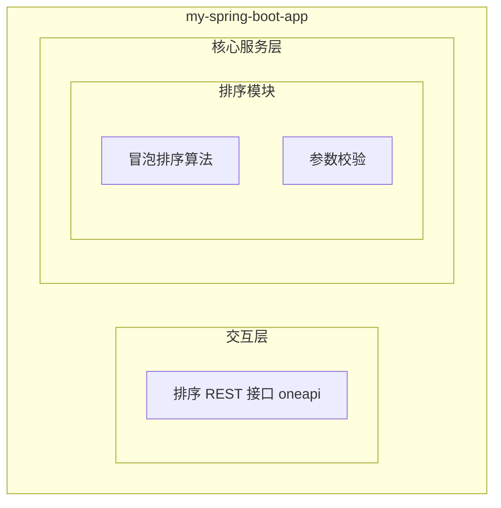
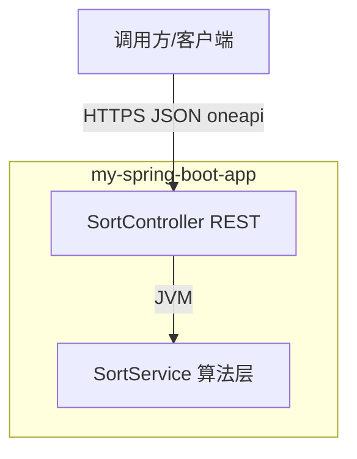
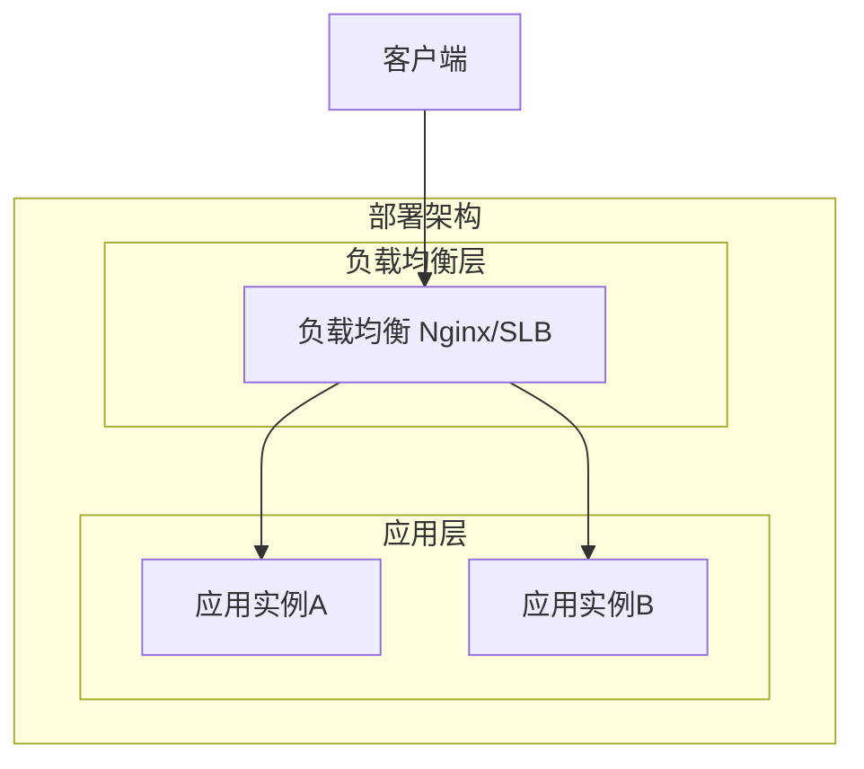
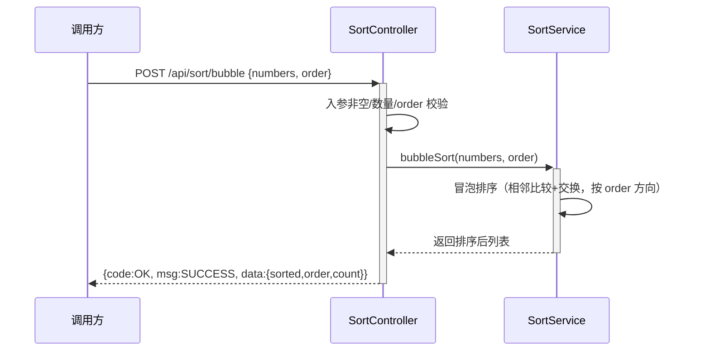

> **文档元信息**
>
> | 项目 | 内容 |
> |------|------|
> | 文档版本 | v1.0 |
> | 作者 | AiWork |
> | 创建日期 | 2026-09-15 |
> | 需求来源 | 需求描述：实现一个冒泡排序 |
> | 评审状态 | 待评审 |

# 冒泡排序 系分设计

## 1. 需求与范围

### 背景与目标

当前仓库 `ranxitest` 为一个基于 Spring Boot 2.6.6 的 Web 演示应用，已有 Item/User 等业务模块，分层为 Controller → Service → Repository。本次需求要求"实现一个冒泡排序"。

目标：在现有 Spring Boot 应用内提供冒泡排序算法能力，并通过 HTTP 接口对外暴露，使外部可提交一组数字并由服务端按冒泡排序算法完成升序（或降序）排列后返回结果。算法实现封装于 Service 层，保持与现有分层架构一致、可被其他模块复用。

### 核心功能

1. 冒泡排序算法实现：对输入的数字列表执行冒泡排序，返回排序后列表。
2. 排序接口：提供 REST 接口接收待排序数字数组，返回排序结果。
3. 参数校验与异常处理：对入参（空数组、超大数组、非法元素等）进行校验并返回明确错误信息。
4. 排序方向支持：支持升序（默认）与降序两种排序方向。

### 约束与非功能要求

- 技术栈：Java 17、Spring Boot 2.6.6、Spring Web（与现仓库一致）。
- 接口风格：REST（JSON），统一出参 `{code, msg, data}`。
- 算法正确性：结果须为输入列表的稳定非递减（升序）/非递增（降序）排列。
- 输入规模约束：单次排序元素数量上限 1000（防止 O(n²) 算法在大数据量下拖垮服务）。
- 无状态：排序为纯计算，不依赖数据库、缓存、外部系统。
- 安全：接口需校验入参合法性，禁止因非法输入导致服务异常。

### 排除范围

- 不涉及数据库持久化、排序结果落库。
- 不涉及用户认证鉴权（沿用应用现有体系，本模块不新增鉴权逻辑）。
- 不涉及前端页面（Thymeleaf）开发；仅提供 JSON 接口。
- 不实现其他排序算法（快速排序、归并排序等不在本次范围）。

### 需求功能清单与优先级

| 编号 | 功能点 | 优先级 | PRD 原始描述/章节 | 备注 |
|------|--------|--------|-------------------|------|
| F01 | 冒泡排序算法实现 | P0 | "实现一个冒泡排序" | 核心算法，封装于 Service 层 |
| F02 | 排序 REST 接口暴露 | P0 | "实现一个冒泡排序"（对外可用） | POST /api/sort/bubble |
| F03 | 参数校验与异常处理 | P1 | 隐含：接口健壮性 | 空数组、超限、非法元素 |
| F04 | 排序方向（升序/降序）支持 | P2 | 隐含：排序方向 | 默认升序 |

### 假设与待确认项

| 编号 | 假设/待确认内容 | 当前假设 | 确认状态 |
|------|-----------------|----------|----------|
| A01 | 排序元素类型 | 整数（Integer），暂不支持浮点/字符串 | 待确认 |
| A02 | 暴露形式 | REST JSON 接口（@RestController），而非 Thymeleaf 页面 | 待确认 |
| A03 | 输入规模上限 | 单次 ≤ 1000 个元素 | 待确认 |
| A04 | 排序方向默认值 | 升序（asc） | 待确认 |
| A05 | 出参统一结构 | {code, msg, data}，data 中含 sorted 数组 | 待确认 |

---

## 2. 架构与模块

### 功能架构



- 交互层说明：`SortController`（@RestController）以 `/api/sort` 前缀对外提供 REST 接口，接收 JSON 入参，返回统一 JSON 出参。
- 核心服务层说明：`SortService` 封装冒泡排序算法与方向控制，被 `SortController` 调用；无 Repository 依赖。
- 扩展/集成层说明：本项不适用，原因：冒泡排序为纯内存计算，无外部系统集成。

**模块清单**

| 模块 | 职责 | 依赖 |
|------|------|------|
| 排序模块（sort） | 提供冒泡排序算法实现与对外 REST 接口，含参数校验 | 无外部模块/服务依赖；仅依赖 Spring Web |

### 应用集成架构



**集成关系说明：**

| 调用方 | 被调用方 | 协议 | 接口类型 | 说明 |
|--------|----------|------|----------|------|
| 调用方/客户端 | SortController | HTTPS | oneapi REST | 提交待排序数组，返回排序结果 |
| SortController | SortService | JVM | 内部方法调用 | 调用冒泡排序算法 |

> 本模块无数据库、缓存、MQ 及外部第三方系统集成。

### 部署架构



**部署说明：**
- **负载均衡层**：沿用应用现有部署（Nginx/SLB），本模块不改变部署形态。
- **应用层**：排序为无状态计算，天然支持多实例水平扩展，请求可由任意实例处理。
- **数据层**：本项不适用，原因：无持久化存储。

---

## 3. 数据模型与存储

本项不适用，原因：冒泡排序为无状态纯内存计算，不涉及任何持久化实体、数据库表、缓存或消息队列。输入数据为请求体中的临时数字数组，处理完成后随响应返回，不落库、不缓存。

---

## 4. 接口设计

### 4.1 oneapi（Web 控制台接口）

| 编号 | 接口名称 | 方法 | 路径 | 模块 |
|------|----------|------|------|------|
| W01 | 冒泡排序 | POST | /api/sort/bubble | 排序模块 |

### 4.2 OpenAPI（对外接口）

本项不适用，原因：本次仅提供 oneapi（/api 前缀）接口，无对外开放 (/openapi) 接口需求。

### 4.3 内部接口（Service 层）

| 编号 | 接口名称 | 类 | 方法签名 |
|------|----------|------|----------|
| S01 | 冒泡排序 | SortService | List<Integer> bubbleSort(List<Integer> numbers, SortOrder order) |

### 4.4 集成接口（Integration 层）

本项不适用，原因：无外部系统集成。

---

## 5. 功能模块设计

### 全局约定

| 约定项 | 约定值 |
|--------|--------|
| 错误码格式 | SORT_{SEQ}（如 SORT_001） |
| 通用出参结构 | {code, msg, data}，code 为 "OK" 表示成功，其余为错误码 |
| 模块映射 | 排序模块 → SORT 前缀 |

### 5.1 排序模块

#### 5.1.1 表结构设计

本模块无表结构设计，原因：冒泡排序无持久化存储需求（见第 3 章）。

##### 5.1.1.x 枚举与常量定义

| 枚举名称 | 取值 | 含义 | 关联字段 |
|----------|------|------|----------|
| SortOrder | ASC | 升序（非递减） | 接口入参 order |
| SortOrder | DESC | 降序（非递增） | 接口入参 order |

| 常量名称 | 取值 | 含义 |
|----------|------|------|
| MAX_INPUT_SIZE | 1000 | 单次排序元素数量上限 |

#### 5.1.2 接口详细设计

##### W01 冒泡排序

- **URI**: POST /api/sort/bubble
- **描述**: 接收一组整数及排序方向，使用冒泡排序算法返回排序后结果。
- **入参**:

| 参数名称 | 类型 | 是否必填 | 描述 |
|----------|------|----------|------|
| numbers | array[integer] | 是 | 待排序整数数组 |
| order | string | 否 | 排序方向，ASC=升序（默认），DESC=降序 |

- **出参**:

| 参数名称 | 类型 | 描述 |
|----------|------|------|
| code | String | 结果码，OK 表示成功 |
| msg | String | 提示信息 |
| data | Object | 业务数据 |
| data.sorted | array[integer] | 排序后整数数组 |
| data.order | String | 实际使用的排序方向 |
| data.count | Integer | 参与排序的元素数量 |

- **错误码**:

| 错误码 | 说明 |
|--------|------|
| SORT_001 | numbers 为空或 null |
| SORT_002 | numbers 元素数量超过上限 1000 |
| SORT_003 | order 取值非法（仅允许 ASC/DESC） |

- **业务规则**: 入参非空校验 → 数量上限校验 → order 合法性校验（缺省 ASC）→ 调用冒泡排序 → 返回结果。

- **请求示例**:
```json
{
  "numbers": [5, 2, 9, 1, 5, 6],
  "order": "ASC"
}
```

- **响应示例**:
```json
{
  "code": "OK",
  "msg": "SUCCESS",
  "data": {
    "sorted": [1, 2, 5, 5, 6, 9],
    "order": "ASC",
    "count": 6
  }
}
```

#### 5.1.3 子功能详细设计

##### 5.1.3.1 冒泡排序算法执行（F01/F02/F03/F04）

- 处理时序图


**业务规则：**

| 规则编号 | 规则描述 | 校验时机 | 不满足时的处理 |
|----------|----------|----------|--------------|
| R01 | numbers 不可为 null 且不可为空数组 | 入口校验 | 返回 SORT_001，提示"待排序数组不能为空" |
| R02 | numbers 元素数量 ≤ 1000 | 入口校验 | 返回 SORT_002，提示"待排序元素数量超过上限 1000" |
| R03 | order 为空时默认 ASC；非空时仅允许 ASC/DESC | 入口校验 | 返回 SORT_003，提示"排序方向非法，仅支持 ASC/DESC" |
| R04 | 冒泡排序须为稳定排序，相等元素相对顺序不变 | 算法实现 | — |
| R05 | 不修改入参数组的原始语义（实现内可使用副本） | 算法实现 | — |

**异常场景：**

| 异常场景 | 处理方式 |
|----------|----------|
| numbers 为 null 或空数组 | 返回 SORT_001 |
| numbers 元素数 > 1000 | 返回 SORT_002 |
| order 取值非 ASC/DESC | 返回 SORT_003 |
| 请求体 JSON 格式错误 | 由 Spring 框架返回 400，全局异常处理兜底 |
| 排序过程中发生未预期异常 | 由 GlobalExceptionHandler 捕获并返回错误信息 |

**并发控制：**
- 并发场景：无并发风险，原因：排序为无状态纯内存计算，每次请求独立处理，不共享可变状态。
- 控制策略：无需加锁；建议方法内对入参列表做防御性拷贝，避免对调用方传入集合的副作用。

**状态机设计：**
本模块无状态字段实体，不适用状态机设计。

##### 技术选型方案对比（算法实现方式）

| 方案 | 描述 | 优点 | 缺点 |
|------|------|------|------|
| 方案A：经典冒泡排序（双层循环 + 提前终止优化） | 相邻元素两两比较交换，单趟无交换则提前结束 | 实现简单、稳定排序、与需求"冒泡排序"语义完全吻合 | 时间复杂度 O(n²)，大数据量性能差 |
| 方案B：标准冒泡排序（无提前终止） | 固定 n-1 趟 | 实现最简 | 对近乎有序的数据多余比较，性能略差 |
| 方案C：使用 JDK Collections.sort | 调用标准库 | 性能好 | 不符合"实现一个冒泡排序"需求，偏离算法实现目标 |

**推荐方案：方案A**。理由：需求明确要求实现冒泡排序，方案A 既忠实于冒泡排序语义，又通过"单趟无交换提前终止"优化对近乎有序输入的性能，兼顾正确性与适度优化；同时通过输入规模上限（1000）规避 O(n²) 在大数据量下的性能风险。

##### 模块自检

| 检查项 | 结果 | 说明 |
|--------|------|------|
| 完备性：F01~F04 均有设计 | 通过 | 算法/接口/校验/方向均覆盖 |
| 过度设计检查 | 通过 | 仅算法+单接口+基础校验，无多余抽象 |

---

## 6. 非功能性需求设计

### 6.1 高可用性

本模块为无状态纯计算，无下游依赖，任意应用实例均可处理请求；应用层多副本部署即可保证高可用。第三方异常降级：不适用，原因：无外部第三方依赖。

### 6.2 可扩展性

排序无共享状态，水平扩容无瓶颈；随应用实例数线性提升吞吐。算法封装于 SortService，后续若需新增其他排序算法可在同模块内扩展，不影响现有接口。

### 6.3 稳定性/可靠性

边界场景：空数组（R01 拦截）、单元素/已有序数组（提前终止优化正常处理）、全等元素（稳定排序保持原序）、最大规模 1000 元素（O(n²) 约 10^6 次比较，单请求毫秒级，可接受）。输入规模上限保证最坏情况计算量可控。

### 6.4 安全性设计

#### 6.4.1 账户系统方案
本项不适用，原因：本模块不涉及登录注册，沿用应用现有体系。

#### 6.4.2 授权&访问控制
- 水平权限检查：不适用，原因：排序接口为公共计算能力，不涉及资源归属查询。
- 垂直权限检查：不适用，原因：无角色化资源控制需求。
- 登录态检查：沿用应用全局拦截策略；若应用对 /api 路径有统一登录拦截则自动生效，本模块不单独处理。

#### 6.4.3 数据防护方案
- 敏感数据加密存储：不适用，原因：无持久化数据。
- 敏感数据脱敏：不适用，原因：入参与出参均为普通整数数组，无敏感信息。

### 6.5 监控/统计/日志/告警

- 关键监控点：接口调用次数、处理耗时、错误码分布（SORT_001/002/003）。
- 日志：记录请求元素数量、排序方向、耗时；不记录完整大数组（防止日志膨胀）。

---

## 7. 变更三板斧

### 7.1 可监控

埋点设计：在 SortController 入口记录接口调用与耗时；在 SortService 记录排序元素数量与耗时；异常分支记录对应错误码。监控维度：调用量、平均/P99 耗时、错误率。

### 7.2 可灰度

灰度思考：本功能为新增独立接口（/api/sort/bubble），不修改既有逻辑，可独立发布上线，天然支持按流量灰度。如需细粒度灰度，可按调用方标识/租户尾号引流。推荐：新接口独立部署即可，无需额外灰度开关；若需灰度则按租户尾号灰度。

### 7.3 可应急

应急方案：本模块为新增独立接口，回滚仅需下线/禁用该接口，不影响既有功能。建议保留接口级功能开关（如配置项 `sort.bubble.enabled`，关闭时返回 SORT 禁用提示），实现快速降级而无需回滚发布包。回滚依赖关系：无上下游数据依赖，回滚零风险。

---

## 8. 方案检查

| 检查项 | 结果 | 说明 |
|--------|------|------|
| 模块划分合理性检查 | 通过 | 单一排序模块，职责单一，无循环依赖 |
| 依赖关系合理性检查 | 通过 | 无外部集成依赖，无下游异常风险 |
| 单点问题检查（部署层面） | 通过 | 无状态多副本部署，无单点 |
| 表模型设计范式检查 | 不适用 | 无数据库表 |
| 隐私安全检查 | 通过 | 无敏感信息，入出参为普通整数 |
| 兼容性检查（接口） | 通过 | 新增接口，无旧调用方兼容问题 |
| 兼容性检查（表） | 不适用 | 无表变更 |
| 数据迁移检查 | 不适用 | 无数据库变更 |
| 一致性检查（功能点） | 通过 | F01~F04 在 5.1 中均有对应设计 |
| 一致性检查（表） | 不适用 | 无实体 |
| 一致性检查（接口） | 通过 | W01、S01 在 5.1 中均有详细定义 |
| 一致性检查（枚举） | 通过 | SortOrder 枚举与入参 order 字段一致 |
| 状态机完整性检查 | 不适用 | 无状态字段实体 |
| 并发风险检查 | 通过 | 无状态纯计算，无并发风险；推荐防御性拷贝 |
| 单点问题检查（定时任务层面） | 不适用 | 无定时任务 |
| 非功能性设计可行性检查 | 通过 | 高可用/扩展/安全/监控设计均可落地 |
| 变更三板斧-可监控 | 通过 | 接口调用/耗时/错误码埋点可行 |
| 变更三板斧-可灰度 | 通过 | 新增独立接口，推荐按租户尾号灰度或独立部署 |
| 变更三板斧-可应急 | 通过 | 接口级功能开关降级，回滚零依赖风险 |
