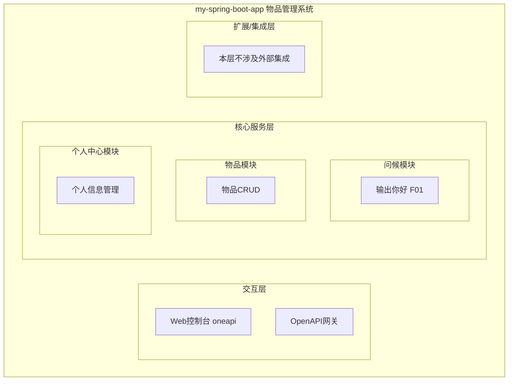
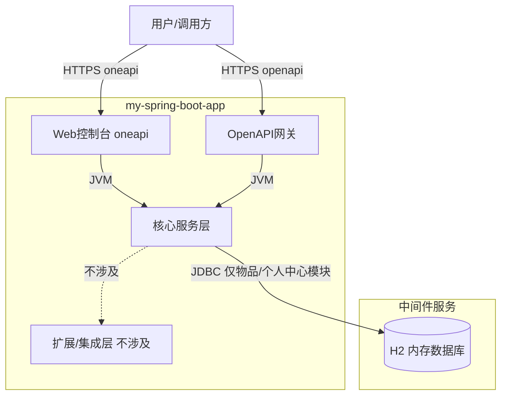
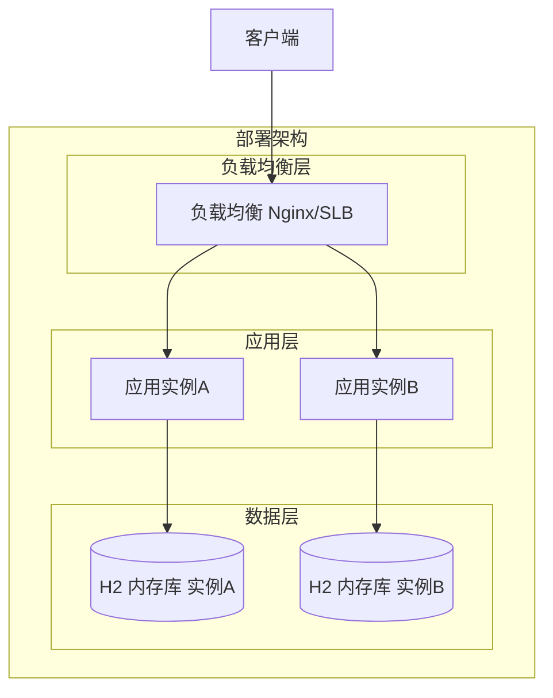
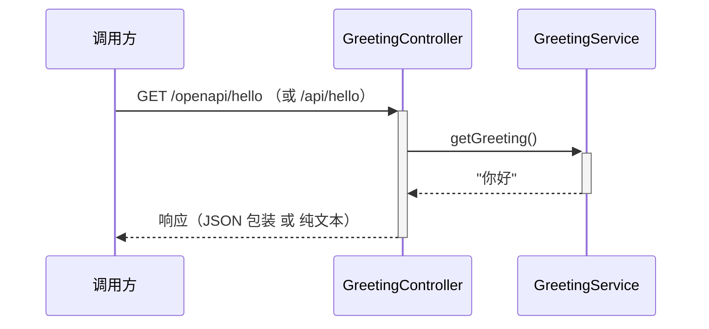

> **文档元信息**
>
> | 项目 | 内容 |
> |------|------|
> | 文档版本 | v1.0 |
> | 作者 | AiWork |
> | 创建日期 | 2026-09-15 |
> | 需求来源 | 任务需求描述：输出你好 |
> | 评审状态 | 待评审 |

# 输出你好 系分设计

## 1. 需求与范围
- 背景与目标：当前应用"物品管理系统"（my-spring-boot-app）已有物品 CRUD、个人中心等模块，但缺少一个最基础的问候/健康检查类接口。需求"输出你好"要求提供一个能够直接返回"你好"文本的接口，用于快速验证服务存活（健康检查/冒烟测试）并提供一个对外可调用的问候示例接口。
- 核心功能：输出"你好"——通过 HTTP GET 请求返回纯文本"你好"。
- 约束与非功能要求：只读、无状态、不依赖数据库或外部服务；响应时间 < 50ms（本地内存返回）；对齐现有 Spring Boot Web 架构，不引入新依赖；字符编码 UTF-8，确保中文"你好"正确返回。
- 排除范围：不涉及用户认证/鉴权；不涉及数据持久化、缓存、消息队列；不涉及前端页面改造。

### 需求功能清单与优先级

| 编号 | 功能点 | 优先级 | PRD 原始描述/章节 | 备注 |
|------|--------|--------|-------------------|------|
| F01 | 输出你好接口 | P0 | 需求描述：输出你好 | GET 请求返回"你好"纯文本 |

### 假设与待确认项

| 编号 | 假设/待确认内容 | 当前假设 | 确认状态 |
|------|-----------------|----------|----------|
| A01 | "输出你好"的具体形式（纯文本/JSON/HTML） | 假设为纯文本返回，同时提供 JSON 包装版本供外部系统调用 | 待确认 |
| A02 | 接口是否需要鉴权 | 假设为公开接口，无需鉴权（问候/健康检查用途） | 待确认 |
| A03 | 接口路径归属（oneapi / OpenAPI） | 假设同时提供 oneapi 页面接口与 OpenAPI 对外接口 | 待确认 |

## 2. 架构与模块
### 功能架构


- 交互层说明：Web 控制台提供 oneapi 接口（`/api` 前缀），OpenAPI 网关提供对外接口（`/openapi` 前缀）。
- 核心服务层说明：新增"问候模块"，仅含"输出你好"功能点，职责单一，与物品模块、个人中心模块并列，无循环依赖。
- 扩展/集成层说明：本需求不涉及外部系统集成。

**模块清单**

| 模块 | 职责 | 依赖 |
|------|------|------|
| 问候模块 | 提供输出"你好"的无状态只读接口 | 无外部依赖 |
| 物品模块 | 物品增删改查、搜索、分类（已有） | ItemRepository / H2 |
| 个人中心模块 | 用户信息管理、用户物品管理（已有） | UserService / ItemService |


### 应用集成架构


**集成关系说明：**

| 调用方 | 被调用方 | 协议 | 接口类型 | 说明 |
|--------|----------|------|----------|------|
| 用户/调用方 | 应用 Web控制台 | HTTPS | oneapi REST | 问候接口页面版本 |
| 用户/调用方 | 应用 OpenAPI网关 | HTTPS | openapi REST | 问候接口对外版本 |
| 应用核心服务层（物品/个人中心） | H2 数据库 | JDBC | SQL | 问候模块不访问数据库 |

### 部署架构


**部署说明：**
- **负载均衡层**：Nginx/SLB，同城双机房，无单点。
- **应用层**：多副本部署，云原生方案；问候模块无状态，任意副本均可服务。
- **数据层**：H2 为内存数据库，各实例独立（当前 demo 形态）；问候模块不依赖数据层。


## 3. 数据模型与存储
### 实体清单

| 实体名称 | 实体说明 | 所属模块 | 与其他实体的关系 |
|----------|----------|----------|-----------------|
| 无 | 本需求为无状态只读接口，不涉及新增/变更实体 | 问候模块 | 无 |

### 实体关系图
```mermaid
erDiagram
    %% 问候模块不涉及实体，无关系连线
```

**模型说明：**
- "输出你好"接口为纯内存返回，不读取、不写入任何数据表。
- 现有实体（items、users）不受本需求影响，不展开。


## 4. 接口设计

### 4.1 oneapi（Web 控制台接口）

| 编号 | 接口名称 | 方法 | 路径 | 模块 |
|------|----------|------|------|------|
| W01 | 输出你好（页面版） | GET | /api/hello | 问候模块 |

### 4.2 OpenAPI（对外接口）

| 编号 | 接口名称 | 方法 | 路径 | 模块 |
|------|----------|------|------|------|
| O01 | 输出你好（对外版） | GET | /openapi/hello | 问候模块 |

### 4.3 内部接口（Service 层）

| 编号 | 接口名称 | 类 | 方法签名 |
|------|----------|------|----------|
| S01 | 获取问候语 | GreetingService | String getGreeting() |

### 4.4 集成接口（Integration 层）

| 编号 | 接口名称 | 类 | 方法签名 | 说明 |
|------|----------|------|----------|------|
| — | 本项不适用 | — | — | 问候模块不涉及外部系统集成 |


## 5. 功能模块设计

### 全局约定
- 错误码格式：`{MODULE}_{SEQ}`，如 `GREETING_001`。
- 通用出参结构（JSON 对外接口）：`{ "code": "OK", "msg": "SUCCESS", "data": <业务数据> }`。

### 5.1 问候模块（greeting）
#### 5.1.1 表结构设计
本模块不适用，原因：问候接口为无状态只读接口，不涉及新增/变更数据表。现有 items、users 表不受影响。

##### 5.1.1.1 枚举与常量定义
本模块无枚举/常量定义。

#### 5.1.2 接口详细设计
##### O01 输出你好（对外版）

- **URI**: GET `/openapi/hello`
- **描述**: 返回问候语"你好"，以 JSON 通用出参结构包装，供外部系统调用。
- **入参**: 无

| 参数名称 | 类型 | 是否必填 | 描述 |
|----------|------|----------|------|
| — | — | — | 无入参 |

- **出参**:

| 参数名称 | 类型 | 描述 |
|----------|------|------|
| code | String | 结果 code，成功为 "OK" |
| msg | String | 提示信息，成功为 "SUCCESS" |
| data | Object | 业务数据 |
| data.greeting | String | 问候语内容，固定值 "你好" |

- **错误码**:

| 错误码 | 说明 |
|--------|------|
| GREETING_001 | 服务内部异常（理论上不会发生，兜底） |

- **业务规则**: R01 问候内容固定为"你好"，不接受参数定制。

- **请求示例**:
```json
GET /openapi/hello
```

- **响应示例**:
```json
{
  "code": "OK",
  "msg": "SUCCESS",
  "data": {
    "greeting": "你好"
  }
}
```

##### W01 输出你好（页面版）

- **URI**: GET `/api/hello`
- **描述**: 返回纯文本"你好"，Content-Type: text/plain; charset=UTF-8，用于冒烟测试/健康检查。
- **入参**: 无

| 参数名称 | 类型 | 是否必填 | 描述 |
|----------|------|----------|------|
| — | — | — | 无入参 |

- **出参**: 纯文本字符串 "你好"

- **错误码**:

| 错误码 | 说明 |
|--------|------|
| GREETING_001 | 服务内部异常（兜底） |

- **业务规则**: R01 问候内容固定为"你好"。

- **请求示例**:
```
GET /api/hello
```

- **响应示例**:
```
你好
```

#### 5.1.3 子功能详细设计
##### 5.1.3.1 输出你好（F01）

- 处理时序图


**业务规则：**

| 规则编号 | 规则描述 | 校验时机 | 不满足时的处理 |
|----------|----------|----------|--------------|
| R01 | 问候内容固定为"你好" | 始终 | 不存在不满足场景 |

**异常场景：**

| 异常场景 | 处理方式 |
|----------|----------|
| 服务未启动 | 调用方收到连接拒绝，由调用方重试或告警 |
| 运行时异常（理论上不发生） | 由 GlobalExceptionHandler 兜底捕获，返回错误信息 |

**并发控制（如涉及数据写入）：**
- 并发场景：无，只读无状态接口。
- 控制策略：无并发风险，原因：不涉及共享可变状态、不涉及数据写入。

**状态机设计：** 本模块不适用，原因：无状态字段实体。

##### 技术选型方案对比

| 方案 | 说明 | 优点 | 缺点 |
|------|------|------|------|
| 方案A：纯文本返回（@RestController + @GetMapping 返回 String） | Controller 直接返回"你好"，Content-Type text/plain | 最简单、改动最小、符合现有架构 | 无结构化信息 |
| 方案B：JSON 包装返回（统一出参 {code,msg,data}） | 返回 {code:OK,msg:SUCCESS,data:{greeting:"你好"}} | 结构化、可扩展、与通用出参一致 | 比纯文本稍重 |
| 方案C：Thymeleaf 页面返回 | 渲染一个 hello.html | 可视化 | 过度设计，需求仅为"输出你好" |

**推荐方案**：同时采用方案A + 方案B。
- `/api/hello`（oneapi）采用方案A 纯文本返回，用于冒烟/健康检查。
- `/openapi/hello`（OpenAPI）采用方案B JSON 包装返回，供外部系统结构化调用。
- **推荐理由**：覆盖 oneapi 与 OpenAPI 两类接口形态，既满足最简纯文本输出，又满足对外结构化调用，符合技能"对外接口默认 OpenAPI"约定；方案C 引入模板渲染属过度设计，不采用。

##### 模块自检
- 完备性对账表：

| 需求功能点 | 接口 | 业务规则 | 异常场景 | 状态机 | 并发控制 | 是否完备 |
|------------|------|----------|----------|--------|----------|----------|
| F01 输出你好 | W01 + O01 | R01 | 已覆盖 | 不适用 | 无风险 | ✅ |

- 过度设计检查：未引入不必要的 Service 抽象复杂度（GreetingService 仅一个 getGreeting() 方法，职责单一）；未引入数据库/缓存/MQ，符合无状态只读定位；未新增依赖，复用现有 spring-boot-starter-web。


## 6. 非功能性需求设计
### 6.1 高可用性
问候模块为无状态只读接口，不依赖数据库或外部服务。应用多副本部署时，任意副本均可独立服务，单副本故障由负载均衡剔除节点，不影响整体可用性。无降级需求（无下游依赖）。

### 6.2 可扩展性
- 水平扩展：无状态接口，可通过增加应用副本线性扩展吞吐。
- 垂直扩展：单实例内存返回，CPU/内存占用极低。

### 6.3 稳定性/可靠性
- 边界场景：高并发下纯内存字符串返回，不存在资源竞争或阻塞。
- 字符编码：强制 UTF-8，确保中文"你好"不被乱码。

### 6.4 安全性设计
#### 6.4.1 账户系统方案
本项不适用，原因：问候接口为公开只读接口，不需要账户/登录态。

#### 6.4.2 授权&访问控制
##### 6.4.2.1 是否实现水平权限检查
不涉及，原因：公开只读接口，无用户级数据查询。

##### 6.4.2.2 是否实现垂直权限检查
不涉及，原因：公开只读接口，无角色区分。

##### 6.4.2.3 是否检查登录态
不检查登录态，/api/hello 与 /openapi/hello 均配置为公开白名单接口。

#### 6.4.3 数据防护方案
##### 6.4.3.1 是否对敏感数据加密存储
不涉及，原因：不返回敏感数据，无数据存储。

##### 6.4.3.2 是否对敏感数据展示进行脱敏
不涉及，原因：返回内容仅为"你好"，无敏感信息。

### 6.5 监控/统计/日志/告警
- 访问日志：由 Spring Boot 默认访问日志记录接口调用。
- 告警点：接口 5xx 错误率（理论上不会发生，兜底监控）。

## 7. 变更三板斧
### 7.1 可监控
针对关键点的一些监控埋点思考与设计：记录 /api/hello、/openapi/hello 调用次数、响应耗时（Spring Boot Actuator / 访问日志）。三方服务埋点不涉及，无外部调用。

### 7.2 可灰度
功能的设计上，进行了哪些灰度的思考，如何设计的，如果不可灰度，原因是什么：问候接口为新增只读接口，不修改既有逻辑，可按租户尾号灰度引流（如有必要）。由于接口无副作用且不依赖数据，灰度必要性低；如需灰度，通过网关路由规则按比例放量即可。

### 7.3 可应急
关键功能是否保留开关，提供快速的应急能力：可通过配置开关（如 `greeting.enabled`）控制是否注册该路由，切回无问候接口的旧逻辑。发布包回滚兜底：回滚为不含问候接口的版本，由于接口为新增只读、无数据库变更，回滚无上下游兼容性风险。

---

## 附录：决策记录

| 决策项 | 决策结果 | 备选方案 | 决策原因 |
|--------|----------|----------|----------|
| OUTPUT_FILE 路径 | `.agents/system-analysis/2026-09-15-输出你好-design.md` | 用户指定路径 / 默认路径 | 用户未指定，按默认规则自动生成 |
| 设计模式 | 全量模式 | 增量模式 / 全量模式 | 无同模块历史文档，采用全量模式 |
| 技术栈 | Java 17 + Spring Boot 2.6.6 + Spring Data JPA + Thymeleaf + H2 | — | 仓库 pom.xml 与 application.properties 确认 |
| 需求解释 | "输出你好"= 新增 HTTP GET 接口返回"你好" | JSON 包装 / HTML 页面 | 最简解释，风险最低、改动最小 |
| 接口形态 | 默认 OpenAPI（RESTful）+ oneapi 页面版 | — | 按技能默认规则 |
| 错误码格式 | GREETING_{SEQ} | — | 全局约定默认 {MODULE}_{SEQ} |
| 通用出参结构 | {code, msg, data} | — | 全局约定默认值 |
| 是否涉及数据存储 | 否 | — | 无状态只读接口 |
| 部署架构 | 公有云同城双机房、云原生、无单点 | 私有化容器化 | 需求未指定，按技能默认规则 |
