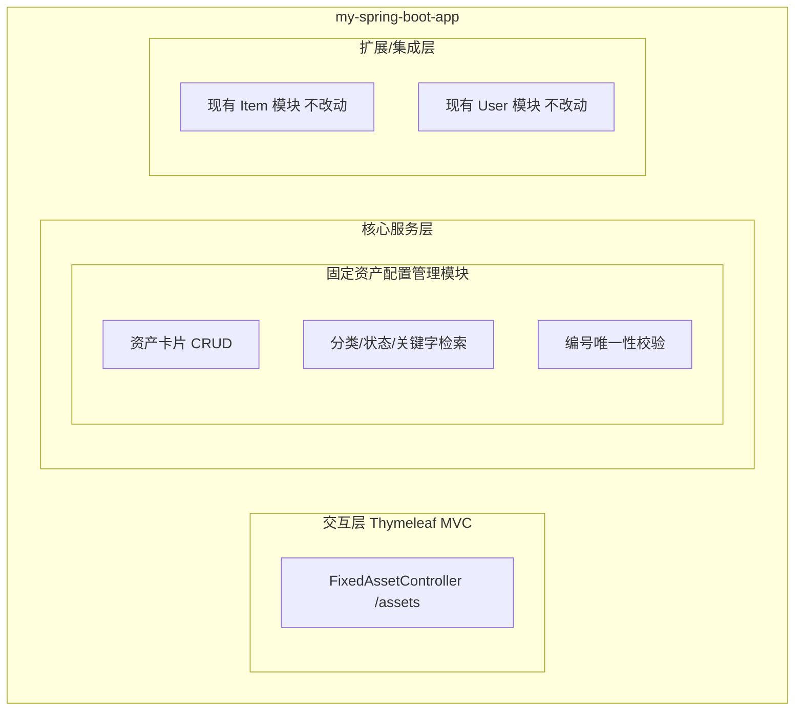
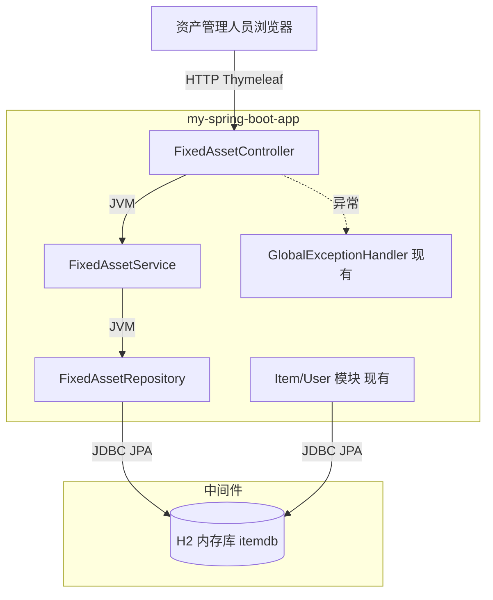
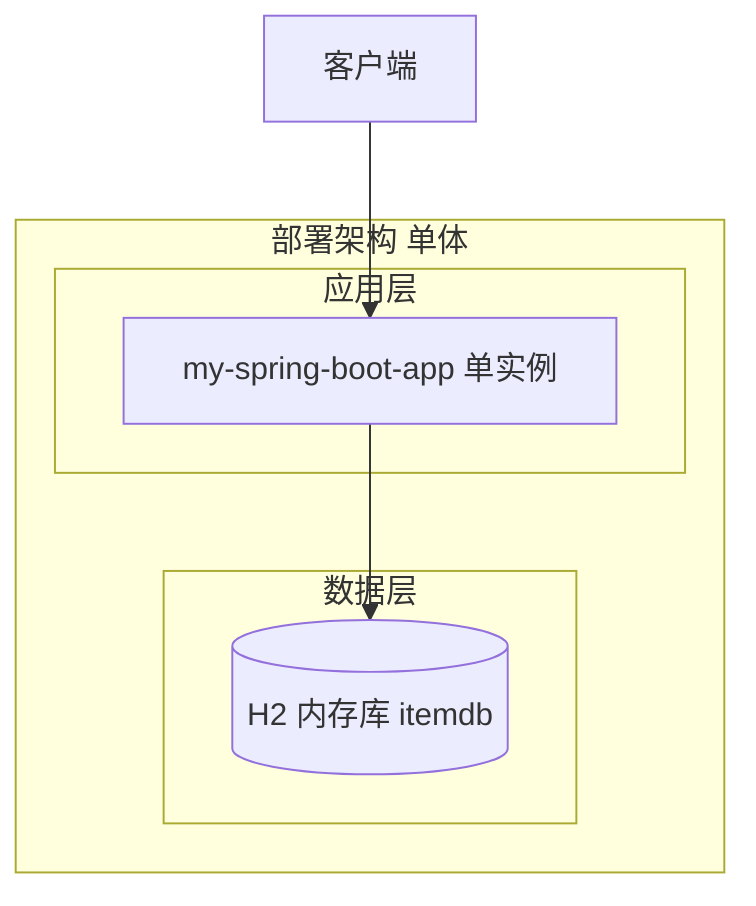
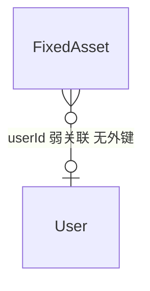
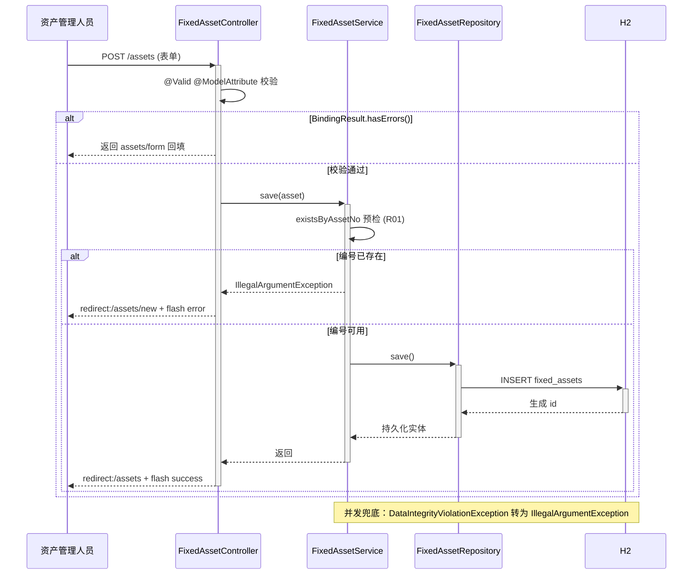
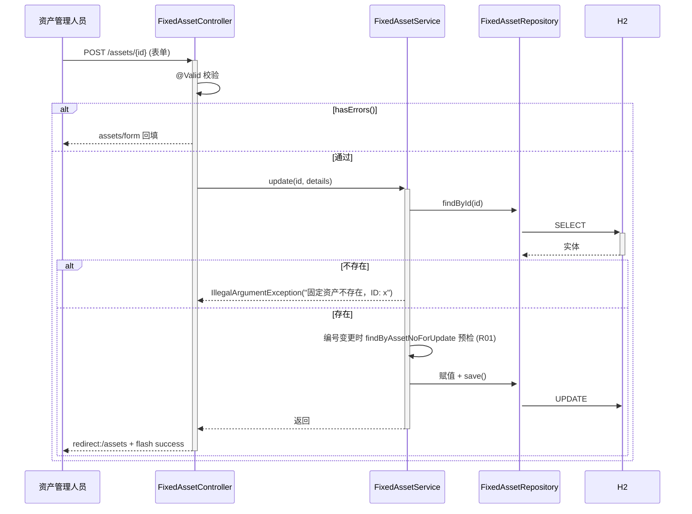
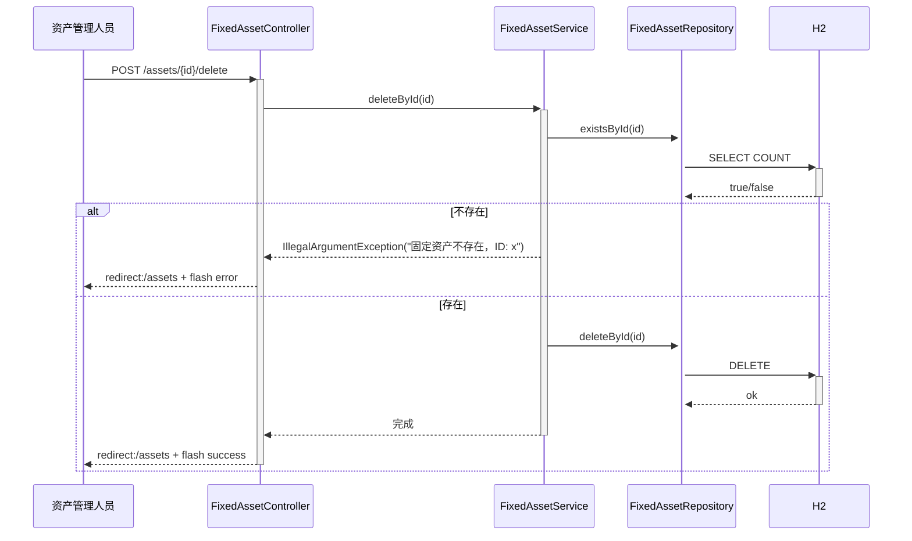
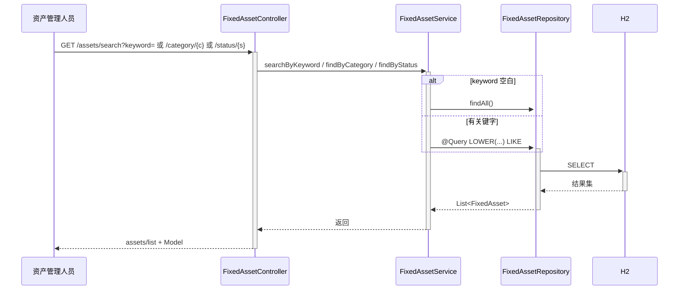
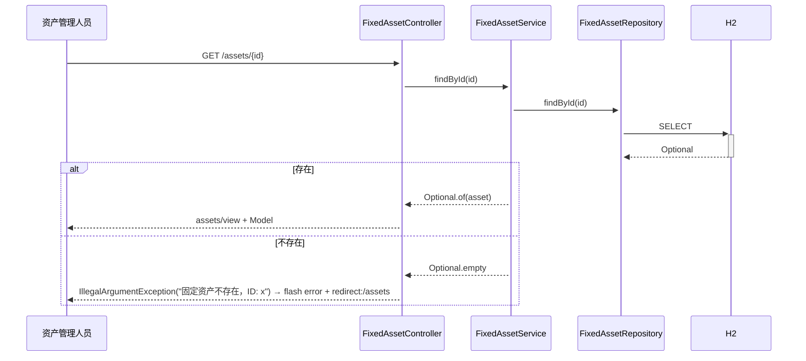
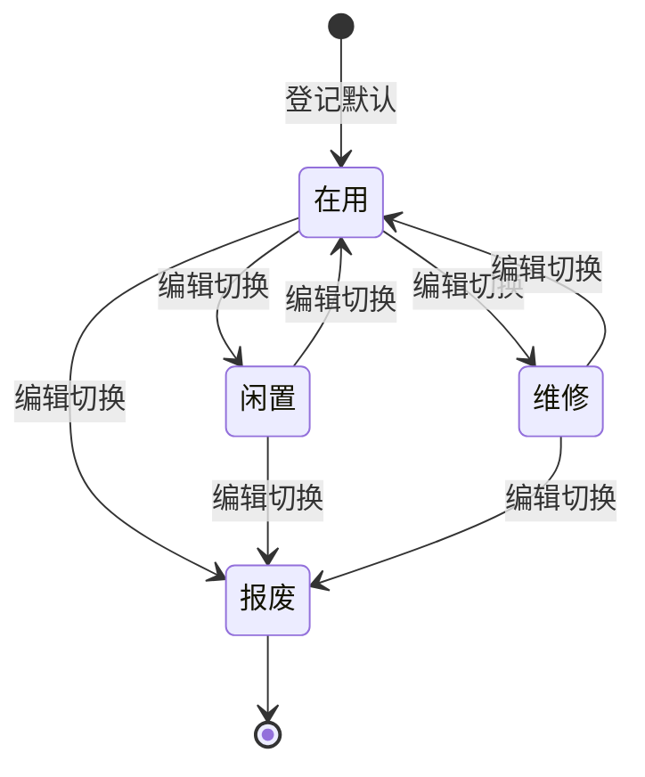

> **文档元信息**
>
> | 项目 | 内容 |
> |------|------|
> | 文档版本 | v1.0 |
> | 作者 | DTCoder（系分生成节点） |
> | 创建日期 | 2026-08-07 |
> | 需求来源 | `.agents/DEV-966dcd0a-7905-11f1-9649-3b4281182f10-4a75d390-4551-4eb5-9f91-06505b9dd1e3/dima.md`（需求澄清）；`docs/plans/fixed-asset-management-plan.md`（实施计划） |
> | 评审状态 | 待评审 |

# 固定资产配置管理 系分设计

## 1. 需求与范围

### 背景与目标

现有应用 `my-spring-boot-app`（Spring Boot 2.x + Thymeleaf + H2）已具备 `Item`（物品）与 `User`（用户）两个领域，采用经典分层架构（Controller–Service–Repository）。本设计在**不改动现有 Item/User 代码**的前提下，新增「固定资产配置管理」领域模块，提供资产卡片的增删改查、分类与状态筛选、关键字搜索能力，供资产管理人员登记与检索固定资产配置信息。

**核心功能：**
- 资产卡片登记（资产编号业务唯一）
- 资产列表与分类/状态筛选、关键字检索
- 资产详情、编辑、删除

**约束与非功能要求：**
- `assetNo` 由用户录入，服务层预检 + DB 唯一约束兜底，保证业务唯一性
- 表单校验失败回填并提示中文错误，成功后 flash 提示
- 复用现有 `GlobalExceptionHandler`，**不新增异常类**
- 现有 Item/User 功能不受影响（纯新增、零侵入）
- 沿用 H2 内存库与 `spring.jpa.hibernate.ddl-auto=update` 自动建表

### 排除范围（明确排除，后续独立立项）

- 折旧计算与月折旧报表
- 领用/归还流程、审批流
- 资产盘点、盘点单
- 资产处置/报废审批流程
- 与外部财务系统的对接

### 需求功能清单与优先级

| 编号 | 功能点 | 优先级 | PRD 原始描述/章节 | 备注 |
|------|--------|--------|-------------------|------|
| F01 | 固定资产登记（创建） | P0 | DIMA §1「可登记一条固定资产并校验唯一资产编号」 | assetNo 唯一性双保险 |
| F02 | 资产列表（带分类/状态筛选） | P0 | DIMA §6「GET /assets 列表，带分类/状态筛选」 | 复用 items/list 布局 |
| F03 | 资产详情查看 | P0 | DIMA §6「GET /assets/{id} 详情」 | 不存在记录异常处理 |
| F04 | 资产编辑更新 | P0 | DIMA §6「POST /assets/{id} 更新」 | 编号变更预检 |
| F05 | 资产删除（物理删除） | P0 | DIMA §6「POST /assets/{id}/delete 删除」 | 软删除不做（YAGNI） |
| F06 | 分类筛选 | P1 | DIMA §6「GET /assets/category/{category}」 | 复用 findAllCategories 聚合 |
| F07 | 状态筛选 | P1 | DIMA §6「GET /assets/status/{status}」 | 状态字典硬编码四项 |
| F08 | 关键字搜索 | P1 | DIMA §5.4「searchByKeyword 在 assetNo/name/spec 模糊匹配」 | 空关键字回退 findAll |
| F09 | 分类聚合（下拉/侧栏） | P2 | DIMA §5.3「findAllCategories SELECT DISTINCT」 | 供列表与表单 |

### 假设与待确认项

| 编号 | 假设/待确认内容 | 当前假设 | 确认状态 |
|------|-----------------|----------|----------|
| A01 | `userId` 归属使用人是否需要强外键约束 | 弱关联（可空 Long），不引入 JPA 外键，避免与现有 schema 耦合；配置管理阶段允许悬空 id | 已确认（DIMA §3/§9 取舍） |
| A02 | 状态取值是否需要动态字典表 | 硬编码四项（在用/闲置/维修/报废），不建独立字典表（YAGNI）；未来需动态扩展再引入 | 已确认（DIMA §5.2） |
| A03 | 是否需要软删除/审计 | 物理删除，不做软删除；未来如需审计再扩展 | 已确认（DIMA §7） |
| A04 | 是否引入数字错误码体系 | 不引入；沿用现有 `IllegalArgumentException` + 中文消息 + `GlobalExceptionHandler` 模式，与 `Item` 模块一致 | 已确认（DIMA §7，方案选型见 §5.1.2） |

## 2. 架构与模块

### 功能架构

- **交互层说明**：`FixedAssetController`（`@Controller @RequestMapping("/assets")`）提供 Thymeleaf 表单与列表视图端点，与 `ItemController` 风格一致。
- **核心服务层说明**：`FixedAssetService`（`@Service @Transactional`）封装 CRUD、检索、编号唯一性校验；`FixedAssetRepository`（Spring Data JPA）承担持久化与 `@Query` 检索。
- **扩展/集成层说明**：`FixedAsset` 与 `Item`/`User` 仅通过 `userId` 弱关联，不引入外键；现有模块零改动。

**模块清单**

| 模块 | 职责 | 依赖 |
|------|------|------|
| 固定资产配置管理 | 资产卡片增删改查、分类/状态筛选、关键字搜索、编号唯一性保障 | H2 数据库（JPA）、现有 `GlobalExceptionHandler` |

### 应用集成架构

**集成关系说明：**

| 调用方 | 被调用方 | 协议 | 接口类型 | 说明 |
|--------|----------|------|----------|------|
| 资产管理人员浏览器 | FixedAssetController | HTTP | Thymeleaf MVC | 表单提交与页面渲染 |
| FixedAssetController | FixedAssetService | JVM | Service 调用 | 业务编排 |
| FixedAssetService | FixedAssetRepository | JVM | Spring Data JPA | 持久化与检索 |
| FixedAssetRepository | H2 | JDBC | SQL | `fixed_assets` 表读写 |
| FixedAssetController | GlobalExceptionHandler | JVM | `@ControllerAdvice` | 业务异常统一兜底 |

### 部署架构

**部署说明：**
- **负载均衡层**：不适用（单体学习应用，单实例，无 LB）。
- **应用层**：`my-spring-boot-app` 单实例，`server.port=8080`，`ddl-auto=update` 自动建 `fixed_assets` 表。
- **数据层**：H2 内存库 `jdbc:h2:mem:itemdb`，应用重启即重置（与现有 Item/User 一致）。

## 3. 数据模型与存储

### 实体清单

| 实体名称 | 实体说明 | 所属模块 | 与其他实体的关系 |
|----------|----------|----------|-----------------|
| FixedAsset | 固定资产卡片，表 `fixed_assets`，业务键 `assetNo` | 固定资产配置管理 | 弱关联 `User`（可空 `userId`，无外键） |
| User | 现有用户实体（不改动） | 现有 User 模块 | 被 FixedAsset 弱引用 |
| Item | 现有物品实体（不改动） | 现有 Item 模块 | 无关系 |

### 实体关系图

**模型说明：**
- `FixedAsset.userId` 为可空 `Long`，仅记录归属使用人 id，不建立 JPA 外键约束，避免与现有 `User` schema 耦合。
- 若 `User` 被删除，`FixedAsset.userId` 可能指向悬空 id——此为配置管理阶段的设计取舍（DIMA §9）；后续如需强约束再增强。

## 4. 接口设计

> 说明：本应用为 Thymeleaf MVC 单体，交互层为 Web 控制台端点（非 REST JSON）。出参为视图名 + `Model`/flash 属性；业务异常经 `GlobalExceptionHandler` 兜底。无 OpenAPI 对外接口、无 Integration 集成接口。

### 4.1 oneapi（Web 控制台接口）

| 编号 | 接口名称 | 方法 | 路径 | 模块 |
|------|----------|------|------|------|
| W01 | 资产列表 | GET | /assets | 固定资产配置管理 |
| W02 | 新增表单 | GET | /assets/new | 固定资产配置管理 |
| W03 | 创建资产 | POST | /assets | 固定资产配置管理 |
| W04 | 编辑表单 | GET | /assets/{id}/edit | 固定资产配置管理 |
| W05 | 更新资产 | POST | /assets/{id} | 固定资产配置管理 |
| W06 | 删除资产 | POST | /assets/{id}/delete | 固定资产配置管理 |
| W07 | 关键字搜索 | GET | /assets/search | 固定资产配置管理 |
| W08 | 按分类 | GET | /assets/category/{category} | 固定资产配置管理 |
| W09 | 按状态 | GET | /assets/status/{status} | 固定资产配置管理 |
| W10 | 资产详情 | GET | /assets/{id} | 固定资产配置管理 |

### 4.2 OpenAPI（对外接口）

不涉及。本应用不对外提供 OpenAPI REST 接口。

### 4.3 内部接口（Service 层）

| 编号 | 接口名称 | 类 | 方法签名 |
|------|----------|------|----------|
| S01 | 全量查询 | FixedAssetService | `List<FixedAsset> findAll()` |
| S02 | 按ID查询 | FixedAssetService | `Optional<FixedAsset> findById(Long id)` |
| S03 | 按编号查询 | FixedAssetService | `Optional<FixedAsset> findByAssetNo(String assetNo)` |
| S04 | 保存（创建） | FixedAssetService | `FixedAsset save(FixedAsset asset)` |
| S05 | 更新 | FixedAssetService | `FixedAsset update(Long id, FixedAsset details)` |
| S06 | 按ID删除 | FixedAssetService | `void deleteById(Long id)` |
| S07 | 关键字搜索 | FixedAssetService | `List<FixedAsset> searchByKeyword(String keyword)` |
| S08 | 按分类 | FixedAssetService | `List<FixedAsset> findByCategory(String category)` |
| S09 | 按状态 | FixedAssetService | `List<FixedAsset> findByStatus(String status)` |
| S10 | 分类聚合 | FixedAssetService | `List<String> getAllCategories()` |
| S11 | 状态字典 | FixedAssetController | `List<String> getAllStatuses()` |

### 4.4 集成接口（Integration 层）

不涉及。无外部系统集成。

## 5. 功能模块设计

### 全局约定

- **错误码格式**：本模块**不引入数字错误码体系**（方案选型见下）。业务异常统一抛 `IllegalArgumentException(中文消息)`，由现有 `GlobalExceptionHandler` 转为 flash `error`。理由：与 `ItemService` 现有模式一致（如「物品名称 'xxx' 已存在」）、YAGNI、DIMA 已明确复用 `GlobalExceptionHandler` 且不新增异常类。
- **通用出参结构**：不适用 REST JSON `{code,msg,data}`。Web 控制台端点出参为 Thymeleaf 视图名 + `Model`/`RedirectAttributes` flash 属性（`success`/`error`），与 `ItemController` 一致。

**错误码方案选型（决策记录）：**

| 方案 | 说明 | 评估 |
|------|------|------|
| A. 数字错误码 `{MODULE}_{SEQ}`（如 ASSET_001） | 引入错误码枚举 + 映射表 | 与现有 `Item` 模块不一致；本应用无 REST 层、无数字错误码体系；过度设计 |
| B. 沿用 `IllegalArgumentException` + 中文消息（推荐） | 业务异常直接抛中文消息，`GlobalExceptionHandler` 兜底 | 与 `ItemService`/`GlobalExceptionHandler` 现状一致；DIMA 已明确复用；零新增机制 |

**推荐并采用方案 B**：沿用现有中文消息 + `GlobalExceptionHandler`，保持与 `Item` 模块一致，零侵入。

### 5.1 固定资产配置管理模块

#### 5.1.1 表结构设计

##### 5.1.1.1 fixed_assets

| 字段名 | 数据类型 | 约束 | 默认值 | 说明 |
|--------|----------|------|--------|------|
| id | bigint | PK, 自增(IDENTITY) | - | 系统自增主键 |
| asset_no | varchar(50) | NOT NULL, UNIQUE | - | 资产编号，业务唯一键 |
| name | varchar(100) | NOT NULL | - | 资产名称 |
| category | varchar(50) | NOT NULL | - | 资产分类 |
| spec | varchar(200) | NULL | - | 规格型号 |
| status | varchar(20) | NOT NULL | - | 状态：在用/闲置/维修/报废 |
| original_value | decimal(10,2) | NOT NULL | - | 原值（>=0） |
| user_id | bigint | NULL | - | 归属使用人（弱关联 User，无外键） |
| purchase_date | date | NOT NULL | - | 购置日期 |
| location | varchar(100) | NULL | - | 存放地点 |
| remark | varchar(500) | NULL | - | 备注 |
| created_at | datetime | NOT NULL, 不可更新 | `@PrePersist` 填充 | 创建时间 |
| updated_at | datetime | NULL | `@PrePersist`+`@PreUpdate` 填充 | 修改时间 |

**索引：**
- UK: `fixed_assets` 唯一键 = `asset_no`（`@Column(unique=true)`）
- IDX: 建议对 `category`、`status` 加查询索引（H2 自动建表场景下由 JPA `@Column` 约束控制，检索走 `@Query`）

**Java 实体映射要点**（复用 `Item.java` 模式）：
- `@Entity @Table(name="fixed_assets")`，包 `com.example.myapp.models`
- `@Id @GeneratedValue(strategy=GenerationType.IDENTITY) Long id`
- `assetNo`：`@NotBlank` `@Size(min=1,max=50)` `@Column(nullable=false,unique=true,length=50)`
- `name`：`@NotBlank` `@Size(min=1,max=100)` `@Column(nullable=false,length=100)`
- `category`：`@NotBlank` `@Size(max=50)` `@Column(nullable=false,length=50)`
- `spec`：`@Size(max=200)` `@Column(length=200)`
- `status`：`@NotBlank` `@Size(max=20)` `@Column(nullable=false,length=20)`
- `originalValue`：`@NotNull` `@DecimalMin("0.0")` `@Digits(integer=10,fraction=2)` `@Column(nullable=false,precision=10,scale=2)`（`BigDecimal`）
- `userId`：`@Column(name="user_id") Long`（可空）
- `purchaseDate`：`@NotNull` `@Column(nullable=false)`（`LocalDate`）
- `location`：`@Size(max=100)` `@Column(length=100)`
- `remark`：`@Size(max=500)` `@Column(length=500)`
- `createdAt`/`updatedAt`：`@PrePersist onCreate()` / `@PreUpdate onUpdate()` 回调填充（与 `Item` 一致）
- 校验消息中文（如「资产编号不能为空」「原值不能为负数」）

##### 5.1.1.2 枚举与常量定义

| 枚举名称 | 取值 | 含义 | 关联字段 |
|----------|------|------|----------|
| FixedAssetStatus | 在用 | 资产正在使用中 | fixed_assets.status |
| FixedAssetStatus | 闲置 | 资产暂未使用 | fixed_assets.status |
| FixedAssetStatus | 维修 | 资产处于维修状态 | fixed_assets.status |
| FixedAssetStatus | 报废 | 资产已报废 | fixed_assets.status |

> 状态取值由 `FixedAssetController.getAllStatuses()` 返回有序列表（`Arrays.asList("在用","闲置","维修","报废")`），不建独立字典表（YAGNI）。`status` 字段以字符串存储，不强校验取值白名单（与现有 `Item.category` 自由文本风格一致）；如未来需强校验再加 `@Pattern`。

#### 5.1.2 接口详细设计

##### W01 资产列表

- **URI**: GET `/assets`
- **描述**: 展示全部固定资产列表，支持分类/状态筛选下拉
- **入参**: 无（筛选通过 W08/W09 跳转）
- **出参**: 视图 `assets/list`；`Model` 属性 `assets`(List)、`categories`(List)、`statuses`(List)
- **错误码**: 不涉及（查询异常走 `GlobalExceptionHandler`）
- **业务规则**: 列表数据按 `findAll()`；分类/状态列表供下拉

##### W03 创建资产

- **URI**: POST `/assets`
- **描述**: 登记一条固定资产
- **入参**:

| 参数名称 | 类型 | 是否必填 | 描述 |
|----------|------|----------|------|
| assetNo | String | 是 | 资产编号（唯一） |
| name | String | 是 | 资产名称 |
| category | String | 是 | 资产分类 |
| spec | String | 否 | 规格型号 |
| status | String | 是 | 状态 |
| originalValue | BigDecimal | 是 | 原值（>=0） |
| userId | Long | 否 | 归属使用人 |
| purchaseDate | LocalDate | 是 | 购置日期 |
| location | String | 否 | 存放地点 |
| remark | String | 否 | 备注 |

- **出参**: 成功重定向 `redirect:/assets` + flash `success`；校验失败返回 `assets/form` 回填；编号重复 flash `error`
- **错误码**: 业务异常 `IllegalArgumentException("资产编号 'xxx' 已存在")`
- **业务规则**: `@Valid @ModelAttribute` 校验；`BindingResult.hasErrors()` 回表单；`save()` 编号唯一性预检 + DB 兜底

##### W05 更新资产

- **URI**: POST `/assets/{id}`
- **描述**: 更新固定资产信息
- **入参**: `id`(路径) + 同 W03 字段
- **出参**: 成功 `redirect:/assets` + flash `success`；校验失败 `assets/form`；编号重复 `redirect:/assets/{id}/edit` + flash `error`
- **业务规则**: `update(id, details)`；编号变更时 `findByAssetNoForUpdate` 预检重复 + DB 兜底

##### W06 删除资产

- **URI**: POST `/assets/{id}/delete`
- **描述**: 物理删除固定资产
- **入参**: `id`(路径)
- **出参**: `redirect:/items`→`redirect:/assets` + flash `success`/`error`
- **业务规则**: `deleteById` 先 `existsById` 预检，不存在抛 `IllegalArgumentException("固定资产不存在，ID: x")`

##### W07 关键字搜索

- **URI**: GET `/assets/search?keyword=`
- **描述**: 在 `assetNo`/`name`/`spec` 模糊匹配
- **入参**: `keyword`(可选)
- **出参**: 视图 `assets/list` + `Model` 属性 `assets`、`keyword`
- **业务规则**: `keyword` 空白回退 `findAll()`（与 `ItemService.searchByKeyword` 一致）

##### W10 资产详情

- **URI**: GET `/assets/{id}`
- **描述**: 查看单条资产详情
- **入参**: `id`(路径)
- **出参**: 视图 `assets/view` + `Model` 属性 `asset`；不存在 flash `error` 重定向列表
- **业务规则**: `findById(id).orElseThrow(() -> new IllegalArgumentException("固定资产不存在，ID: x"))`

#### 5.1.3 子功能详细设计

##### 5.1.3.1 资产创建（F01）

- 处理时序图

**业务规则：**

| 规则编号 | 规则描述 | 校验时机 | 不满足时的处理 |
|----------|----------|----------|--------------|
| R01 | assetNo 业务唯一 | 创建时 | 抛 `IllegalArgumentException("资产编号 'xxx' 已存在")` |
| R02 | 必填字段非空 + 长度 | 始终（`@Valid`） | `BindingResult` 回表单 + 字段级中文错误 |
| R03 | originalValue >= 0 | 始终（`@DecimalMin`） | 回表单 + 「原值不能为负数」 |
| R04 | purchaseDate 非空 | 始终（`@NotNull`） | 回表单 + 「购置日期不能为空」 |

**异常场景：**

| 异常场景 | 处理方式 |
|----------|----------|
| assetNo 并发重复 | `DataIntegrityViolationException` 兜底捕获，转 `IllegalArgumentException("资产编号 'xxx' 已存在")`，由 `GlobalExceptionHandler` 转 flash error |
| 表单校验失败 | `BindingResult.hasErrors()` 返回 `assets/form`，Thymeleaf 内联字段错误并保留输入 |
| 未知系统异常 | `GlobalExceptionHandler.handleGeneralException` → `error` 视图 |

**并发控制：**
- 并发场景：两人同时登记相同 `assetNo`
- 控制策略：应用层 `existsByAssetNo` 预检 + DB 唯一约束（`@Column(unique=true)`）双保险；并发极端场景由 `DataIntegrityViolationException` 兜底为可读错误（复用 `ItemService.save` 模式）。无乐观锁/分布式锁需求。

##### 5.1.3.2 资产更新（F04）

- 处理时序图

**业务规则：** R01（编号变更时唯一性）、R02–R04（同创建）。

**异常场景：** 同创建；记录不存在抛 `IllegalArgumentException("固定资产不存在，ID: x")`。

**并发控制：** 编号变更时 `findByAssetNoForUpdate`（`@Lock` 悲观读，复用 `ItemRepository.findByNameForUpdate` 模式）预检 + DB 唯一约束兜底。

##### 5.1.3.3 资产删除（F05）

- 处理时序图

**业务规则：** R05 删除前 `existsById` 预检，不存在抛 `IllegalArgumentException`。

**事务/回滚：** `@Transactional` 类级声明；删除为单语句，无级联，失败回滚整事务。

##### 5.1.3.4 资产检索（F06/F07/F08）

- 处理时序图

**业务规则：**
- `searchByKeyword`：`@Query("SELECT a FROM FixedAsset a WHERE LOWER(a.assetNo) LIKE LOWER(CONCAT('%',:kw,'%')) OR LOWER(a.name) LIKE ... OR LOWER(a.spec) LIKE ...")`，空白回退 `findAll()`
- `findByCategory(category)`、`findByStatus(status)`：Spring Data 派生查询
- `findAllCategories()`：`@Query("SELECT DISTINCT a.category FROM FixedAsset a ORDER BY a.category")`（复用 `ItemRepository.findAllCategories`）

##### 5.1.3.5 资产详情（F03）

- 处理时序图

**状态机设计（status 字段）：**

> `status` 为自由文本枚举，配置管理阶段不强制状态流转约束（YAGNI）。状态由用户在表单中直接选择并保存，无前置流转校验。如未来需状态机约束（如「报废不可回到在用」）再在 Service 层加流转校验。

**状态流转规则：** 当前阶段无强制流转校验（用户可直接设任意状态）；仅记录语义。

## 6. 非功能性需求设计

### 6.1 高可用性
单体学习应用，单实例，无多副本/降级需求。上游（H2 内存库）与应用同进程，无外部依赖故障域。异常统一由 `GlobalExceptionHandler` 兜底，不会抛出未处理 500。

### 6.2 可扩展性
- 垂直：单体 JVM，可通过调大堆内存承载更多资产数据。
- 水平：H2 内存库不支持多实例共享，如需水平扩展需替换为外部 DB（MySQL/PostgreSQL）并调整 `application.properties`——属未来演进，不在本期范围。
- 模块扩展：新增折旧/领用等领域时各自独立模块，不影响 `FixedAsset` 配置模块。

### 6.3 稳定性/可靠性
- `assetNo` 唯一性双保险保证数据一致。
- 表单校验前置（`@Valid`）拦截非法输入。
- 边界：`originalValue` 精度 `decimal(10,2)`，`@Digits(10,2)` 防溢出；`purchaseDate` 历史日期允许（不做未来日期校验，YAGNI）。

### 6.4 安全性设计

#### 6.4.1 账户系统方案
不涉及。本应用无登录态/账户系统（现有 `User` 实体仅作数据存储，无鉴权）。

#### 6.4.2 授权&访问控制

##### 6.4.2.1 是否实现水平权限检查
不实现。本应用为无鉴权学习应用，所有资产为公共数据，无水平权限隔离需求。

##### 6.4.2.2 是否实现垂直权限检查
不实现。无角色体系。

##### 6.4.2.3 是否检查登录态
不检查。无登录拦截器（与现有 `Item`/`User` 模块一致）。

#### 6.4.3 数据防护方案

##### 6.4.3.1 是否对敏感数据加密存储
不涉及。固定资产配置数据（编号/名称/原值/地点）非敏感个人数据，明文存储。`userId` 为弱关联 id，非敏感。

##### 6.4.3.2 是否对敏感数据展示进行脱敏
不涉及。无身份证/手机号等敏感字段需脱敏。

### 6.5 监控/统计/日志/告警
- 日志：沿用 Spring Boot 默认日志；`@Transactional` 异常由 `GlobalExceptionHandler` 转 flash error。
- 监控/告警：不适用（学习应用，无 APM/告警体系）。
- SQL：`spring.jpa.show-sql=true` 已开启，便于调试。

## 7. 变更三板斧

### 7.1 可监控
- `show-sql=true` 提供 SQL 可观测。
- 业务异常经 `GlobalExceptionHandler` 转为用户可见 flash error，可读性好。
- 关键点：`assetNo` 唯一性冲突会以中文消息反馈给用户，可定位。

### 7.2 可灰度
不可灰度（纯新增模块，单体单实例，无灰度基础设施）。由于是**纯新增文件、零侵入现有模块**，灰度等价于「功能是否上线」——可通过是否在首页/导航暴露入口实现软灰度（本期不在范围）。

### 7.3 可应急
- **开关**：无独立功能开关（YAGNI）。由于纯新增、零侵入，应急=下线该模块。
- **回滚**：回滚即删除新增文件（`FixedAsset.java`/`FixedAssetRepository.java`/`FixedAssetService.java`/`FixedAssetController.java`/`templates/assets/*`）+ 撤销 git commit。因不修改 `Item`/`User`/`GlobalExceptionHandler`/`application.properties`，回滚无上下游依赖、无既有行为变更风险。
- **DB**：`fixed_assets` 表由 `ddl-auto=update` 自动创建；回滚删除文件后，残留空表不影响现有功能（H2 内存库重启即重置）。

---

## 附录：方案检查（Step 9 自检）

| 检查项 | 结果 | 说明 |
|--------|------|------|
| 模块划分合理性 | 通过 | 单一模块 `FixedAsset`，职责单一，复用现有分层 |
| 接口完整性 | 通过 | CRUD + 检索 + 详情端点齐全，与 `ItemController` 风格一致 |
| 数据模型完整性 | 通过 | `fixed_assets` 表字段、约束、索引、枚举齐全 |
| 唯一性保障 | 通过 | `assetNo` 预检 + DB 唯一约束双保险 |
| 异常处理一致性 | 通过 | 复用 `GlobalExceptionHandler`，不新增异常类 |
| 校验完整性 | 通过 | `@Valid` + `BindingResult` + 中文消息 |
| 隔离性 | 通过 | 零侵入 Item/User，弱关联无外键 |
| 事务设计 | 通过 | `@Transactional` 类级，删除/保存原子 |
| 并发控制 | 通过 | DB 唯一约束兜底 + 悲观读预检 |
| 非功能覆盖 | 通过 | 安全/可用/扩展按实评估，不涉及项标注 |
| 回滚方案 | 通过 | 纯新增，删除文件即回滚 |
| 视图复用 | 通过 | `templates/assets/*` 复用 items 布局风格 |
| 测试策略 | 通过 | Service/Controller 双层测试，H2 隔离 |
| 错误码方案选型 | 通过 | 方案 B 沿用现有模式，理由充分 |
| 状态字典 | 通过 | 硬编码四项，YAGNI |
